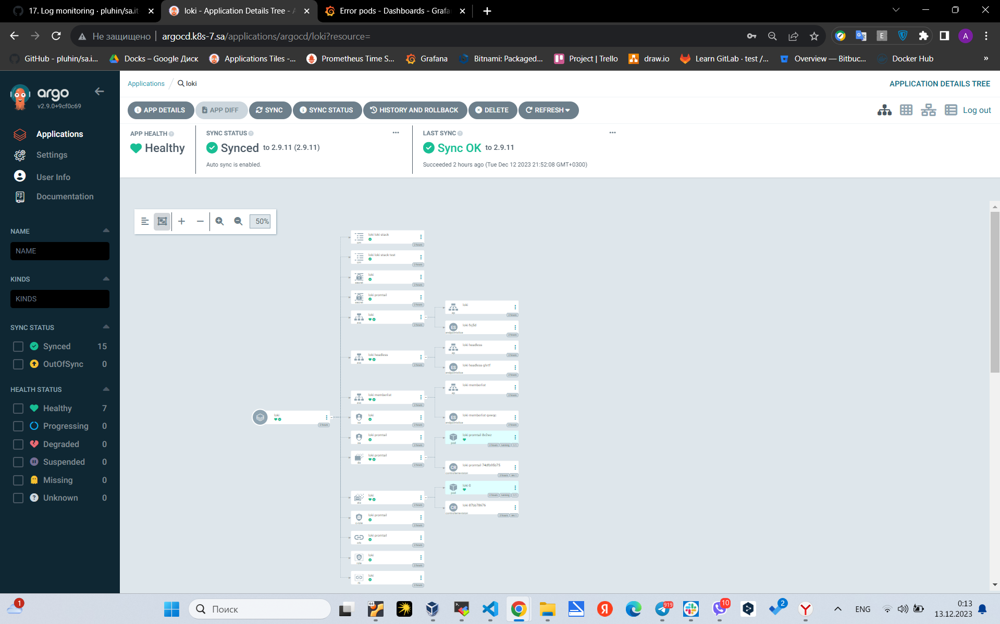
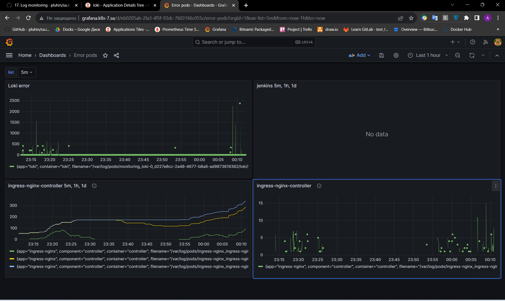

# 17. Log monitoring

## Deploy Grafana loki inside your cluster



## Create Grafana dashboard to monitor counts errors for the following application inside your cluster



json

```json
{
  "annotations": {
    "list": [
      {
        "builtIn": 1,
        "datasource": {
          "type": "grafana",
          "uid": "-- Grafana --"
        },
        "enable": true,
        "hide": true,
        "iconColor": "rgba(0, 211, 255, 1)",
        "name": "Annotations & Alerts",
        "type": "dashboard"
      }
    ]
  },
  "editable": true,
  "fiscalYearStartMonth": 0,
  "graphTooltip": 0,
  "id": 7,
  "links": [],
  "liveNow": false,
  "panels": [
    {
      "datasource": {
        "type": "loki",
        "uid": "c9a75f9d-776b-414f-b0ea-4c9eb54d332d"
      },
      "fieldConfig": {
        "defaults": {
          "color": {
            "mode": "palette-classic"
          },
          "custom": {
            "axisBorderShow": false,
            "axisCenteredZero": false,
            "axisColorMode": "text",
            "axisLabel": "",
            "axisPlacement": "auto",
            "barAlignment": 0,
            "drawStyle": "line",
            "fillOpacity": 0,
            "gradientMode": "none",
            "hideFrom": {
              "legend": false,
              "tooltip": false,
              "viz": false
            },
            "insertNulls": false,
            "lineInterpolation": "linear",
            "lineWidth": 1,
            "pointSize": 5,
            "scaleDistribution": {
              "type": "linear"
            },
            "showPoints": "auto",
            "spanNulls": false,
            "stacking": {
              "group": "A",
              "mode": "none"
            },
            "thresholdsStyle": {
              "mode": "off"
            }
          },
          "mappings": [],
          "thresholds": {
            "mode": "absolute",
            "steps": [
              {
                "color": "green",
                "value": null
              },
              {
                "color": "red",
                "value": 80
              }
            ]
          }
        },
        "overrides": []
      },
      "gridPos": {
        "h": 8,
        "w": 12,
        "x": 0,
        "y": 0
      },
      "id": 4,
      "options": {
        "legend": {
          "calcs": [],
          "displayMode": "list",
          "placement": "bottom",
          "showLegend": true
        },
        "tooltip": {
          "mode": "single",
          "sort": "none"
        }
      },
      "targets": [
        {
          "datasource": {
            "type": "loki",
            "uid": "c9a75f9d-776b-414f-b0ea-4c9eb54d332d"
          },
          "editorMode": "builder",
          "expr": "count_over_time({pod=\"loki-0\"}[$__auto] |= \"error\")",
          "queryType": "range",
          "refId": "A"
        }
      ],
      "title": "Loki error",
      "type": "timeseries"
    },
    {
      "datasource": {
        "type": "loki",
        "uid": "c9a75f9d-776b-414f-b0ea-4c9eb54d332d"
      },
      "fieldConfig": {
        "defaults": {
          "color": {
            "mode": "palette-classic"
          },
          "custom": {
            "axisBorderShow": false,
            "axisCenteredZero": false,
            "axisColorMode": "text",
            "axisLabel": "",
            "axisPlacement": "auto",
            "barAlignment": 0,
            "drawStyle": "line",
            "fillOpacity": 0,
            "gradientMode": "none",
            "hideFrom": {
              "legend": false,
              "tooltip": false,
              "viz": false
            },
            "insertNulls": false,
            "lineInterpolation": "linear",
            "lineWidth": 1,
            "pointSize": 5,
            "scaleDistribution": {
              "type": "linear"
            },
            "showPoints": "auto",
            "spanNulls": false,
            "stacking": {
              "group": "A",
              "mode": "none"
            },
            "thresholdsStyle": {
              "mode": "off"
            }
          },
          "mappings": [],
          "thresholds": {
            "mode": "absolute",
            "steps": [
              {
                "color": "green",
                "value": null
              },
              {
                "color": "red",
                "value": 80
              }
            ]
          }
        },
        "overrides": []
      },
      "gridPos": {
        "h": 8,
        "w": 12,
        "x": 12,
        "y": 0
      },
      "id": 3,
      "options": {
        "legend": {
          "calcs": [],
          "displayMode": "list",
          "placement": "bottom",
          "showLegend": true
        },
        "tooltip": {
          "mode": "single",
          "sort": "none"
        }
      },
      "targets": [
        {
          "datasource": {
            "type": "loki",
            "uid": "c9a75f9d-776b-414f-b0ea-4c9eb54d332d"
          },
          "editorMode": "code",
          "expr": "count_over_time({pod=\"jenkins-85d5498c6d-fvc42\"}[5m] |= `error`)",
          "queryType": "range",
          "refId": "A"
        },
        {
          "datasource": {
            "type": "loki",
            "uid": "c9a75f9d-776b-414f-b0ea-4c9eb54d332d"
          },
          "editorMode": "code",
          "expr": "count_over_time({pod=\"jenkins-85d5498c6d-fvc42\"}[1h] |= `error`)",
          "hide": false,
          "queryType": "range",
          "refId": "B"
        },
        {
          "datasource": {
            "type": "loki",
            "uid": "c9a75f9d-776b-414f-b0ea-4c9eb54d332d"
          },
          "editorMode": "code",
          "expr": "count_over_time({pod=\"jenkins-85d5498c6d-fvc42\"}[1d] |= `error`)",
          "hide": false,
          "queryType": "range",
          "refId": "C"
        }
      ],
      "title": "jenkins 5m, 1h, 1d",
      "type": "timeseries"
    },
    {
      "datasource": {
        "type": "loki",
        "uid": "c9a75f9d-776b-414f-b0ea-4c9eb54d332d"
      },
      "description": "ingress-nginx-controller 5m, 1h, 1d",
      "fieldConfig": {
        "defaults": {
          "color": {
            "mode": "palette-classic"
          },
          "custom": {
            "axisBorderShow": false,
            "axisCenteredZero": false,
            "axisColorMode": "text",
            "axisLabel": "",
            "axisPlacement": "auto",
            "barAlignment": 0,
            "drawStyle": "line",
            "fillOpacity": 0,
            "gradientMode": "none",
            "hideFrom": {
              "legend": false,
              "tooltip": false,
              "viz": false
            },
            "insertNulls": false,
            "lineInterpolation": "linear",
            "lineWidth": 1,
            "pointSize": 5,
            "scaleDistribution": {
              "type": "linear"
            },
            "showPoints": "auto",
            "spanNulls": false,
            "stacking": {
              "group": "A",
              "mode": "none"
            },
            "thresholdsStyle": {
              "mode": "off"
            }
          },
          "mappings": [],
          "thresholds": {
            "mode": "absolute",
            "steps": [
              {
                "color": "green",
                "value": null
              },
              {
                "color": "red",
                "value": 80
              }
            ]
          }
        },
        "overrides": []
      },
      "gridPos": {
        "h": 8,
        "w": 12,
        "x": 0,
        "y": 8
      },
      "id": 2,
      "options": {
        "legend": {
          "calcs": [],
          "displayMode": "list",
          "placement": "bottom",
          "showLegend": true
        },
        "tooltip": {
          "mode": "single",
          "sort": "none"
        }
      },
      "targets": [
        {
          "datasource": {
            "type": "loki",
            "uid": "c9a75f9d-776b-414f-b0ea-4c9eb54d332d"
          },
          "editorMode": "code",
          "expr": "count_over_time({pod=\"ingress-nginx-controller-fbd5665c9-hhcg5\"}[5m] |= \"error\")",
          "queryType": "range",
          "refId": "A"
        },
        {
          "datasource": {
            "type": "loki",
            "uid": "c9a75f9d-776b-414f-b0ea-4c9eb54d332d"
          },
          "editorMode": "code",
          "expr": "count_over_time({pod=\"ingress-nginx-controller-fbd5665c9-hhcg5\"}[1h] |= \"error\")",
          "key": "Q-1e23be6a-c0c3-4cca-973e-a0b6f1edeeff-1",
          "queryType": "range",
          "refId": "B"
        },
        {
          "datasource": {
            "type": "loki",
            "uid": "c9a75f9d-776b-414f-b0ea-4c9eb54d332d"
          },
          "editorMode": "code",
          "expr": "count_over_time({pod=\"ingress-nginx-controller-fbd5665c9-hhcg5\"}[1d] |= \"error\")",
          "key": "Q-2f3db7c7-4ac6-4bb1-a94b-f8b627b6bde3-2",
          "queryType": "range",
          "refId": "C"
        }
      ],
      "title": "ingress-nginx-controller 5m, 1h, 1d",
      "type": "timeseries"
    },
    {
      "datasource": {
        "type": "loki",
        "uid": "c9a75f9d-776b-414f-b0ea-4c9eb54d332d"
      },
      "description": "count_over_time for ingress-nginx-controller",
      "fieldConfig": {
        "defaults": {
          "color": {
            "mode": "palette-classic"
          },
          "custom": {
            "axisBorderShow": false,
            "axisCenteredZero": false,
            "axisColorMode": "text",
            "axisLabel": "",
            "axisPlacement": "auto",
            "barAlignment": 0,
            "drawStyle": "line",
            "fillOpacity": 0,
            "gradientMode": "none",
            "hideFrom": {
              "legend": false,
              "tooltip": false,
              "viz": false
            },
            "insertNulls": false,
            "lineInterpolation": "linear",
            "lineWidth": 1,
            "pointSize": 5,
            "scaleDistribution": {
              "type": "linear"
            },
            "showPoints": "auto",
            "spanNulls": false,
            "stacking": {
              "group": "A",
              "mode": "none"
            },
            "thresholdsStyle": {
              "mode": "off"
            }
          },
          "mappings": [],
          "thresholds": {
            "mode": "absolute",
            "steps": [
              {
                "color": "green",
                "value": null
              },
              {
                "color": "red",
                "value": 80
              }
            ]
          }
        },
        "overrides": []
      },
      "gridPos": {
        "h": 8,
        "w": 12,
        "x": 12,
        "y": 8
      },
      "id": 1,
      "options": {
        "legend": {
          "calcs": [],
          "displayMode": "list",
          "placement": "bottom",
          "showLegend": true
        },
        "tooltip": {
          "mode": "single",
          "sort": "none"
        }
      },
      "targets": [
        {
          "datasource": {
            "type": "loki",
            "uid": "c9a75f9d-776b-414f-b0ea-4c9eb54d332d"
          },
          "editorMode": "code",
          "expr": "count_over_time({pod=\"ingress-nginx-controller-fbd5665c9-hhcg5\"}[$__auto] |= \"error\")",
          "queryType": "range",
          "refId": "A"
        }
      ],
      "title": "ingress-nginx-controller",
      "type": "timeseries"
    }
  ],
  "refresh": "",
  "schemaVersion": 38,
  "tags": [],
  "templating": {
    "list": [
      {
        "current": {
          "selected": false,
          "text": "5m",
          "value": "5m"
        },
        "hide": 0,
        "includeAll": false,
        "label": "list",
        "multi": false,
        "name": "list",
        "options": [
          {
            "selected": true,
            "text": "5m",
            "value": "5m"
          },
          {
            "selected": false,
            "text": "1h",
            "value": "1h"
          },
          {
            "selected": false,
            "text": "1d",
            "value": "1d"
          }
        ],
        "query": "5m, 1h, 1d",
        "queryValue": "",
        "skipUrlSync": false,
        "type": "custom"
      }
    ]
  },
  "time": {
    "from": "now-6h",
    "to": "now"
  },
  "timepicker": {},
  "timezone": "",
  "title": "Error pods",
  "uid": "eb0205ab-2fa3-4f5f-93dc-7603166c055c",
  "version": 7,
  "weekStart": ""
}
```