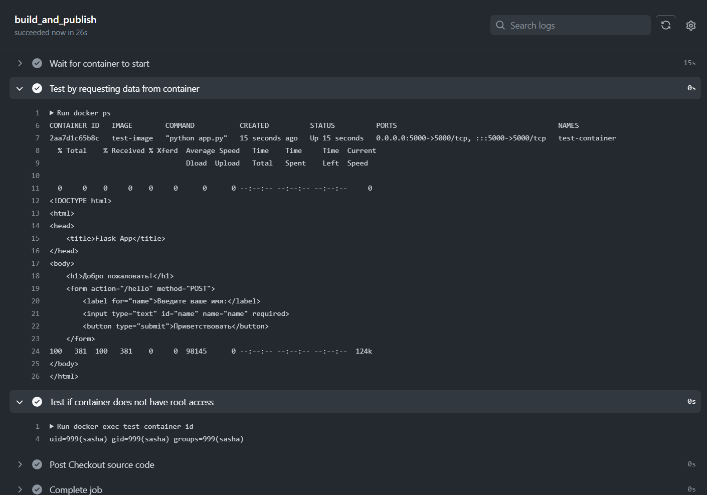
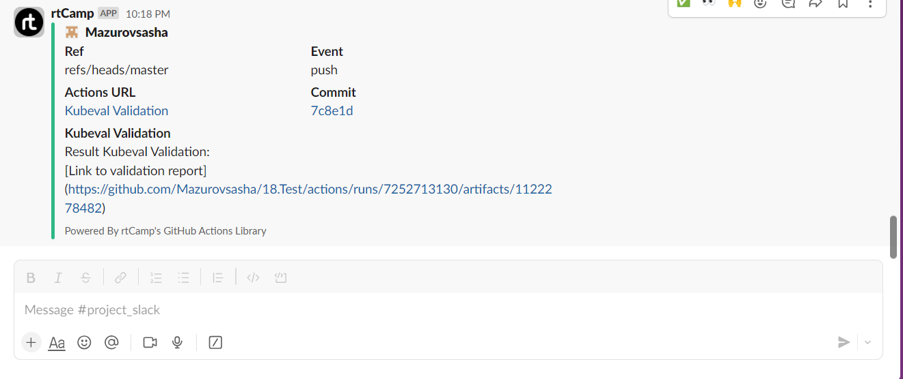

# 18. Testing

## Homework repo [https://github.com/Mazurovsasha/18.Test.git]

## Automate Docker images test by github action:

```yaml
name: Docker test

on:
  push:
    branches:
      - master

jobs:
  build_and_publish:
    runs-on: ubuntu-latest

    steps:
    - name: Checkout source code
      uses: actions/checkout@v3

    - name: Build and deploy Docker image
      run: |
        docker build -t test-image ./app
        docker run -d --name test-container -p 5000:5000 test-image

    - name: Wait for container to start
      run: sleep 15
      
    - name: Test by requesting data from container
      run: |
        docker ps
        docker exec test-container curl http://localhost:5000
              
    - name: Test if container does not have root access
      run: |
        docker exec test-container id
 ```

 

 ## Create CI for testing Kubernetes manifests using kubeval

 ```yaml
 name: Kubeval Validation

on:
  push:
    branches:
      - master

jobs:
  build_and_publish:
    runs-on: ubuntu-latest

    steps:
    - name: Install kubeval
      run: |
        curl -LO https://github.com/instrumenta/kubeval/releases/latest/download/kubeval-linux-amd64.tar.gz
        tar xf kubeval-linux-amd64.tar.gz
        sudo cp kubeval /usr/local/bin

    - name: Checkout values.yaml
      uses: actions/checkout@v2
      with:
        repository: Mazurovsasha/project-helm
        path: .
    
    - name: Kubeval Validation
      id: kubeval
      run: |
        kubeval --strict -d ./project/templates >> report.txt || true

    - name: Upload validation report
      uses: actions/upload-artifact@v4
      id: artifact-upload-step
      with:
        name: validation-report
        path: report.txt

    - name: Output artifact ID
      run:  echo 'Artifact ID is ${{ steps.artifact-upload-step.outputs.artifact-id }}'

    - name: Slack Notification Kubeval Validation
      uses: rtCamp/action-slack-notify@v2
      env:
        SLACK_CHANNEL: 'project_slack'
        SLACK_COLOR: ${{ job.status }}
        SLACK_ICON: https://github.com/rtCamp.png?size=48
        SLACK_MESSAGE: |
          Result Kubeval Validation:
          [Link to validation report](https://github.com/${{ github.repository }}/actions/runs/${{ github.run_id }}/artifacts/${{ steps.artifact-upload-step.outputs.artifact-id }})
        SLACK_TITLE: Kubeval Validation
        SLACK_USERNAME: rtCamp
        SLACK_WEBHOOK: ${{ secrets.SLACK_WEBHOOK }}
      with:
        status: ${{ job.status }}
 ```

 