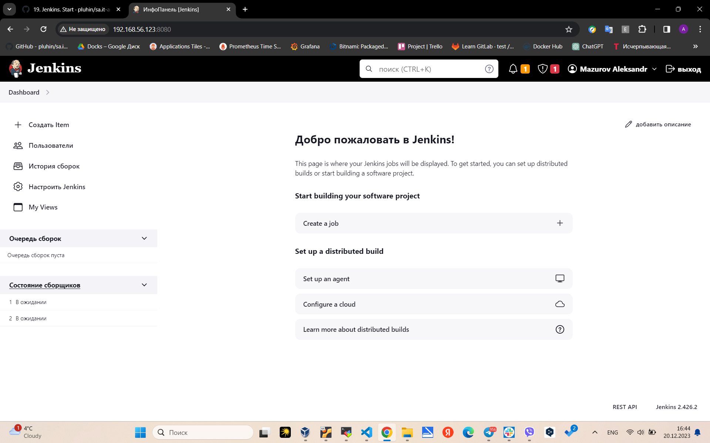
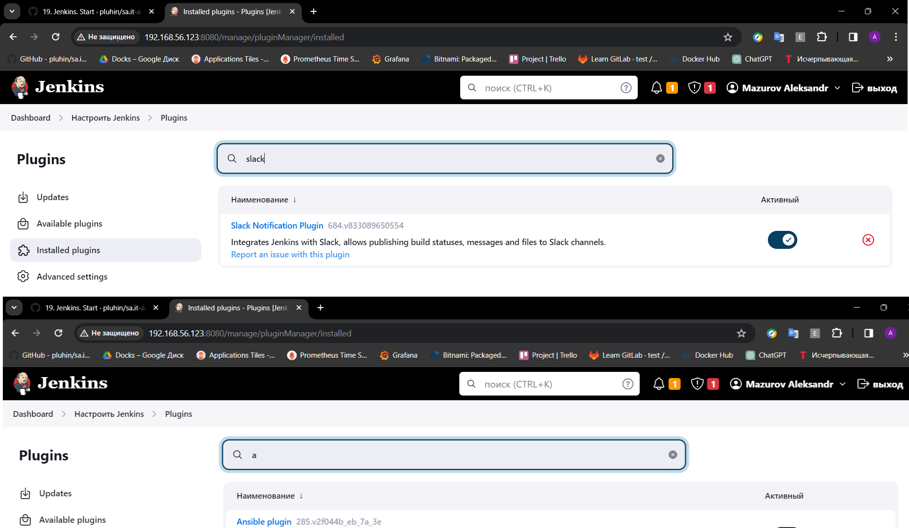
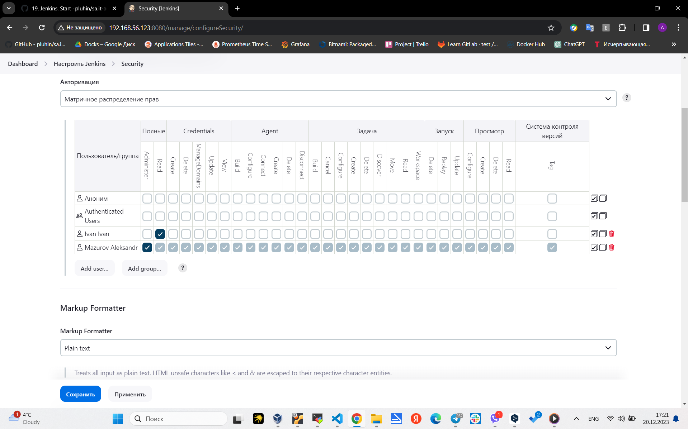
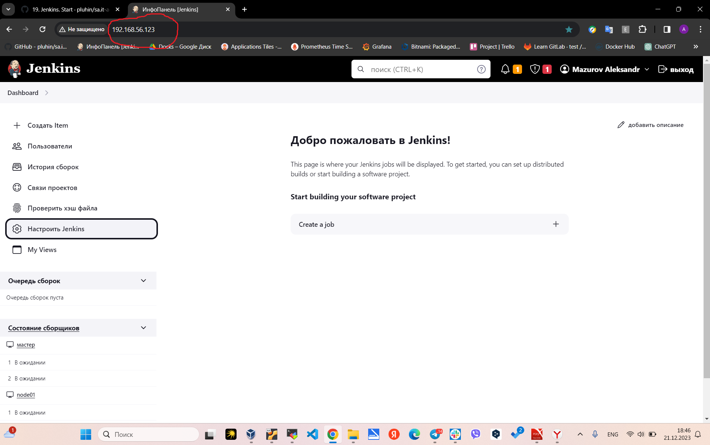
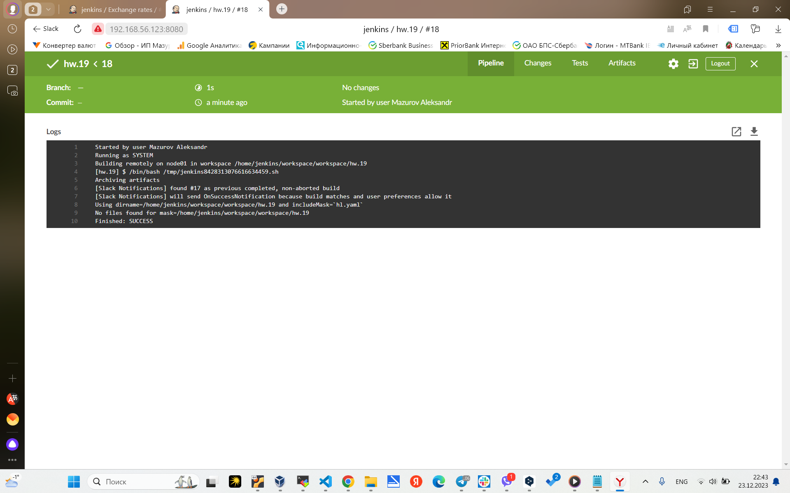
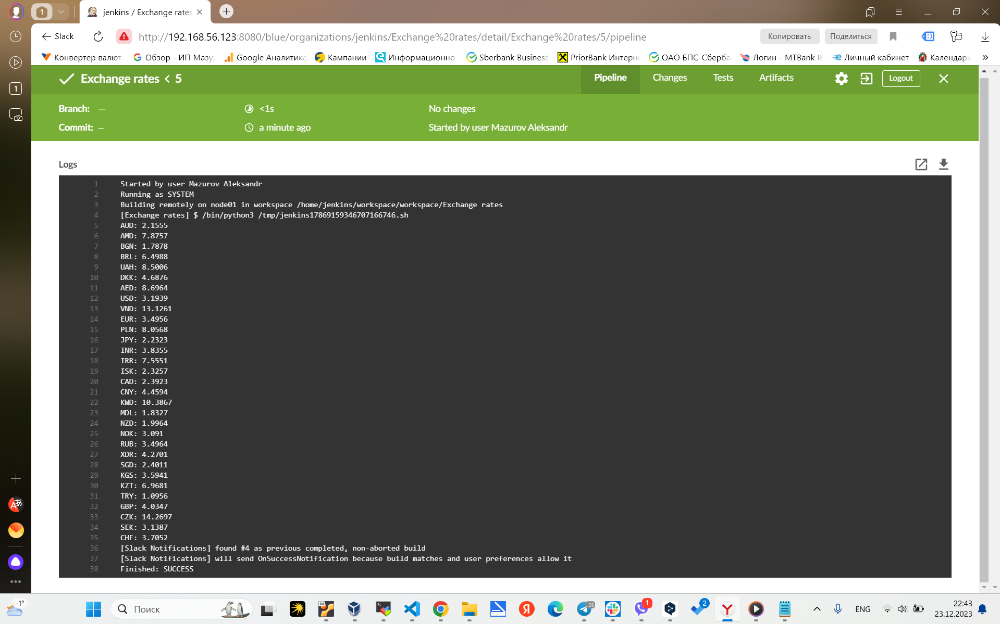

# 19. Jenkins. Start

## Deploy Jenkins inside your home environment

### Install Jenkins



### Install plugins: Ansible, slack notification



### add restricted user to view Jobs, without any changes inside Jobs and Jenkins settings



### Hide Jenkins behind the web server (Nginx, Apache)



```
sudo nano /etc/nginx/sites-available/default
```

Add:
```
server {
    listen 80;

    location / {
        proxy_pass http://localhost:8080;
        proxy_set_header Host $host;
        proxy_set_header X-Real-IP $remote_addr;
        proxy_set_header X-Forwarded-For $proxy_add_x_forwarded_for;
        proxy_set_header X-Forwarded-Proto $scheme;
    }

    location ~ /\. {
        deny all;
    }
}

```

### Create job to run each day and collect data and send as artefacts to the slack

Build periodically 

```
TZ=Europe/Minsk
59 08 * * *
```

### Check if today holiday in Belarus: https://holidayapi.com/countries/by/2023



```bash
#!/bin/bash
RESPONSE=$(curl -s "https://holidayapi.com/v1/holidays?key=10f51a82-ae02-48d0-a850-662733ecb2b1&country=BY&year=2023&date=2023-$(date +%m-%d)")
echo "$RESPONSE" > hl.yaml
```
### Inform about exchange rates for current day (nbrb.by)



```python
#!/bin/python3
import requests

url = "https://api.nbrb.by/exrates/rates?periodicity=0"
response = requests.get(url)
data = response.json()

for currency in data:
    abbreviation = currency["Cur_Abbreviation"]
    official_rate = currency["Cur_OfficialRate"]
    print(f"{abbreviation}: {official_rate}")
```