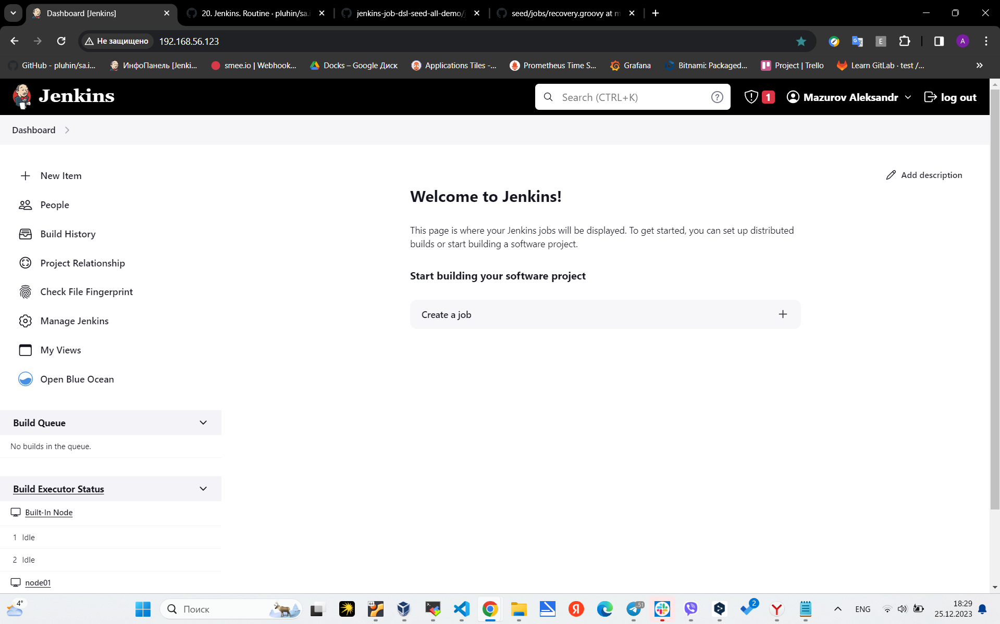
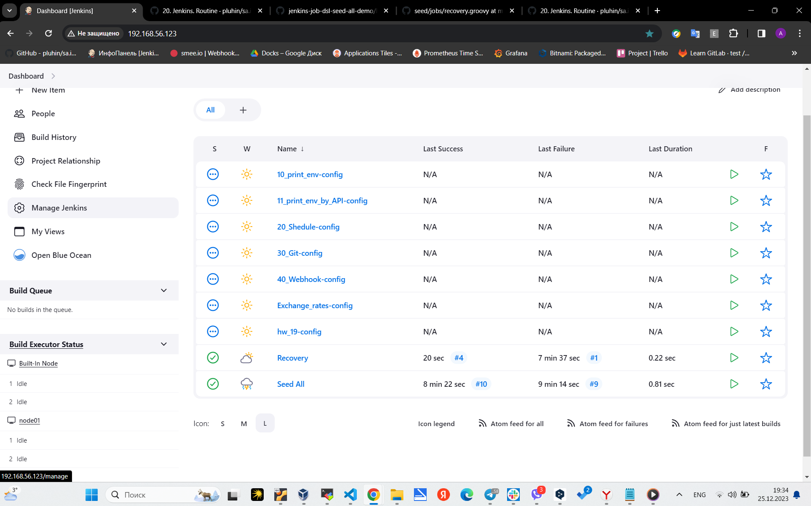
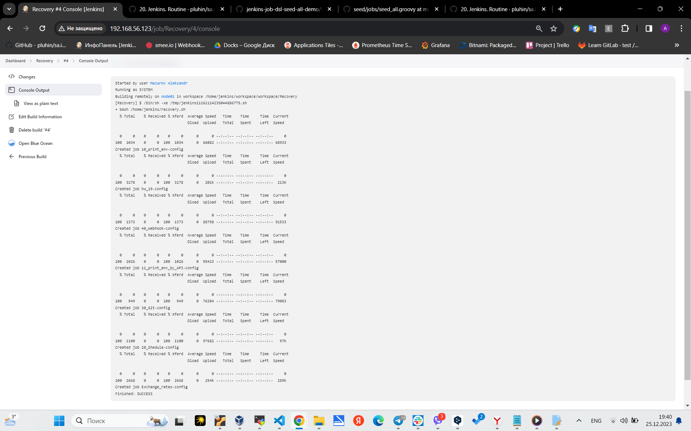

# 20. Jenkins. Routine



seed_all.groovy
```groovy
job('Seed All') {
  scm {
    git ('https://github.com/Mazurovsasha/seed.git')
  }
  steps {
    dsl {
      external('jobs/*.groovy')  
      // default behavior
      // removeAction('IGNORE')      
      removeAction('DELETE')
    }
  }
}
```
recovery.groovy

```groovy
job('Recovery') {
  steps {
    shell('bash /home/jenkins/recovery.sh')
  }
}
```

recovery.sh
```bash
#!/bin/bash

export API_TOKEN="******"
JENKINS_URL=http://192.168.56.123/createItem

find /home/jenkins/workspace/workspace/'Seed All' -type f -name "*.xml" | while read -r file; do
  file_name=$(basename "$file")
  job_name="${file_name%.*}"
  curl -X POST -H "Content-Type:text/xml" -u "${API_TOKEN}" "${JENKINS_URL}?name=${job_name}" --data-binary "@${file}"
  echo "Created job ${job_name}"
done
```


