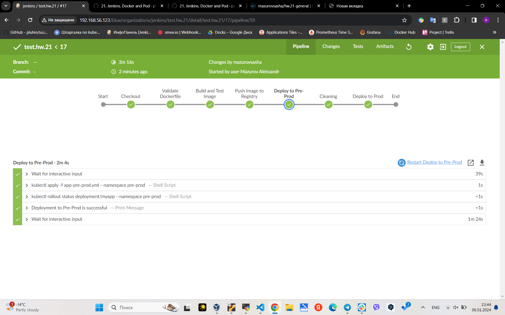
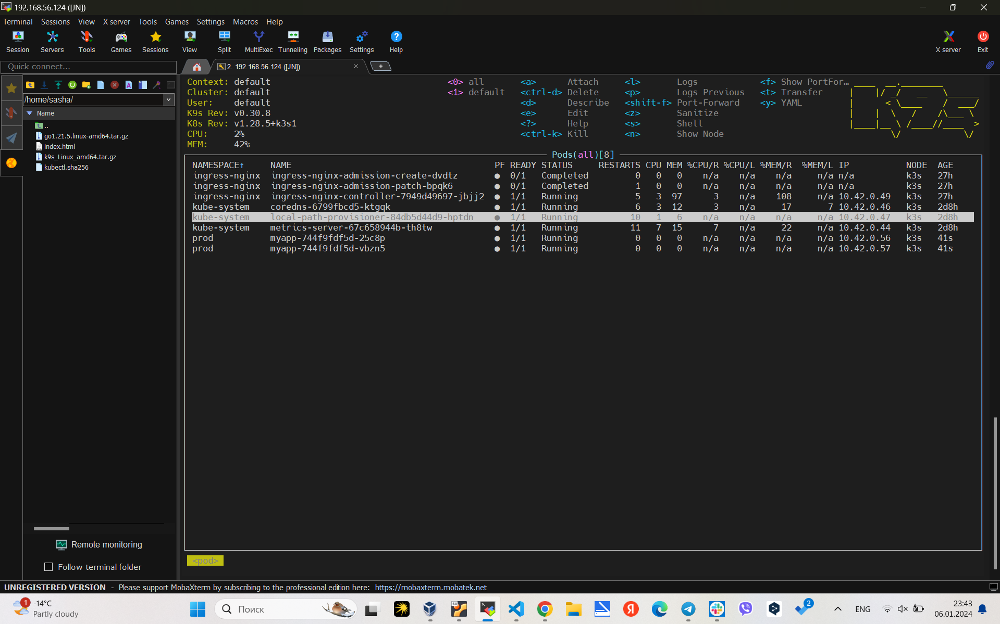
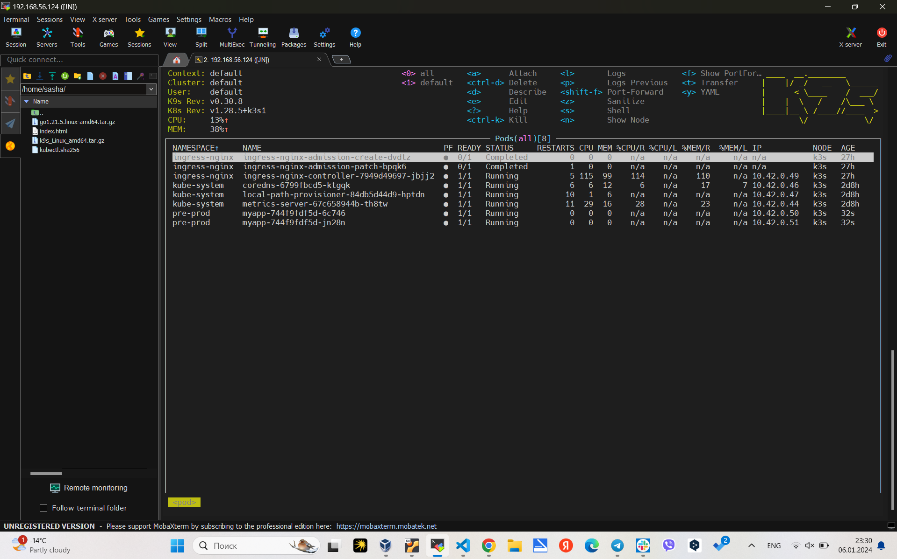

# 21. Jenkins. Docker and Pod

Repository content: [https://github.com/Mazurovsasha/21.Jenkins.Pipeline.git]

Docker hub [https://hub.docker.com/repository/docker/mazurovsasha/hw.21/general]







```
Started by user Mazurov Aleksandr
Obtained Jenkinsfile from git https://github.com/Mazurovsasha/21.Jenkins.Pipeline.git
[Pipeline] Start of Pipeline
[Pipeline] node
Running on node01 in /home/jenkins/workspace/workspace/test.hw.21
[Pipeline] {
[Pipeline] stage
[Pipeline] { (Declarative: Checkout SCM)
[Pipeline] checkout
Selected Git installation does not exist. Using Default
The recommended git tool is: NONE
No credentials specified
Fetching changes from the remote Git repository
 > git rev-parse --resolve-git-dir /home/jenkins/workspace/workspace/test.hw.21/.git # timeout=10
 > git config remote.origin.url https://github.com/Mazurovsasha/21.Jenkins.Pipeline.git # timeout=10
Fetching upstream changes from https://github.com/Mazurovsasha/21.Jenkins.Pipeline.git
 > git --version # timeout=10
 > git --version # 'git version 2.34.1'
 > git fetch --tags --force --progress -- https://github.com/Mazurovsasha/21.Jenkins.Pipeline.git +refs/heads/*:refs/remotes/origin/* # timeout=10
Checking out Revision 1b5d157f5ccd7a5cd7d20d5bebdde23391771efd (refs/remotes/origin/master)
Commit message: "eddit post stage"
 > git rev-parse refs/remotes/origin/master^{commit} # timeout=10
 > git config core.sparsecheckout # timeout=10
 > git checkout -f 1b5d157f5ccd7a5cd7d20d5bebdde23391771efd # timeout=10
 > git rev-list --no-walk eb0377aae3bcdcc9987560bbb0a9280a9e8fd543 # timeout=10
[Pipeline] }
[Pipeline] // stage
[Pipeline] withEnv
[Pipeline] {
[Pipeline] stage
[Pipeline] { (Checkout)
[Pipeline] git
Selected Git installation does not exist. Using Default
The recommended git tool is: NONE
No credentials specified
Fetching changes from the remote Git repository
 > git rev-parse --resolve-git-dir /home/jenkins/workspace/workspace/test.hw.21/.git # timeout=10
 > git config remote.origin.url https://github.com/Mazurovsasha/21.Jenkins.Pipeline.git # timeout=10
Fetching upstream changes from https://github.com/Mazurovsasha/21.Jenkins.Pipeline.git
 > git --version # timeout=10
 > git --version # 'git version 2.34.1'
 > git fetch --tags --force --progress -- https://github.com/Mazurovsasha/21.Jenkins.Pipeline.git +refs/heads/*:refs/remotes/origin/* # timeout=10
Checking out Revision 1b5d157f5ccd7a5cd7d20d5bebdde23391771efd (refs/remotes/origin/master)
Commit message: "eddit post stage"
[Pipeline] }
[Pipeline] // stage
[Pipeline] stage
[Pipeline] { (Validate Dockerfile)
[Pipeline] sh
 > git rev-parse refs/remotes/origin/master^{commit} # timeout=10
 > git config core.sparsecheckout # timeout=10
 > git checkout -f 1b5d157f5ccd7a5cd7d20d5bebdde23391771efd # timeout=10
 > git branch -a -v --no-abbrev # timeout=10
 > git branch -D master # timeout=10
 > git checkout -b master 1b5d157f5ccd7a5cd7d20d5bebdde23391771efd # timeout=10
+ docker run --rm -i hadolint/hadolint
[Pipeline] }
[Pipeline] // stage
[Pipeline] stage
[Pipeline] { (Build and Test Image)
[Pipeline] sh
+ docker build -t mazurovsasha/hw.21:v.1.0.0 ./app
#0 building with "default" instance using docker driver

#1 [internal] load build definition from Dockerfile
#1 transferring dockerfile: 30B 0.0s
#1 transferring dockerfile: 854B 0.0s done
#1 DONE 0.3s

#2 [internal] load .dockerignore
#2 transferring context: 2B done
#2 DONE 0.4s

#3 [internal] load metadata for docker.io/library/python:3.9
#3 ...

#4 [auth] library/python:pull token for registry-1.docker.io
#4 DONE 0.0s

#3 [internal] load metadata for docker.io/library/python:3.9
#3 DONE 1.7s

#5 [1/6] FROM docker.io/library/python:3.9@sha256:30678bb79d9eeaf98ec0ce83cdcd4d6f5301484ef86873a711e69df2ca77e8ac
#5 DONE 0.0s

#6 [internal] load build context
#6 transferring context: 202B done
#6 DONE 0.2s

#7 [4/6] COPY requirements.txt requirements.txt
#7 CACHED

#8 [5/6] RUN pip install --no-cache-dir -r requirements.txt
#8 CACHED

#9 [2/6] WORKDIR /app
#9 CACHED

#10 [3/6] RUN groupadd -r sasha && useradd -r -g sasha sasha
#10 CACHED

#11 [6/6] COPY . .
#11 CACHED

#12 exporting to image
#12 exporting layers done
#12 writing image sha256:8c4dfa0dbba0940490f0ccf686dda5874ea07bc62cd3f557415f4968bd4fc55b 0.1s done
#12 naming to docker.io/mazurovsasha/hw.21:v.1.0.0
#12 naming to docker.io/mazurovsasha/hw.21:v.1.0.0 0.0s done
#12 DONE 0.1s
[Pipeline] sh
+ docker run -d --name test-container3 -p 5000:5000 mazurovsasha/hw.21:v.1.0.0
e6927835e79386f7eb39ad8694a78303b28001f4d0d339ce42085cdc75ef3b90
[Pipeline] sh
+ sleep 15
[Pipeline] timeout
Timeout set to expire in 5 sec
[Pipeline] {
[Pipeline] retry
[Pipeline] {
[Pipeline] script
[Pipeline] {
[Pipeline] sh
+ docker exec test-container3 curl http://localhost:5000
  % Total    % Received % Xferd  Average Speed   Time    Time     Time  Current
                                 Dload  Upload   Total   Spent    Left  Speed

  0     0    0     0    0     0      0      0 --:--:-- --:--:-- --:--:--     0
100   381  100   381    0     0   9791      0 --:--:-- --:--:-- --:--:-- 10026
<!DOCTYPE html>
<html>
<head>
    <title>Flask App</title>
</head>
<body>
    <h1>Добро пожаловать!</h1>
    <form action="/hello" method="POST">
        <label for="name">Введите ваше имя:</label>
        <input type="text" id="name" name="name" required>
        <button type="submit">Приветствовать</button>
    </form>
</body>
</html>
[Pipeline] }
[Pipeline] // script
[Pipeline] }
[Pipeline] // retry
[Pipeline] }
[Pipeline] // timeout
[Pipeline] sh
+ docker ps -a -q -f ancestor=mazurovsasha/hw.21:v.1.0.0
+ docker stop e6927835e793
e6927835e793
[Pipeline] sh
+ docker ps -a -q -f ancestor=mazurovsasha/hw.21:v.1.0.0
+ docker rm e6927835e793
e6927835e793
[Pipeline] }
[Pipeline] // stage
[Pipeline] stage
[Pipeline] { (Push Image to Registry)
[Pipeline] script
[Pipeline] {
[Pipeline] withCredentials
Masking supported pattern matches of $REGISTRY_USERNAME or $REGISTRY_PASSWORD
[Pipeline] {
[Pipeline] sh
+ docker login -u **** -p ****
WARNING! Using --password via the CLI is insecure. Use --password-stdin.
WARNING! Your password will be stored unencrypted in /home/jenkins/.docker/config.json.
Configure a credential helper to remove this warning. See
https://docs.docker.com/engine/reference/commandline/login/#credentials-store

Login Succeeded
[Pipeline] sh
+ docker push ****/hw.21:v.1.0.0
The push refers to repository [docker.io/****/hw.21]
b26f7b4fabac: Preparing
0d31cf98f3f6: Preparing
4eee120024ae: Preparing
bde54cf64f93: Preparing
667e89bce8d5: Preparing
6b453b473b14: Preparing
90c3fd7d657b: Preparing
6fb1aacdf632: Preparing
a0814d1f5387: Preparing
ac7146fb6cf5: Preparing
209de9f22f2f: Preparing
777ac9f3cbb2: Preparing
ae134c61b154: Preparing
6b453b473b14: Waiting
90c3fd7d657b: Waiting
6fb1aacdf632: Waiting
a0814d1f5387: Waiting
ac7146fb6cf5: Waiting
209de9f22f2f: Waiting
777ac9f3cbb2: Waiting
ae134c61b154: Waiting
667e89bce8d5: Layer already exists
b26f7b4fabac: Layer already exists
4eee120024ae: Layer already exists
bde54cf64f93: Layer already exists
0d31cf98f3f6: Layer already exists
a0814d1f5387: Layer already exists
6b453b473b14: Layer already exists
ac7146fb6cf5: Layer already exists
90c3fd7d657b: Layer already exists
6fb1aacdf632: Layer already exists
209de9f22f2f: Layer already exists
ae134c61b154: Layer already exists
777ac9f3cbb2: Layer already exists
v.1.0.0: digest: sha256:0ed4d5354c4fe157f8e67d5b784c91c5299cf773efff562a9d3f15ad71e55192 size: 3047
[Pipeline] }
[Pipeline] // withCredentials
[Pipeline] }
[Pipeline] // script
[Pipeline] }
[Pipeline] // stage
[Pipeline] stage
[Pipeline] { (Deploy to Pre-Prod)
[Pipeline] input
Approve Deployment to Pre-Prod
Proceed or Abort
Approved by Mazurov Aleksandr
[Pipeline] sh
+ kubectl apply -f app-pre-prod.yml --namespace pre-prod
namespace/pre-prod unchanged
deployment.apps/myapp created
ingress.networking.k8s.io/myapp-ingress configured
service/myapp unchanged
[Pipeline] timeout
Timeout set to expire in 5 min 0 sec
[Pipeline] {
[Pipeline] script
[Pipeline] {
[Pipeline] sh
+ kubectl rollout status deployment/myapp --namespace pre-prod
Waiting for deployment "myapp" rollout to finish: 0 of 2 updated replicas are available...
Waiting for deployment "myapp" rollout to finish: 1 of 2 updated replicas are available...
deployment "myapp" successfully rolled out
[Pipeline] echo
Deployment to Pre-Prod is successful
[Pipeline] input
Approve Deployment to Prod
Proceed or Abort
Approved by Mazurov Aleksandr
[Pipeline] }
[Pipeline] // script
[Pipeline] }
[Pipeline] // timeout
[Pipeline] }
[Pipeline] // stage
[Pipeline] stage
[Pipeline] { (Cleaning)
[Pipeline] sh
+ kubectl delete deployment myapp --namespace pre-prod
deployment.apps "myapp" deleted
[Pipeline] }
[Pipeline] // stage
[Pipeline] stage
[Pipeline] { (Deploy to Prod)
[Pipeline] sh
+ kubectl apply -f app-prod.yml --namespace prod
namespace/prod unchanged
deployment.apps/myapp created
ingress.networking.k8s.io/myapp-ingress created
service/myapp unchanged
[Pipeline] timeout
Timeout set to expire in 5 min 0 sec
[Pipeline] {
[Pipeline] script
[Pipeline] {
[Pipeline] sh
+ kubectl rollout status deployment/myapp --namespace prod
Waiting for deployment "myapp" rollout to finish: 0 of 2 updated replicas are available...
Waiting for deployment "myapp" rollout to finish: 1 of 2 updated replicas are available...
deployment "myapp" successfully rolled out
[Pipeline] }
[Pipeline] // script
[Pipeline] }
[Pipeline] // timeout
[Pipeline] }
[Pipeline] // stage
[Pipeline] stage
[Pipeline] { (Declarative: Post Actions)
[Pipeline] slackSend
Slack Send Pipeline step running, values are - baseUrl: <empty>, teamDomain: https://brosersstorage.slack.com, channel: jenkins, color: #00FF00, botUser: false, tokenCredentialId: slack-token, notifyCommitters: false, iconEmoji: <empty>, username: <empty>, timestamp: <empty>
ERROR: Slack notification failed. See Jenkins logs for details.
[Pipeline] }
[Pipeline] // stage
[Pipeline] }
[Pipeline] // withEnv
[Pipeline] }
[Pipeline] // node
[Pipeline] End of Pipeline
Finished: SUCCESS
```