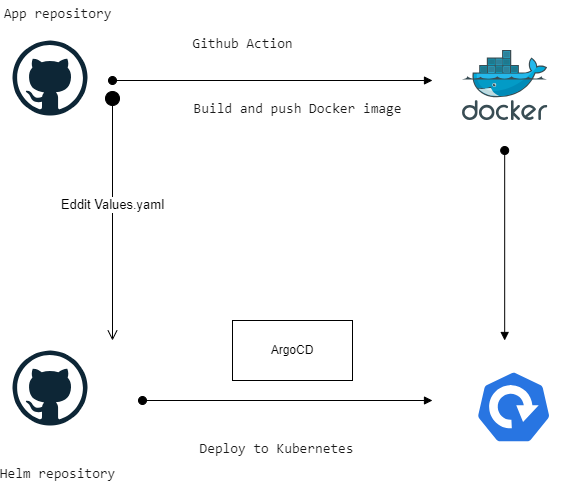

## Aleksandr Mazurov's project. Group number: m-sa2-25-23

**Project's reporter:** Aleksandr Mazurov

**Group number:** m-sa2-25-23

## Description of application for deployment

+ Name of application: **myproject**

+ The programming language for this application is **Node.js**

+ DB used - **PostgreSQL** 

+ App repository [https://github.com/Mazurovsasha/project.git]
  
+ Helm repository [https://github.com/Mazurovsasha/project-helm.git]

+ Docker repository [https://hub.docker.com/repository/docker/mazurovsasha/project/general]

+ Project [http://myproject.k8s-7.sa/]

## Pipeline. High Level Design

## Technologies which were used in project

The application is written in Node.js DB is deployed on a separate host. The DB password has been placed in a secret.

Two repositories on github have been created to organize the pipeline ci/cd. One repository stores the application code. The second repository contains Helm Chart. Deployment is organized using ArgoCD. 

The CI part of the project is organized using GitHub Action. 

The trigger to start the action is a push to the master branch of the repository with the application code. 

The first part of the action builds a Docker image of the application.

The Docker image tag is the version number of the application. The Action gets it from the package.json file. 

Next, the Docker image is pushed to the repository on the Docker hub.

The second part of the Action is changing the "taggg" variable in the values.yaml file and pushing those changes to the repository with Helm Chart. Connection to the repository with Helm Chart is organized via ssh keys.

After the Update values.yaml step, the Helm Chart is checked using Helm lint

The final part of the Action is sending a message to slack

CD part of the project is realized using ArgoCD. 

ArgoCD monitors the repository with Helm Chart. SYNC POLICY - AUTO-SYNC.

Deployment settings:

+ replicaCount: 2

+ rollingUpdate:
      maxSurge: 1
      maxUnavailable: 0

Switching between versions is organized by ArgoCD tools. Notification of the results is sent to slack.