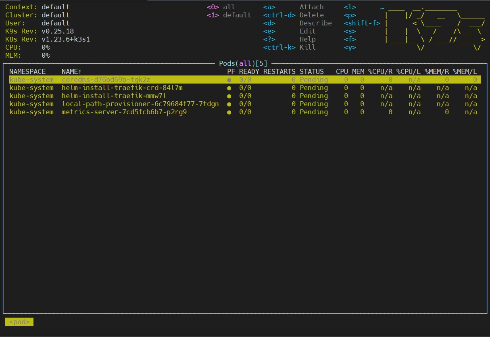
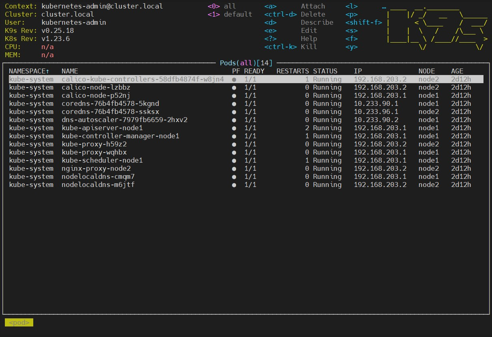

## Kubernetes installation

### Merge configs
``` bash
╭─vagrant@Ubuntu20 ~/.kube
╰─$ kubectl --kubeconfig=configk8s config get-contexts
CURRENT   NAME                             CLUSTER         AUTHINFO           NAMESPACE
*         kubernetes-admin@cluster.local   cluster.local   kubernetes-admin

╭─vagrant@Ubuntu20 ~/.kube
╰─$ kubectl --kubeconfig=configk3s config get-contexts
CURRENT   NAME      CLUSTER   AUTHINFO   NAMESPACE
*         default   default   default

╭─vagrant@Ubuntu20 ~/.kube
╰─$ KUBECONFIG=configk3s:configk8s kubectl config view --merge --flatten > config

╭─vagrant@Ubuntu20 ~/.kube
╰─$ kubectl config view                          
apiVersion: v1
clusters:
- cluster:
    certificate-authority-data: DATA+OMITTED
    server: https://127.0.0.1:6444
  name: cluster.local
- cluster:
    certificate-authority-data: DATA+OMITTED
    server: https://127.0.0.1:6443
  name: default
contexts:
- context:
    cluster: default
    user: default
  name: default
- context:
    cluster: cluster.local
    user: kubernetes-admin
  name: kubernetes-admin@cluster.local
current-context: kubernetes-admin@cluster.local
kind: Config
preferences: {}
users:
- name: default
  user:
    client-certificate-data: REDACTED
    client-key-data: REDACTED
- name: kubernetes-admin
  user:
    client-certificate-data: REDACTED
    client-key-data: REDACTED
	
╭─vagrant@Ubuntu20 ~/.kube
╰─$ kubectl config get-contexts
CURRENT   NAME                             CLUSTER         AUTHINFO           NAMESPACE
          default                          default         default
*         kubernetes-admin@cluster.local   cluster.local   kubernetes-admin
```
---
### Screenshots

