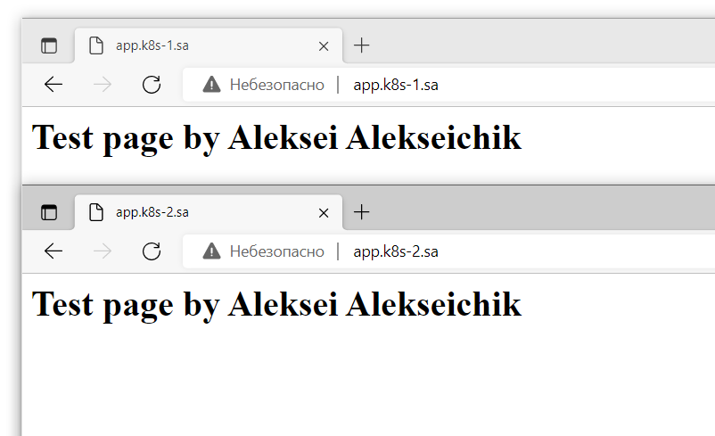
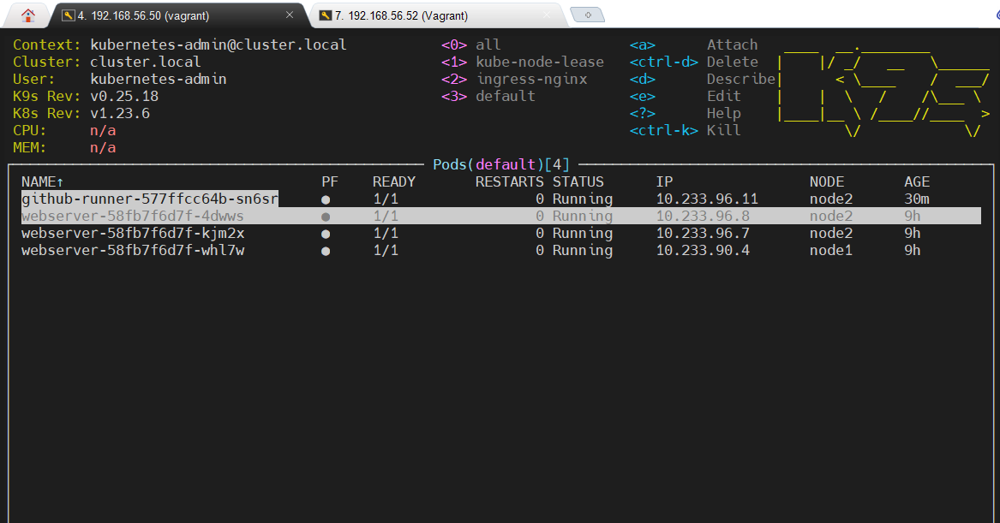
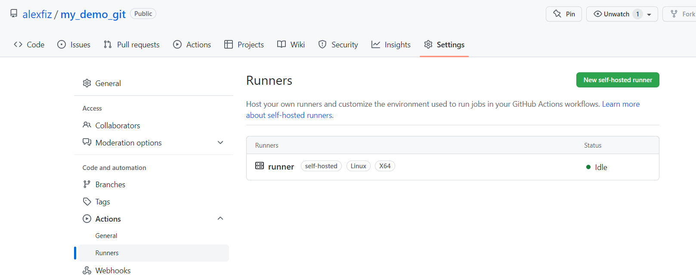
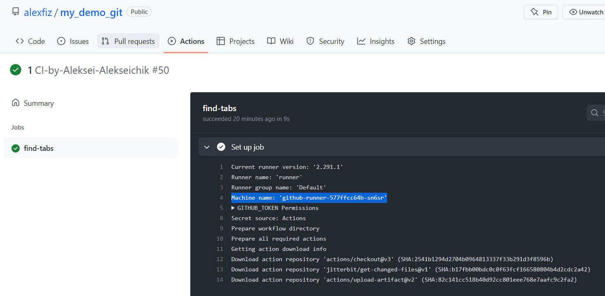

## 12.K8s.first_deployment
---

---
Additional task:

``` yaml
apiVersion: apps/v1
kind: Deployment
metadata:
  name: github-runner
  labels:
    app: github-runner
spec:
  replicas: 1
  selector:
    matchLabels:
      app: github-runner
  template:
    metadata:
      labels:
        app: github-runner
    spec:
      containers:
      - name: github-runner
        image: sanderknape/github-runner:latest
        env:
        - name: GITHUB_OWNER
          value: alexeifiz
        - name: GITHUB_REPOSITORY
          value: my_demo_git
        - name: GITHUB_PAT 
          valueFrom:
            secretKeyRef:
              name: mysecret
              key: key
```
---
### Pod with github runner

### Runner in my repo

### Execution action in my repo

