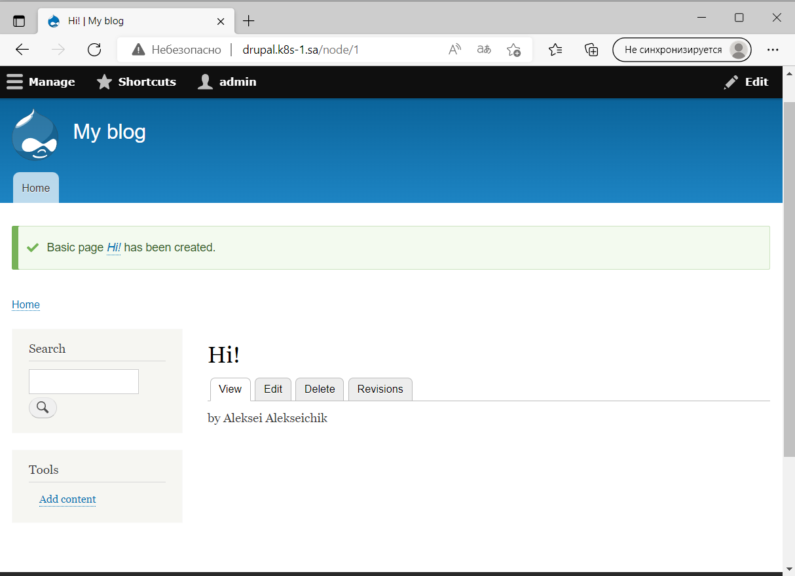
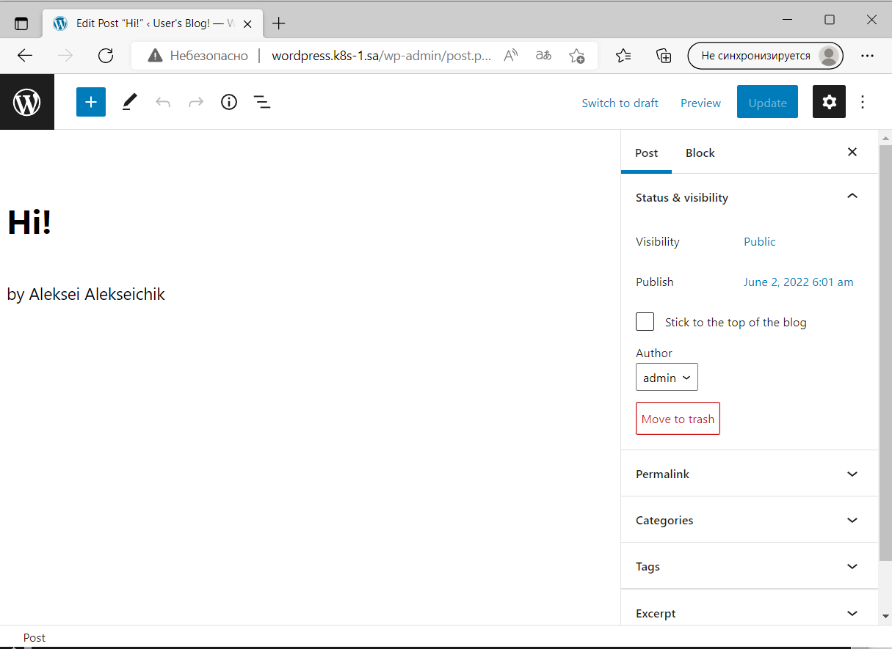

## 13.K8s.Helm
---
### Preparing
``` bash
 helm repo add bitnami https://charts.bitnami.com/bitnami
 helm install nfs-subdir-external-provisioner nfs-subdir-external-provisioner/nfs-subdir-external-provisioner \
    --set nfs.server=192.168.37.105 \
    --set nfs.path=/mnt/IT-Academy/nfs-data/sa2-20-22/Aleksei_A/
 vim wp_ingress.yaml
 kubectl apply -f wp_ingress.yaml
 vim dp_ingress.yaml
 kubectl apply -f dp_ingress.yaml
 ```
 ### Wordpress instalation
 ``` bash
helm install sa-wordpress --set global.storageClass=nfs-client,wordpressUsername=admin bitnami/wordpress
 ```
 ### Drupal instalation
 ``` bash
helm install sa-drupal --set global.storageClass=nfs-client,drupalUsername=admin,drupalPassword=qwerty bitnami/drupal
 ```
 ---
 
 ---
 