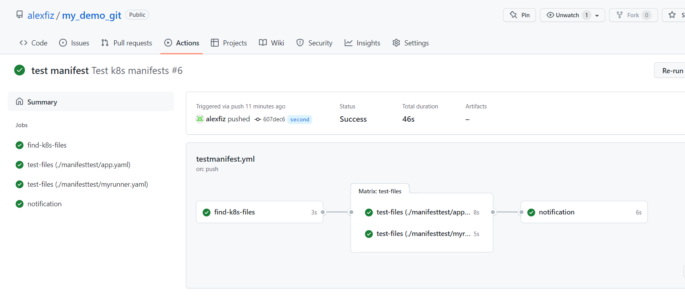
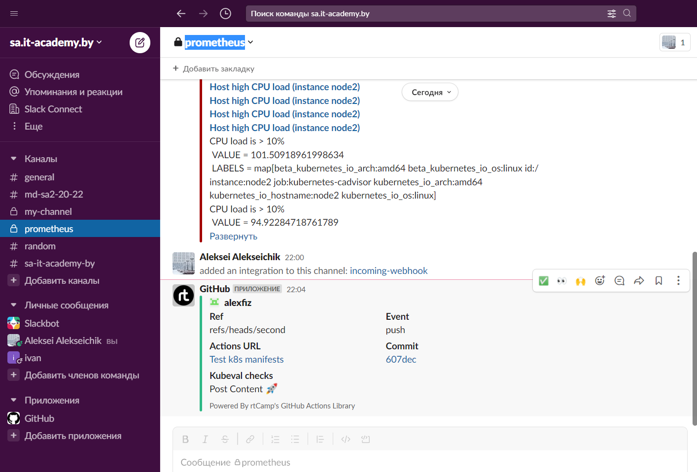

## 17.Testing
---
### Molecule test
```bash
╭─vagrant@Ubuntu20 ~/testing/web/roles/test
╰─$ molecule test
INFO     default scenario test matrix: dependency, lint, cleanup, destroy, syntax, create, prepare, converge, idempotence, side_effect, verify, cleanup, destroy
INFO     Performing prerun with role_name_check=0...
INFO     Set ANSIBLE_LIBRARY=/home/vagrant/.cache/ansible-compat/9f86d0/modules:/home/vagrant/.ansible/plugins/modules:/usr/share/ansible/plugins/modules
INFO     Set ANSIBLE_COLLECTIONS_PATH=/home/vagrant/.cache/ansible-compat/9f86d0/collections:/home/vagrant/.ansible/collections:/usr/share/ansible/collections
INFO     Set ANSIBLE_ROLES_PATH=/home/vagrant/.cache/ansible-compat/9f86d0/roles:/home/vagrant/.ansible/roles:/usr/share/ansible/roles:/etc/ansible/roles
INFO     Running default > dependency
WARNING  Skipping, missing the requirements file.
WARNING  Skipping, missing the requirements file.
INFO     Running default > lint
INFO     Lint is disabled.
INFO     Running default > cleanup
WARNING  Skipping, cleanup playbook not configured.
INFO     Running default > destroy
INFO     Sanity checks: 'docker'

PLAY [Destroy] *****************************************************************

TASK [Destroy molecule instance(s)] ********************************************
changed: [localhost] => (item=instance1)
changed: [localhost] => (item=instance2)

TASK [Wait for instance(s) deletion to complete] *******************************
ok: [localhost] => (item=instance1)
ok: [localhost] => (item=instance2)

TASK [Delete docker networks(s)] ***********************************************

PLAY RECAP *********************************************************************
localhost                  : ok=2    changed=1    unreachable=0    failed=0    skipped=1    rescued=0    ignored=0

INFO     Running default > syntax

playbook: /home/vagrant/testing/web/roles/test/molecule/default/converge.yml
INFO     Running default > create

PLAY [Create] ******************************************************************

TASK [Log into a Docker registry] **********************************************
skipping: [localhost] => (item=None)
skipping: [localhost] => (item=None)
skipping: [localhost]

TASK [Check presence of custom Dockerfiles] ************************************
ok: [localhost] => (item={'image': 'quay.io/centos/centos:stream8', 'name': 'instance1', 'pre_build_image': True})
ok: [localhost] => (item={'image': 'bitnami/python:latest', 'name': 'instance2', 'pre_build_image': True})

TASK [Create Dockerfiles from image names] *************************************
skipping: [localhost] => (item={'image': 'quay.io/centos/centos:stream8', 'name': 'instance1', 'pre_build_image': True})
skipping: [localhost] => (item={'image': 'bitnami/python:latest', 'name': 'instance2', 'pre_build_image': True})

TASK [Discover local Docker images] ********************************************
ok: [localhost] => (item={'changed': False, 'skipped': True, 'skip_reason': 'Conditional result was False', 'item': {'image': 'quay.io/centos/centos:stream8', 'name': 'instance1', 'pre_build_image': True}, 'ansible_loop_var': 'item', 'i': 0, 'ansible_index_var': 'i'})
ok: [localhost] => (item={'changed': False, 'skipped': True, 'skip_reason': 'Conditional result was False', 'item': {'image': 'bitnami/python:latest', 'name': 'instance2', 'pre_build_image': True}, 'ansible_loop_var': 'item', 'i': 1, 'ansible_index_var': 'i'})

TASK [Build an Ansible compatible image (new)] *********************************
skipping: [localhost] => (item=molecule_local/quay.io/centos/centos:stream8)
skipping: [localhost] => (item=molecule_local/bitnami/python:latest)

TASK [Create docker network(s)] ************************************************

TASK [Determine the CMD directives] ********************************************
ok: [localhost] => (item={'image': 'quay.io/centos/centos:stream8', 'name': 'instance1', 'pre_build_image': True})
ok: [localhost] => (item={'image': 'bitnami/python:latest', 'name': 'instance2', 'pre_build_image': True})

TASK [Create molecule instance(s)] *********************************************
changed: [localhost] => (item=instance1)
changed: [localhost] => (item=instance2)

TASK [Wait for instance(s) creation to complete] *******************************
changed: [localhost] => (item={'failed': 0, 'started': 1, 'finished': 0, 'ansible_job_id': '894062054506.27726', 'results_file': '/home/vagrant/.ansible_async/894062054506.27726', 'changed': True, 'item': {'image': 'quay.io/centos/centos:stream8', 'name': 'instance1', 'pre_build_image': True}, 'ansible_loop_var': 'item'})
FAILED - RETRYING: [localhost]: Wait for instance(s) creation to complete (300 retries left).
changed: [localhost] => (item={'failed': 0, 'started': 1, 'finished': 0, 'ansible_job_id': '526087258176.27754', 'results_file': '/home/vagrant/.ansible_async/526087258176.27754', 'changed': True, 'item': {'image': 'bitnami/python:latest', 'name': 'instance2', 'pre_build_image': True}, 'ansible_loop_var': 'item'})

PLAY RECAP *********************************************************************
localhost                  : ok=5    changed=2    unreachable=0    failed=0    skipped=4    rescued=0    ignored=0

INFO     Running default > prepare
WARNING  Skipping, prepare playbook not configured.
INFO     Running default > converge

PLAY [Converge] ****************************************************************

TASK [Gathering Facts] *********************************************************
ok: [instance1]
ok: [instance2]

TASK [Include test] ************************************************************

TASK [test : OS/version] *******************************************************
ok: [instance1] => {
    "msg": [
        "OS/version: CentOS/8"
    ]
}
ok: [instance2] => {
    "msg": [
        "OS/version: Debian/11"
    ]
}

TASK [test : Mount point/capacity/used] ****************************************
ok: [instance1] => (item={'mount': '/etc/resolv.conf', 'device': '/dev/mapper/ubuntu--vg-ubuntu--lv', 'fstype': 'ext4', 'options': 'rw,relatime,bind', 'size_total': 33157857280, 'size_available': 21601931264, 'block_size': 4096, 'block_total': 8095180, 'block_available': 5273909, 'block_used': 2821271, 'inode_total': 2064384, 'inode_available': 1828205, 'inode_used': 236179, 'uuid': 'N/A'}) => {
    "msg": [
        "Mountpoint/capacity/used: '/etc/resolv.conf'/30GB/10GB"
    ]
}
ok: [instance1] => (item={'mount': '/etc/hostname', 'device': '/dev/mapper/ubuntu--vg-ubuntu--lv', 'fstype': 'ext4', 'options': 'rw,relatime,bind', 'size_total': 33157857280, 'size_available': 21601931264, 'block_size': 4096, 'block_total': 8095180, 'block_available': 5273909, 'block_used': 2821271, 'inode_total': 2064384, 'inode_available': 1828205, 'inode_used': 236179, 'uuid': 'N/A'}) => {
    "msg": [
        "Mountpoint/capacity/used: '/etc/hostname'/30GB/10GB"
    ]
}
ok: [instance2] => (item={'mount': '/etc/resolv.conf', 'device': '/dev/mapper/ubuntu--vg-ubuntu--lv', 'fstype': 'ext4', 'options': 'rw,relatime,bind', 'size_total': 33157857280, 'size_available': 21601931264, 'block_size': 4096, 'block_total': 8095180, 'block_available': 5273909, 'block_used': 2821271, 'inode_total': 2064384, 'inode_available': 1828205, 'inode_used': 236179, 'uuid': 'N/A'}) => {
    "msg": [
        "Mountpoint/capacity/used: '/etc/resolv.conf'/30GB/10GB"
    ]
}
ok: [instance1] => (item={'mount': '/etc/hosts', 'device': '/dev/mapper/ubuntu--vg-ubuntu--lv', 'fstype': 'ext4', 'options': 'rw,relatime,bind', 'size_total': 33157857280, 'size_available': 21601931264, 'block_size': 4096, 'block_total': 8095180, 'block_available': 5273909, 'block_used': 2821271, 'inode_total': 2064384, 'inode_available': 1828205, 'inode_used': 236179, 'uuid': 'N/A'}) => {
    "msg": [
        "Mountpoint/capacity/used: '/etc/hosts'/30GB/10GB"
    ]
}
ok: [instance2] => (item={'mount': '/etc/hostname', 'device': '/dev/mapper/ubuntu--vg-ubuntu--lv', 'fstype': 'ext4', 'options': 'rw,relatime,bind', 'size_total': 33157857280, 'size_available': 21601931264, 'block_size': 4096, 'block_total': 8095180, 'block_available': 5273909, 'block_used': 2821271, 'inode_total': 2064384, 'inode_available': 1828205, 'inode_used': 236179, 'uuid': 'N/A'}) => {
    "msg": [
        "Mountpoint/capacity/used: '/etc/hostname'/30GB/10GB"
    ]
}
ok: [instance2] => (item={'mount': '/etc/hosts', 'device': '/dev/mapper/ubuntu--vg-ubuntu--lv', 'fstype': 'ext4', 'options': 'rw,relatime,bind', 'size_total': 33157857280, 'size_available': 21601931264, 'block_size': 4096, 'block_total': 8095180, 'block_available': 5273909, 'block_used': 2821271, 'inode_total': 2064384, 'inode_available': 1828205, 'inode_used': 236179, 'uuid': 'N/A'}) => {
    "msg": [
        "Mountpoint/capacity/used: '/etc/hosts'/30GB/10GB"
    ]
}

TASK [test : RAM/capacity/free] ************************************************
ok: [instance1] => {
    "msg": [
        "RAM capacity/free: 3936MB/1187MB"
    ]
}
ok: [instance2] => {
    "msg": [
        "RAM capacity/free: 3936MB/1187MB"
    ]
}

PLAY RECAP *********************************************************************
instance1                  : ok=4    changed=0    unreachable=0    failed=0    skipped=0    rescued=0    ignored=0
instance2                  : ok=4    changed=0    unreachable=0    failed=0    skipped=0    rescued=0    ignored=0

INFO     Running default > idempotence

PLAY [Converge] ****************************************************************

TASK [Gathering Facts] *********************************************************
ok: [instance1]
ok: [instance2]

TASK [Include test] ************************************************************

TASK [test : OS/version] *******************************************************
ok: [instance1] => {
    "msg": [
        "OS/version: CentOS/8"
    ]
}
ok: [instance2] => {
    "msg": [
        "OS/version: Debian/11"
    ]
}

TASK [test : Mount point/capacity/used] ****************************************
ok: [instance1] => (item={'mount': '/etc/resolv.conf', 'device': '/dev/mapper/ubuntu--vg-ubuntu--lv', 'fstype': 'ext4', 'options': 'rw,relatime,bind', 'size_total': 33157857280, 'size_available': 21601927168, 'block_size': 4096, 'block_total': 8095180, 'block_available': 5273908, 'block_used': 2821272, 'inode_total': 2064384, 'inode_available': 1828205, 'inode_used': 236179, 'uuid': 'N/A'}) => {
    "msg": [
        "Mountpoint/capacity/used: '/etc/resolv.conf'/30GB/10GB"
    ]
}
ok: [instance1] => (item={'mount': '/etc/hostname', 'device': '/dev/mapper/ubuntu--vg-ubuntu--lv', 'fstype': 'ext4', 'options': 'rw,relatime,bind', 'size_total': 33157857280, 'size_available': 21601927168, 'block_size': 4096, 'block_total': 8095180, 'block_available': 5273908, 'block_used': 2821272, 'inode_total': 2064384, 'inode_available': 1828205, 'inode_used': 236179, 'uuid': 'N/A'}) => {
    "msg": [
        "Mountpoint/capacity/used: '/etc/hostname'/30GB/10GB"
    ]
}
ok: [instance1] => (item={'mount': '/etc/hosts', 'device': '/dev/mapper/ubuntu--vg-ubuntu--lv', 'fstype': 'ext4', 'options': 'rw,relatime,bind', 'size_total': 33157857280, 'size_available': 21601927168, 'block_size': 4096, 'block_total': 8095180, 'block_available': 5273908, 'block_used': 2821272, 'inode_total': 2064384, 'inode_available': 1828205, 'inode_used': 236179, 'uuid': 'N/A'}) => {
    "msg": [
        "Mountpoint/capacity/used: '/etc/hosts'/30GB/10GB"
    ]
}
ok: [instance2] => (item={'mount': '/etc/resolv.conf', 'device': '/dev/mapper/ubuntu--vg-ubuntu--lv', 'fstype': 'ext4', 'options': 'rw,relatime,bind', 'size_total': 33157857280, 'size_available': 21602447360, 'block_size': 4096, 'block_total': 8095180, 'block_available': 5274035, 'block_used': 2821145, 'inode_total': 2064384, 'inode_available': 1828209, 'inode_used': 236175, 'uuid': 'N/A'}) => {
    "msg": [
        "Mountpoint/capacity/used: '/etc/resolv.conf'/30GB/10GB"
    ]
}
ok: [instance2] => (item={'mount': '/etc/hostname', 'device': '/dev/mapper/ubuntu--vg-ubuntu--lv', 'fstype': 'ext4', 'options': 'rw,relatime,bind', 'size_total': 33157857280, 'size_available': 21602447360, 'block_size': 4096, 'block_total': 8095180, 'block_available': 5274035, 'block_used': 2821145, 'inode_total': 2064384, 'inode_available': 1828209, 'inode_used': 236175, 'uuid': 'N/A'}) => {
    "msg": [
        "Mountpoint/capacity/used: '/etc/hostname'/30GB/10GB"
    ]
}
ok: [instance2] => (item={'mount': '/etc/hosts', 'device': '/dev/mapper/ubuntu--vg-ubuntu--lv', 'fstype': 'ext4', 'options': 'rw,relatime,bind', 'size_total': 33157857280, 'size_available': 21602447360, 'block_size': 4096, 'block_total': 8095180, 'block_available': 5274035, 'block_used': 2821145, 'inode_total': 2064384, 'inode_available': 1828209, 'inode_used': 236175, 'uuid': 'N/A'}) => {
    "msg": [
        "Mountpoint/capacity/used: '/etc/hosts'/30GB/10GB"
    ]
}

TASK [test : RAM/capacity/free] ************************************************
ok: [instance1] => {
    "msg": [
        "RAM capacity/free: 3936MB/1189MB"
    ]
}
ok: [instance2] => {
    "msg": [
        "RAM capacity/free: 3936MB/1241MB"
    ]
}

PLAY RECAP *********************************************************************
instance1                  : ok=4    changed=0    unreachable=0    failed=0    skipped=0    rescued=0    ignored=0
instance2                  : ok=4    changed=0    unreachable=0    failed=0    skipped=0    rescued=0    ignored=0

INFO     Idempotence completed successfully.
INFO     Running default > side_effect
WARNING  Skipping, side effect playbook not configured.
INFO     Running default > verify
INFO     Running Ansible Verifier

PLAY [Verify] ******************************************************************

TASK [Example assertion] *******************************************************
ok: [instance1] => {
    "changed": false,
    "msg": "All assertions passed"
}
ok: [instance2] => {
    "changed": false,
    "msg": "All assertions passed"
}

PLAY RECAP *********************************************************************
instance1                  : ok=1    changed=0    unreachable=0    failed=0    skipped=0    rescued=0    ignored=0
instance2                  : ok=1    changed=0    unreachable=0    failed=0    skipped=0    rescued=0    ignored=0

INFO     Verifier completed successfully.
INFO     Running default > cleanup
WARNING  Skipping, cleanup playbook not configured.
INFO     Running default > destroy

PLAY [Destroy] *****************************************************************

TASK [Destroy molecule instance(s)] ********************************************
changed: [localhost] => (item=instance1)
changed: [localhost] => (item=instance2)

TASK [Wait for instance(s) deletion to complete] *******************************
changed: [localhost] => (item=instance1)
changed: [localhost] => (item=instance2)

TASK [Delete docker networks(s)] ***********************************************

PLAY RECAP *********************************************************************
localhost                  : ok=2    changed=2    unreachable=0    failed=0    skipped=1    rescued=0    ignored=0

INFO     Pruning extra files from scenario ephemeral directory

```
---
### Testing Kubernetes manifests


```yaml
name: Test k8s manifests

on: [push, pull_request]

jobs:
  find-k8s-files:
    runs-on: ubuntu-latest
    outputs:
      files: ${{ env.files }}
    steps:
      - name: Get k8s files
        uses: actions/checkout@v2
        id: files
      - run: |
              FILES="$(ls -d ./manifesttest/* | jq -R -s -c 'split("\n")[:-1]')"
              echo "files=`echo -n $FILES`" >> $GITHUB_ENV
  test-files:
    needs: find-k8s-files
    runs-on: ubuntu-latest
    strategy:
      matrix:
        k8s-files: ${{fromJson(needs.find-k8s-files.outputs.files)}}
      fail-fast: false
    steps:
    - uses: actions/checkout@v2
    - name: Test files with kubeval
      uses: instrumenta/kubeval-action@master
      with:
       files: ${{matrix.k8s-files}}
  notification:
    needs: test-files
    runs-on: ubuntu-latest
    steps:
    - name: Slack Notification
      uses: rtCamp/action-slack-notify@v2
      env:
        SLACK_CHANNEL: prometheus
        SLACK_COLOR: ${{ job.status }}
        SLACK_ICON: https://github.com/rtCamp.png?size=48
        SLACK_MESSAGE: 'Post Content :rocket:'
        SLACK_TITLE: Kubeval checks
        SLACK_USERNAME: GitHub
        SLACK_WEBHOOK: ${{ secrets.SLACK_WEBHOOK }}
```