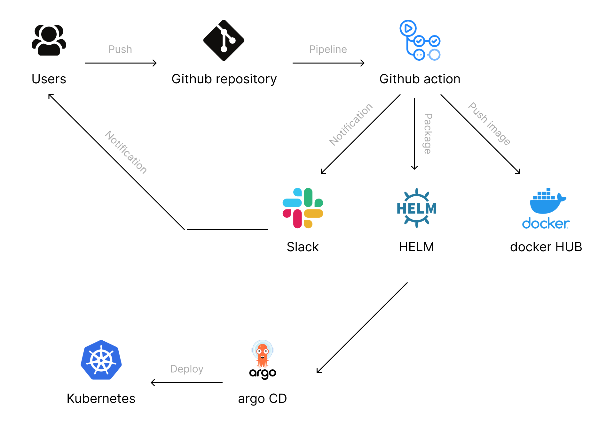

# Project report
---

### Project's reporter: Aleksei Alekseichik
### Group number: md-sa2-20-22

---

## Description of application for deployment:

- Application: Wordpress

- Programming language: PHP

- DB: MySQL

- Link on git repository: https://github.com/docker-library/wordpress

---

## Pipeline

---

## Technologies which were used in project:

- Orchestration: 
Kubernetes

- Automation tools:
Github action, Argo CD

- SCM:
Github

- Notification:
Slack

- Other tools:
 Docker, Helm

---

## CI/CD description:
After pushing to the master branch, Git Action builds and pushes the image to Docker HUB, creates a HELM diagram package. ArgoCD deploys applikation in k8s kluster.

## Rollback flow description and implementation:

Version selection in ArgoCD

---

## Links:

Project repository: https://github.com/alexfiz/project