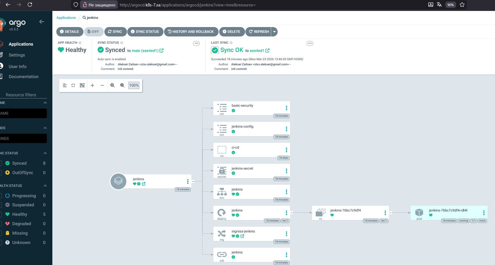
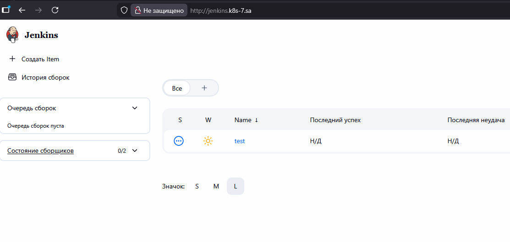

# 15. ArgoCD

### Repositories
- Helm chart: https://gitlab.com/alekson2/jenkins-helm
- ArgoCD manifests: https://gitlab.com/alekson2/argocd

### Install Argo CD

```bash
kubectl create namespace argocd
wget https://raw.githubusercontent.com/argoproj/argo-cd/stable/manifests/install.yaml
kubectl apply -n argocd --server-side --force-conflicts -f install.yaml
kubectl get pods -n argocd
kubectl -n argocd get secret argocd-initial-admin-secret -o jsonpath='{.data.password}' | base64 --decode
touch argocd-ingress.yaml
kubectl apply -f argocd-ingress.yaml 
```

### Create Jenkins Helm chart repository in GitLab

```bash
mkdir ~/jenkins-helm
cd ~/jenkins-helm/
cp -rf ~/sa.it-academy.by/Aleksei_Zaitsev/14.application_deployment/jenkins-helm/ .
git init
git remote add origin git@gitlab.com:alekson2/jenkins-helm.git
git switch --create main
git add .
git commit -m "init commit"
git push -u origin main 
```

### Create ArgoCD applications repository in GitLab

```bash
mkdir ~/argocd-apps
cd ~/argocd-apps
git init
git remote add origin git@gitlab.com:alekson2/argocd.git
git switch --create main
touch README.md
git add .
git status
git commit -m "init commit"
git push -u origin main 
```

### Configure SealedSecret

```bash
cd argocd-apps/
nano git-secret.yaml
kubeseal --controller-namespace kube-system --format yaml < git-secret.yaml > sealed-git-secret.yaml
```


### Create Application manifest for Jenkins Helm chart

```yaml
apiVersion: argoproj.io/v1alpha1
kind: Application
metadata:
  name: jenkins
  namespace: argocd
spec:
  project: default
  source:
    repoURL: https://gitlab.com/alekson2/jenkins-helm.git
    targetRevision: main
    path: jenkins-helm
  destination:
    server: https://kubernetes.default.svc
    namespace: ci-cd
  syncPolicy:
    automated:
      selfHeal: true
      prune: true
    syncOptions:
      - CreateNamespace=true
```

### Push Application manifest and SealedSecret to GitLab

```bash
git status
git add .
git status
git commit -m "Add Jenkins application and sealed secret"
git push
```

### Remove old Jenkins and deploy via ArgoCD

```bash
kubectl delete deployment jenkins -n ci-cd
kubectl delete svc jenkins -n ci-cd
kubectl delete configmap jenkins-config basic-security -n ci-cd
kubectl delete secret jenkins-secret -n ci-cd
kubectl delete ingress ingress-jenkins -n ci-cd
kubectl delete clusterrolebinding jenkins
```

```bash
kubectl apply -f ~/argocd-apps/sealed-git-secret.yaml
kubectl apply -f ~/argocd-apps/jenkins-app.yaml
```
ArgoCD and Jenkins in Web UI



