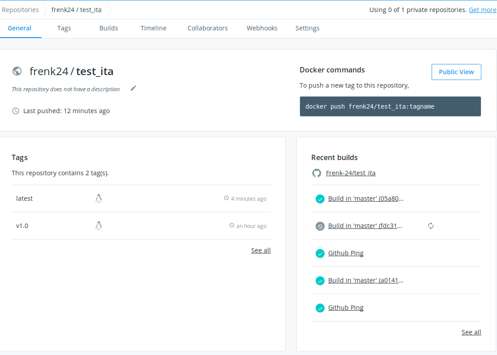
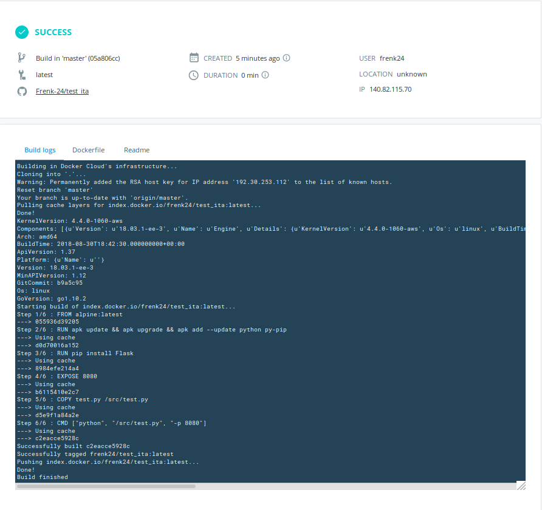
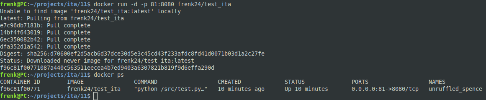

# 11. Docker. Lading

## Home task: 
 - Create a Docker file of any Python application
   - As example: any API listener
 - Add automated build for that image Docker hub
 - Test
   - Send/receive API request

### Docker file

```
FROM alpine:latest

RUN apk update \
    && apk upgrade \
    && apk add --update python py-pip

RUN pip install Flask

EXPOSE  8080

COPY test.py /src/test.py

CMD ["python", "/src/test.py", "-p 8080"]
```
### Python application

```
from flask import Flask
app = Flask(__name__)
@app.route("/")
def hello():
    return "My homwork 11"
if __name__ == "__main__":
    app.run(host="0.0.0.0", port=int("8080"), debug=True)
```

### Add automated build for that image



### Build logs



### Docker run



### curl

