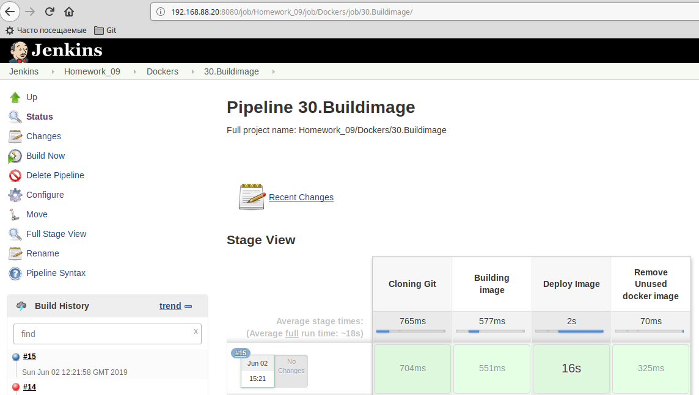
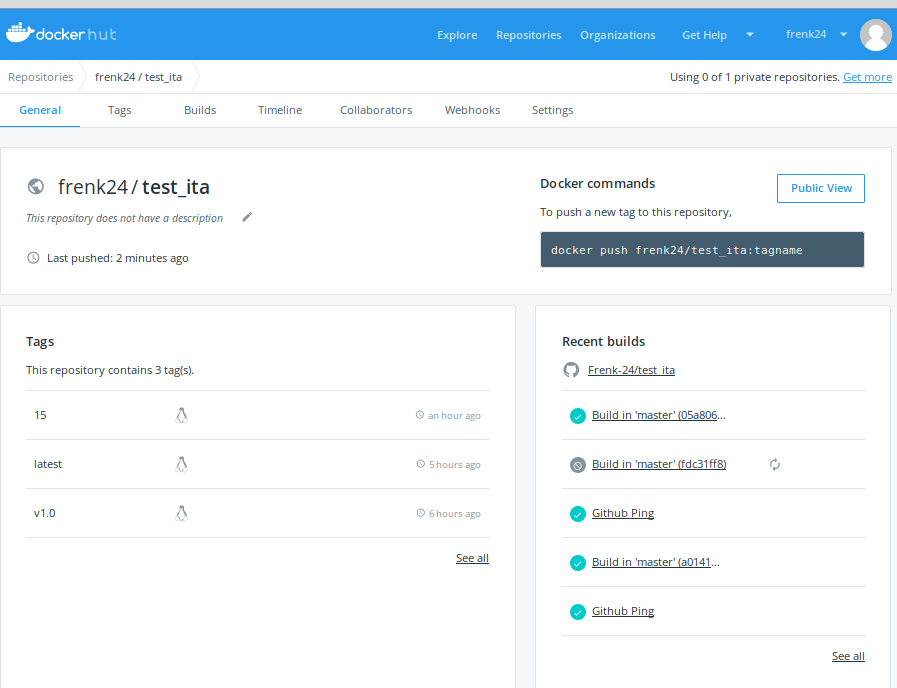
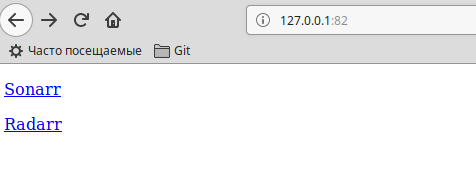
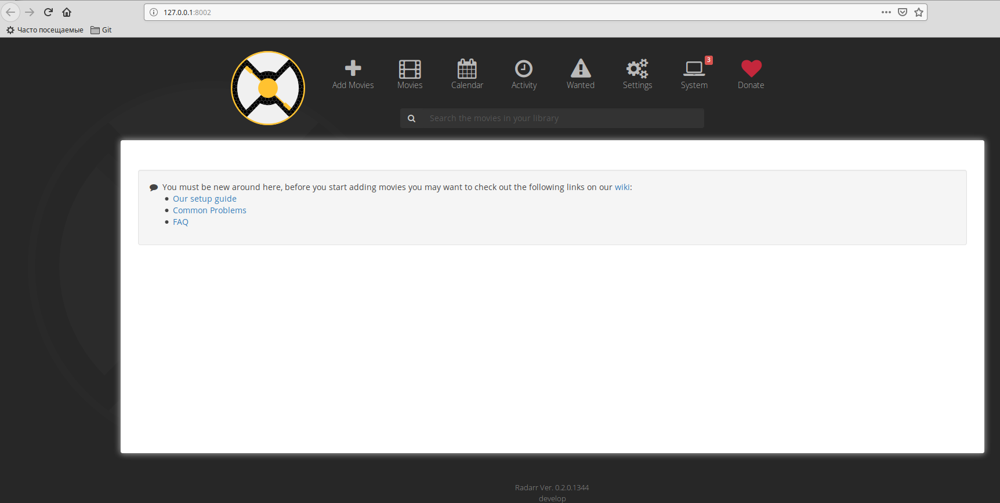
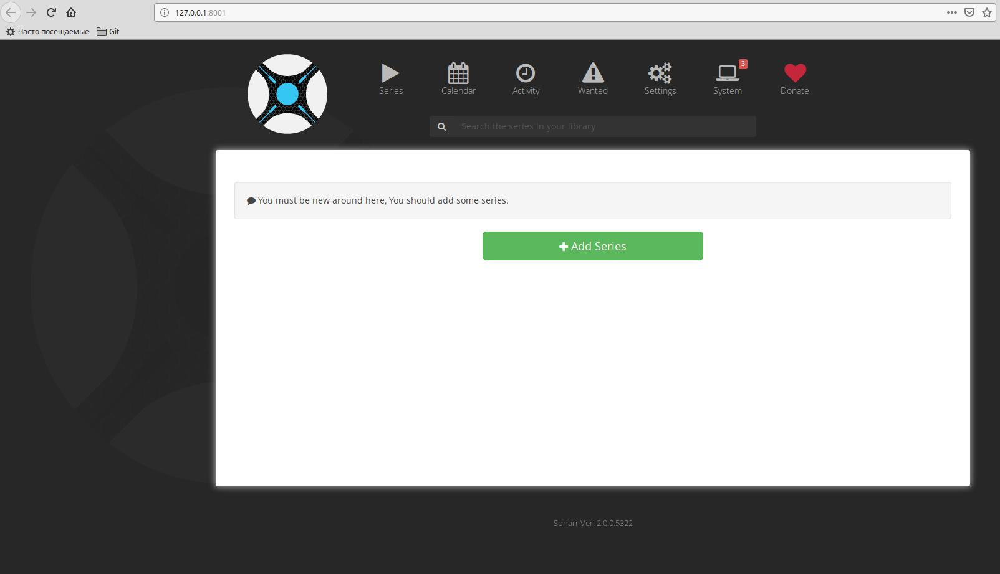

# Homework 12

## TODO
1. Automate task **11.Docker.Lading** by Jenkins
 - Use remote repo as source for build image
 - Make image locally (on Jenkins master/Slave)
 - Push image on Docker Hub
2. Create docker compose file which contains the fiollowing applications:
 - Web server (with links to the another Web apps) sonarr
 - sonarr
 - radarr

## 1. Homework - Docker. Logistics

### Automate task **11. Docker. Lading** by Jenkins
##### Jenkinsfile

```groovy
pipeline {
  environment {
    registry = "frenk24/test_ita"
    registryCredential = 'dockerhub'
  }
  agent any
  stages {
    stage('Cloning Git') {
      steps {
        git 'https://github.com/frenk-24/test_ita'
      }
    }
    stage('Building image') {
      steps{
        script {
          dockerImage = docker.build registry + ":$BUILD_NUMBER"
        }
      }
    }
    stage('Deploy Image') {
      steps{
        script {
          docker.withRegistry( '', registryCredential ) {
            dockerImage.push()
          }
        }
      }
    }
    stage('Remove Unused docker image') {
      steps{
        sh "docker rmi $registry:$BUILD_NUMBER"
      }
    }
  }
}
```

##### Pipeline docker_hub:






[jenkins console output](./jenkins/pipeline_log)

## 2. Homework - Docker. Compose

##### Docker-compose file:

```yaml
---
version: '3'

services:
  nginx:
    image: nginx:latest
    container_name: nginx
    ports:
      - "82:80"
    volumes:
    - ./html:/usr/share/nginx/html

  sonarr:
    image: linuxserver/sonarr
    container_name: sonarr
    depends_on: 
      - nginx
    environment:
      - PUID=1000
      - PGID=1000
      - TZ=Europe/Minsk
    ports:
      - 8001:8989

  radarr:
    image: linuxserver/radarr
    container_name: radarr
    depends_on: 
      - nginx
    environment:
      - PUID=1000
      - PGID=1000
      - TZ=Europe/Minsk
    ports:
      - 8002:7878
```

##### HTML file:

```html
    <!DOCTYPE HTML PUBLIC "-//W3C//DTD HTML 4.01//EN" "http://www.w3.org/TR/html4/strict.dtd">
    <html>
    <head>
        <meta http-equiv="Content-Type" content="text/html; charset=utf-8">
        <title>Docker.Logictics</title>
    </head>
    <body>
    <p>
        <a href="http://127.0.0.1:8001">Sonarr</a>
    </p>
    <p>
        <a href="http://127.0.0.1:8002">Radarr</a>
    </p>
    </body>
    </html>
```

$ docker ps
CONTAINER ID        IMAGE                COMMAND                  CREATED             STATUS              PORTS                    NAMES
58b4279b0ae9        linuxserver/radarr   "/init"                  About an hour ago   Up 31 seconds       0.0.0.0:8002->7878/tcp   radarr
2a2c084712ac        linuxserver/sonarr   "/init"                  About an hour ago   Up 32 seconds       0.0.0.0:8001->8989/tcp   sonarr
ea184f8b9ec4        nginx:latest         "nginx -g 'daemon of…"   About an hour ago   Up 33 seconds       0.0.0.0:82->80/tcp       nginx


##### Screen web:



##### Screen radarr:



##### Screen sonarr:


