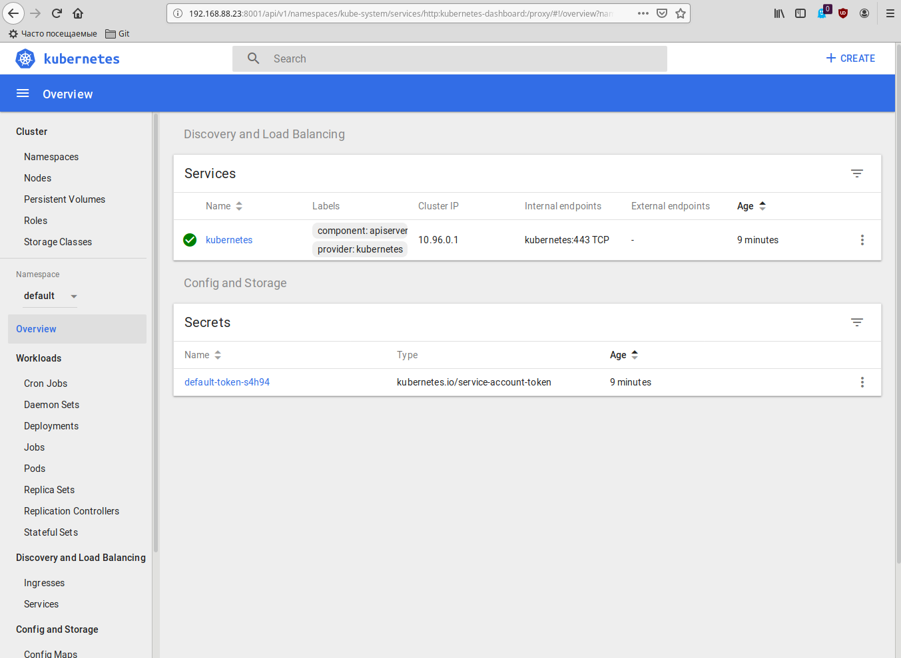

# 13. K8s. Structure

 - Install minikube on your bare/virtual host
 - Provide access to the dashboard from your workstation
 - Automate it (bash/ansible/Jenkinsfile) Your code and printscreen of dachboard put into folder 13. K8s.
 - Structure add to your repository, then prepare PR (Pull Request)

### Automation of the installation of minikube

1. Install VM

2. Install minikube

Installation was performed using ansible

Dashboard

