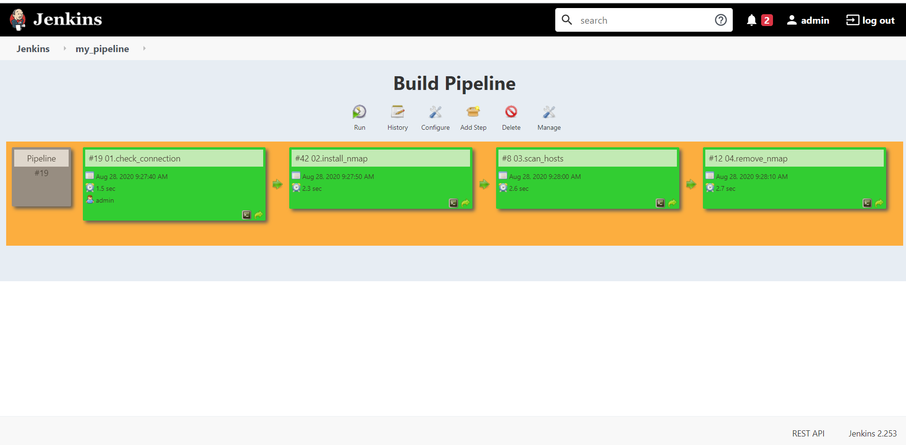

# 11.Jenkins.Routine

## Pipeline screenshot



## 01.check_connection
```sh
Started by user admin
Running as SYSTEM
Building remotely on ec_node38 in workspace /home/jenkins/workspace/01.check_connection
[01.check_connection] $ /bin/bash /tmp/jenkins6600211488496539514.sh
192.168.203.40 | SUCCESS => {
    "changed": false, 
    "ping": "pong"
}
Triggering a new build of 02.install_nmap
Finished: SUCCESS
```


## 02.install_nmap
```sh
Started by upstream project "01.check_connection" build number 19
originally caused by:
 Started by user admin
Running as SYSTEM
Building remotely on ec_node38 in workspace /home/jenkins/workspace/02.install_nmap
[02.install_nmap] $ /bin/bash /tmp/jenkins4635281948695665034.sh
jenkins
/home/jenkins/workspace/02.install_nmap
sudo: unable to resolve host sa-ubuntu-38
Reading package lists...
Building dependency tree...
Reading state information...
Suggested packages:
  ndiff
The following NEW packages will be installed:
  nmap
debconf: unable to initialize frontend: Dialog
debconf: (Dialog frontend will not work on a dumb terminal, an emacs shell buffer, or without a controlling terminal.)
debconf: falling back to frontend: Readline
debconf: unable to initialize frontend: Readline
debconf: (This frontend requires a controlling tty.)
debconf: falling back to frontend: Teletype
dpkg-preconfigure: unable to re-open stdin: 
0 upgraded, 1 newly installed, 0 to remove and 30 not upgraded.
Need to get 0 B/5174 kB of archives.
After this operation, 24.0 MB of additional disk space will be used.
Selecting previously unselected package nmap.
(Reading database ... 
(Reading database ... 5%
(Reading database ... 10%
(Reading database ... 15%
(Reading database ... 20%
(Reading database ... 25%
(Reading database ... 30%
(Reading database ... 35%
(Reading database ... 40%
(Reading database ... 45%
(Reading database ... 50%
(Reading database ... 55%
(Reading database ... 60%
(Reading database ... 65%
(Reading database ... 70%
(Reading database ... 75%
(Reading database ... 80%
(Reading database ... 85%
(Reading database ... 90%
(Reading database ... 95%
(Reading database ... 100%
(Reading database ... 44728 files and directories currently installed.)
Preparing to unpack .../nmap_7.60-1ubuntu5_amd64.deb ...
Unpacking nmap (7.60-1ubuntu5) ...
Setting up nmap (7.60-1ubuntu5) ...
Processing triggers for man-db (2.8.3-2ubuntu0.1) ...
Triggering a new build of 03.scan_hosts
Finished: SUCCESS
```

## 03.scan_hosts
```sh
Started by upstream project "02.install_nmap" build number 43
originally caused by:
 Started by upstream project "01.check_connection" build number 20
 originally caused by:
  Started by user admin
Running as SYSTEM
Building remotely on ec_node38 in workspace /home/jenkins/workspace/03.scan_hosts
[03.scan_hosts] $ /bin/bash /tmp/jenkins244699994723114051.sh

Starting Nmap 7.60 ( https://nmap.org ) at 2020-08-28 09:48 UTC
Nmap scan report for 192.168.203.2
Host is up (0.0051s latency).
Nmap scan report for 192.168.203.4
Host is up (0.0034s latency).
Nmap scan report for 192.168.203.6
Host is up (0.0025s latency).
Nmap scan report for 192.168.203.8
Host is up (0.0017s latency).
Nmap scan report for 192.168.203.10
Host is up (0.00083s latency).
Nmap scan report for 192.168.203.12
Host is up (0.0024s latency).
Nmap scan report for 192.168.203.14
Host is up (0.0042s latency).
Nmap scan report for 192.168.203.16
Host is up (0.0034s latency).
Nmap scan report for 192.168.203.18
Host is up (0.0026s latency).
Nmap scan report for 192.168.203.19
Host is up (0.0022s latency).
Nmap scan report for 192.168.203.20
Host is up (0.0017s latency).
Nmap scan report for 192.168.203.22
Host is up (0.00081s latency).
Nmap scan report for 192.168.203.24
Host is up (0.0015s latency).
Nmap scan report for 192.168.203.26
Host is up (0.0051s latency).
Nmap scan report for 192.168.203.28
Host is up (0.0043s latency).
Nmap scan report for 192.168.203.29
Host is up (0.0039s latency).
Nmap scan report for 192.168.203.30
Host is up (0.0034s latency).
Nmap scan report for 192.168.203.32
Host is up (0.0026s latency).
Nmap scan report for 192.168.203.34
Host is up (0.0017s latency).
Nmap scan report for 192.168.203.36
Host is up (0.00091s latency).
Nmap scan report for 192.168.203.37
Host is up (0.00053s latency).
Nmap scan report for 192.168.203.38
Host is up (0.00053s latency).
Nmap scan report for 192.168.203.40
Host is up (0.0068s latency).
Nmap scan report for 192.168.203.42
Host is up (0.0064s latency).
Nmap scan report for 192.168.203.44
Host is up (0.0055s latency).
Nmap scan report for 192.168.203.46
Host is up (0.0047s latency).
Nmap scan report for 192.168.203.48
Host is up (0.0040s latency).
Nmap scan report for 192.168.203.50
Host is up (0.0032s latency).
Nmap scan report for 192.168.203.52
Host is up (0.0024s latency).
Nmap scan report for 192.168.203.54
Host is up (0.0016s latency).
Nmap scan report for 192.168.203.56
Host is up (0.00079s latency).
Nmap scan report for 192.168.203.58
Host is up (0.00091s latency).
Nmap scan report for 192.168.203.60
Host is up (0.0034s latency).
Nmap done: 60 IP addresses (33 hosts up) scanned in 2.21 seconds
Triggering a new build of 04.remove_nmap
Finished: SUCCESS
```

## 04.remove_nmap
```sh
Started by upstream project "03.scan_hosts" build number 10
originally caused by:
 Started by upstream project "02.install_nmap" build number 43
 originally caused by:
  Started by upstream project "01.check_connection" build number 20
  originally caused by:
   Started by user admin
Running as SYSTEM
Building remotely on ec_node38 in workspace /home/jenkins/workspace/04.remove_nmap
[04.remove_nmap] $ /bin/bash /tmp/jenkins259665753879448989.sh
sudo: unable to resolve host sa-ubuntu-38
Reading package lists...
Building dependency tree...
Reading state information...
The following packages were automatically installed and are no longer required:
  libblas3 liblinear3 liblua5.3-0
Use 'sudo apt autoremove' to remove them.
The following packages will be REMOVED:
  nmap
0 upgraded, 0 newly installed, 1 to remove and 30 not upgraded.
After this operation, 24.0 MB disk space will be freed.
(Reading database ... 
(Reading database ... 5%
(Reading database ... 10%
(Reading database ... 15%
(Reading database ... 20%
(Reading database ... 25%
(Reading database ... 30%
(Reading database ... 35%
(Reading database ... 40%
(Reading database ... 45%
(Reading database ... 50%
(Reading database ... 55%
(Reading database ... 60%
(Reading database ... 65%
(Reading database ... 70%
(Reading database ... 75%
(Reading database ... 80%
(Reading database ... 85%
(Reading database ... 90%
(Reading database ... 95%
(Reading database ... 100%
(Reading database ... 45538 files and directories currently installed.)
Removing nmap (7.60-1ubuntu5) ...
Processing triggers for man-db (2.8.3-2ubuntu0.1) ...
Finished: SUCCESS

```
