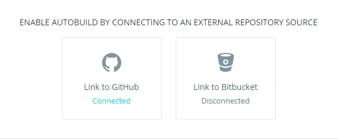
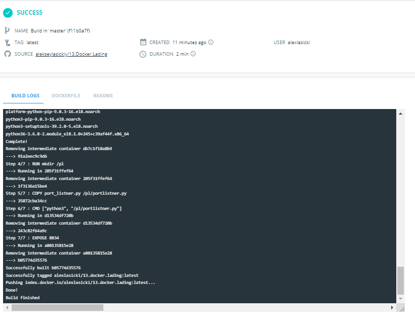

# 13.Docker.Lading

## Dockerfile

```sh
FROM centos:latest

MAINTAINER alexlasicki

RUN yum install epel-release -y \
    && yum update -y \
    && yum install python3-pip -y

RUN mkdir /pl

COPY port_listner.py /pl/portlistner.py

CMD ["python3", "/pl/portlistner.py"]


EXPOSE 8034
```
## port_listner.py

```py
import socket

PORT = 8034

with socket.socket(socket.AF_INET, socket.SOCK_STREAM) as s:
    s.bind(("", PORT))
    s.listen()
    conn, addr = s.accept()
    with conn:
        print('Connected by', addr)
        while True:
            data = conn.recv(1024)
            if not data:
                break
            conn.sendall(data)
```            

[Docker repository](https://hub.docker.com/repository/docker/alexlasicki/13.docker.lading)





