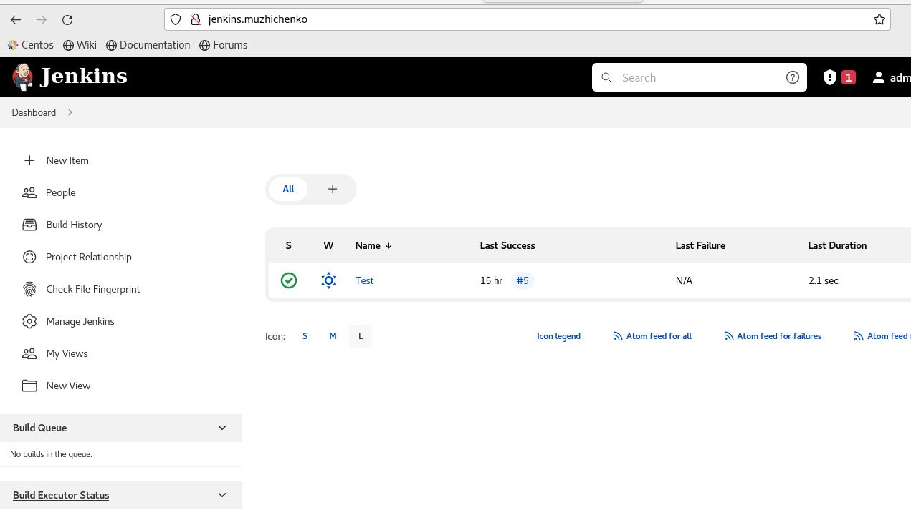
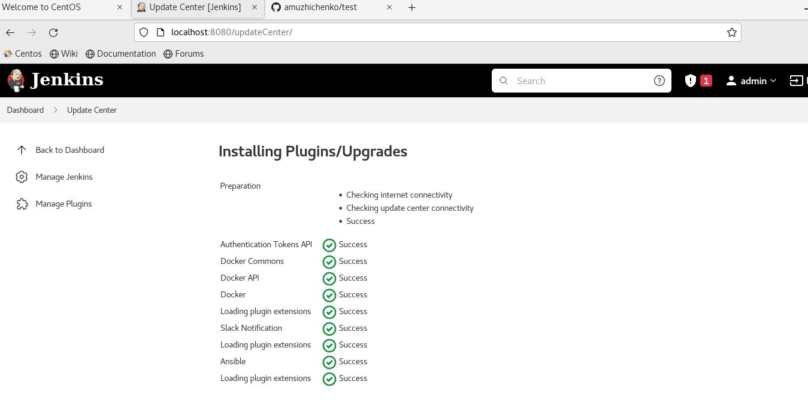
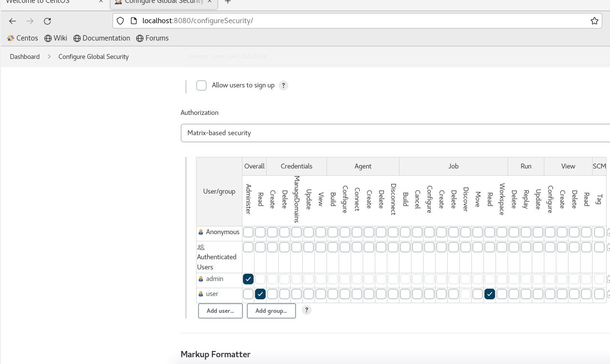

## 18.Jenkins.Start_Alex_Muzhichenko

### Screenshots





### Jenkins.log

```bash

[alex@localhost ~]$ cat /etc/nginx/conf.d/jenkins.conf
upstream jenkins {
  server 127.0.0.1:8080 fail_timeout=0;
}

server {
  listen 80;
  server_name jenkins.muzhichenko;

  location / {
    proxy_set_header        Host $host:$server_port;
    proxy_set_header        X-Real-IP $remote_addr;
    proxy_set_header        X-Forwarded-For $proxy_add_x_forwarded_for;
    proxy_set_header        X-Forwarded-Proto $scheme;
    proxy_redirect          http://127.0.0.1:8080 http://jenkins.muzhichenko;
    proxy_pass              http://127.0.0.1:8080;
  }
}


```

