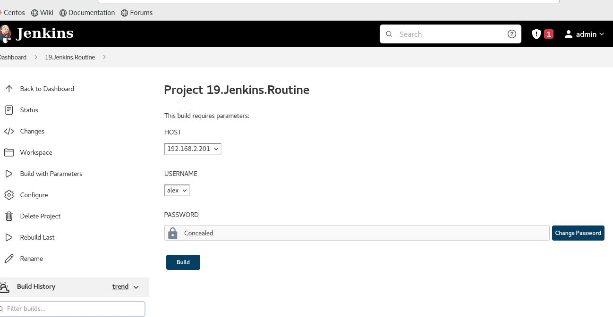

## 19.Jenkins_Route

### Jenkins_Job



### Jenkins_Output

```bash

started by user admin
Running as SYSTEM
Building remotely on node01 (slave) in workspace /home/jenkins/workspace/19.Jenkins.Routine
[19.Jenkins.Routine] $ /bin/bash /tmp/jenkins17334536385279871009.sh
-----Ping Remote host-----
PING 192.168.2.201 (192.168.2.201) 56(84) bytes of data.
64 bytes from 192.168.2.201: icmp_seq=1 ttl=64 time=0.017 ms
64 bytes from 192.168.2.201: icmp_seq=2 ttl=64 time=0.052 ms
64 bytes from 192.168.2.201: icmp_seq=3 ttl=64 time=0.034 ms
64 bytes from 192.168.2.201: icmp_seq=4 ttl=64 time=0.040 ms
64 bytes from 192.168.2.201: icmp_seq=5 ttl=64 time=0.042 ms

--- 192.168.2.201 ping statistics ---
5 packets transmitted, 5 received, 0% packet loss, time 4092ms
rtt min/avg/max/mdev = 0.017/0.037/0.052/0.011 ms
[19.Jenkins.Routine] $ /bin/bash /tmp/jenkins6691456238205698800.sh
-----NMAP install-----

WARNING: apt does not have a stable CLI interface. Use with caution in scripts.

Hit:1 http://by.archive.ubuntu.com/ubuntu focal InRelease
Hit:2 http://by.archive.ubuntu.com/ubuntu focal-updates InRelease
Hit:3 http://by.archive.ubuntu.com/ubuntu focal-backports InRelease
Hit:4 http://by.archive.ubuntu.com/ubuntu focal-security InRelease
Reading package lists...
Building dependency tree...
Reading state information...
9 packages can be upgraded. Run 'apt list --upgradable' to see them.

WARNING: apt does not have a stable CLI interface. Use with caution in scripts.

Reading package lists...
Building dependency tree...
Reading state information...
nmap is already the newest version (7.80+dfsg1-2build1).
The following package was automatically installed and is no longer required:
  libfwupdplugin1
Use 'sudo apt autoremove' to remove it.
0 upgraded, 0 newly installed, 0 to remove and 9 not upgraded.
[19.Jenkins.Routine] $ /bin/bash /tmp/jenkins15557975414001293980.sh
------scan-----
Starting Nmap 7.80 ( https://nmap.org ) at 2022-06-23 07:33 UTC
Nmap scan report for 192.168.2.101
Host is up (0.00095s latency).
Nmap scan report for 192.168.2.201
Host is up (0.00018s latency).
Nmap done: 256 IP addresses (2 hosts up) scanned in 19.76 seconds
[19.Jenkins.Routine] $ /bin/bash /tmp/jenkins11233659853735489601.sh
------Remove nmap------

WARNING: apt does not have a stable CLI interface. Use with caution in scripts.

Reading package lists...
Building dependency tree...
Reading state information...
The following packages were automatically installed and are no longer required:
  libblas3 libfwupdplugin1 liblinear4 liblua5.3-0 lua-lpeg nmap-common
Use 'sudo apt autoremove' to remove them.
The following packages will be REMOVED:
  nmap
0 upgraded, 0 newly installed, 1 to remove and 9 not upgraded.
After this operation, 4499 kB disk space will be freed.
(Reading database ... 
(Reading database ... 5%
(Reading database ... 10%
(Reading database ... 15%
(Reading database ... 20%
(Reading database ... 25%
(Reading database ... 30%
(Reading database ... 35%
(Reading database ... 40%
(Reading database ... 45%
(Reading database ... 50%
(Reading database ... 55%
(Reading database ... 60%
(Reading database ... 65%
(Reading database ... 70%
(Reading database ... 75%
(Reading database ... 80%
(Reading database ... 85%
(Reading database ... 90%
(Reading database ... 95%
(Reading database ... 100%
(Reading database ... 74714 files and directories currently installed.)
Removing nmap (7.80+dfsg1-2build1) ...
Processing triggers for man-db (2.9.1-1) ...
[19.Jenkins.Routine] $ /bin/bash /tmp/jenkins14293934959112993888.sh
------Print log------
# Nmap 7.80 scan initiated Thu Jun 23 07:33:59 2022 as: nmap -sP -oN log.log 192.168.2.*
Nmap scan report for 192.168.2.101
Host is up (0.00095s latency).
Nmap scan report for 192.168.2.201
Host is up (0.00018s latency).
# Nmap done at Thu Jun 23 07:34:19 2022 -- 256 IP addresses (2 hosts up) scanned in 19.76 seconds
Finished: SUCCESS


```

