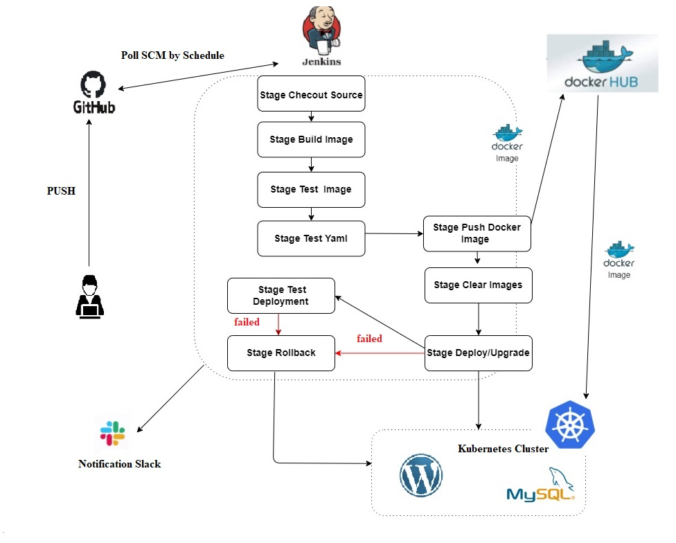

# Project report

### Project's reporter: Alexander Muzhichenko

### Group number: md-sa2-20-22

### Linkedin: https://www.linkedin.com/in/alexandermuzhichenko/

---

## Description of application for deployment:

- Name of application: Wordpress

- Programming language: PHP

- Kind of DB: MySQL 5.7

- Link on git repository: https://github.com/docker-library/wordpress

---

## Pipeline scheme::

---

## Technologies which were used in project:

### Orchestration: 
Kubernetes

### Automation tools:
Jenkins

### SCM:
Github

### Notification:
Slack

### Infrastructure:
Jenkins installed on localhost,virtual hosts(k8s cluster) in EC HTP

## CI/CD description:

Every weekday Jenkins polls Git repository, if a new commit is detected, Jenkins runs a job. The first time the pipeline is started manually.

"**Stage Build Image**": the application docker-image is built."**Srage Test Image**":checks for the presence of some wordpress files inside the image."**Stage Test YAML**" the application deployment configuration files are validated with KUBEVAL. "**Stage Push Docker Image**" : the built image is pushed into the Docker Hub Registry. "**Stage Clear Images**" : the images are removed from the host node. "**Stage Deploy/Upgrade**" : if the application deployment does not exist in the kubernetes cluster, then it is created. If it exists, then the image is updated to the new version. "**Stage Deployment Test**": check if our application is available, script TEST.SH checks the  response header and the presence of a certain string in the code of the web page.If "**Stage Deploy/Upgrade**"  or "**Stage Deployment Test**" fails, then the "**Stage Rollback**" is executed, which rolls back the deployment to the previous version.

At the end, a notification about the result of the build is sent to the **Slack**.

## Link on project:

https://github.com/amuzhichenko/project
