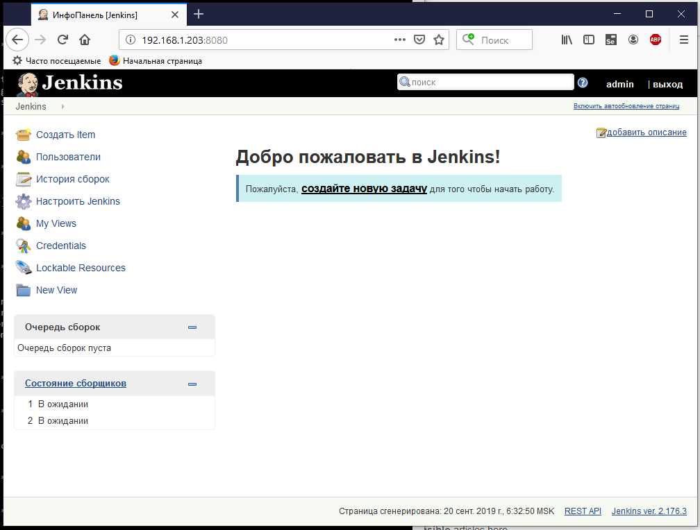

## Deploying Jenkins from Vagrant file

From Vagrant file will come:
* launch and configuration of a virtual system
* updating the operating system and packages on the virtual system
* running a bootstrap script to install Ansibl on the virtual system
* launch Ansibl playboks to install and configure Ngnix and Jenkins

```
Vagrant.configure("2") do |config|

	config.vm.box = "generic/ubuntu1804"
	
	config.vm.define "lab-jenkins01"
	config.vm.hostname = "lab-jenkins01"
	config.vm.network "public_network", ip: "192.168.1.203"

	config.vm.provider "virtualbox" do |vb|
		vb.name = "lab-jenkins01"
		vb.gui = false
		vb.memory = "4096"
		vb.cpus = "4"
		vb.customize ["modifyvm", :id, "--ioapic", "on"]
	end

	if Vagrant.has_plugin?("vagrant-timezone")
		config.timezone.value = "Europe/Minsk"
	end
          
	config.vm.provision "shell", path: "bootstrap.sh"
        
	config.vm.provision "ansible_local" do |ansible|
        config.vm.synced_folder ".", "/vagrant"
		ansible.playbook = "./play.yml" 
		ansible.become = true
        end
end
```

## Screenshot of Jenkins


## Result of deployment Jenkins from Vagrant file
```
D:\!Vagrant\lab-jenkins01>vagrant up
Bringing machine 'lab-jenkins01' up with 'virtualbox' provider...
==> lab-jenkins01: Importing base box 'generic/ubuntu1804'...
==> lab-jenkins01: Matching MAC address for NAT networking...
==> lab-jenkins01: Checking if box 'generic/ubuntu1804' version '1.9.24' is up to date...
==> lab-jenkins01: Setting the name of the VM: lab-jenkins01
==> lab-jenkins01: Clearing any previously set network interfaces...
==> lab-jenkins01: Preparing network interfaces based on configuration...
    lab-jenkins01: Adapter 1: nat
    lab-jenkins01: Adapter 2: bridged
==> lab-jenkins01: Forwarding ports...
    lab-jenkins01: 22 (guest) => 2222 (host) (adapter 1)
==> lab-jenkins01: Running 'pre-boot' VM customizations...
==> lab-jenkins01: Booting VM...
==> lab-jenkins01: Waiting for machine to boot. This may take a few minutes...
    lab-jenkins01: SSH address: 127.0.0.1:2222
    lab-jenkins01: SSH username: vagrant
    lab-jenkins01: SSH auth method: private key
    lab-jenkins01:
    lab-jenkins01: Vagrant insecure key detected. Vagrant will automatically replace
    lab-jenkins01: this with a newly generated keypair for better security.
    lab-jenkins01:
    lab-jenkins01: Inserting generated public key within guest...
    lab-jenkins01: Removing insecure key from the guest if it's present...
    lab-jenkins01: Key inserted! Disconnecting and reconnecting using new SSH key...
==> lab-jenkins01: Machine booted and ready!
==> lab-jenkins01: Checking for guest additions in VM...
    lab-jenkins01: The guest additions on this VM do not match the installed version of
    lab-jenkins01: VirtualBox! In most cases this is fine, but in rare cases it can
    lab-jenkins01: prevent things such as shared folders from working properly. If you see
    lab-jenkins01: shared folder errors, please make sure the guest additions within the
    lab-jenkins01: virtual machine match the version of VirtualBox you have installed on
    lab-jenkins01: your host and reload your VM.
    lab-jenkins01:
    lab-jenkins01: Guest Additions Version: 5.2.32
    lab-jenkins01: VirtualBox Version: 6.0
==> lab-jenkins01: Setting hostname...
==> lab-jenkins01: Configuring and enabling network interfaces...
==> lab-jenkins01: Mounting shared folders...
    lab-jenkins01: /vagrant => D:/!Vagrant/lab-jenkins01
==> lab-jenkins01: Setting time zone to 'Europe/Minsk'...
==> lab-jenkins01: Running provisioner: shell...
    lab-jenkins01: Running: C:/Users/tozter/AppData/Local/Temp/vagrant-shell20190920-940-1ch89ng.sh
    lab-jenkins01:
    lab-jenkins01: WARNING: apt does not have a stable CLI interface. Use with caution in scripts.
    lab-jenkins01: Get:1 http://security.ubuntu.com/ubuntu bionic-security InRelease [88.7 kB]
    lab-jenkins01: Hit:2 http://us.archive.ubuntu.com/ubuntu bionic InRelease
    lab-jenkins01: Get:3 http://us.archive.ubuntu.com/ubuntu bionic-updates InRelease [88.7 kB]
    lab-jenkins01: Get:4 http://security.ubuntu.com/ubuntu bionic-security/main i386 Packages [373 kB]
    lab-jenkins01: Get:5 http://us.archive.ubuntu.com/ubuntu bionic-backports InRelease [74.6 kB]
    lab-jenkins01: Get:6 http://security.ubuntu.com/ubuntu bionic-security/main amd64 Packages [516 kB]
    lab-jenkins01: Get:7 http://us.archive.ubuntu.com/ubuntu bionic-updates/main amd64 Packages [739 kB]
    lab-jenkins01: Get:8 http://security.ubuntu.com/ubuntu bionic-security/main Translation-en [173 kB]
    lab-jenkins01: Get:9 http://security.ubuntu.com/ubuntu bionic-security/restricted amd64 Packages [7,648 B]
    lab-jenkins01: Get:10 http://security.ubuntu.com/ubuntu bionic-security/restricted Translation-en [3,064 B]
    lab-jenkins01: Get:11 http://security.ubuntu.com/ubuntu bionic-security/universe amd64 Packages [607 kB]
    lab-jenkins01: Get:12 http://security.ubuntu.com/ubuntu bionic-security/universe i386 Packages [591 kB]
    lab-jenkins01: Get:13 http://us.archive.ubuntu.com/ubuntu bionic-updates/main i386 Packages [585 kB]
    lab-jenkins01: Get:14 http://security.ubuntu.com/ubuntu bionic-security/universe Translation-en [202 kB]
    lab-jenkins01: Get:15 http://security.ubuntu.com/ubuntu bionic-security/multiverse i386 Packages [4,152 B]
    lab-jenkins01: Get:16 http://security.ubuntu.com/ubuntu bionic-security/multiverse amd64 Packages [4,904 B]
    lab-jenkins01: Get:17 http://security.ubuntu.com/ubuntu bionic-security/multiverse Translation-en [2,396 B]
    lab-jenkins01: Get:18 http://us.archive.ubuntu.com/ubuntu bionic-updates/main Translation-en [266 kB]
    lab-jenkins01: Get:19 http://us.archive.ubuntu.com/ubuntu bionic-updates/restricted amd64 Packages [14.5 kB]
    lab-jenkins01: Get:20 http://us.archive.ubuntu.com/ubuntu bionic-updates/restricted Translation-en [4,736 B]
    lab-jenkins01: Get:21 http://us.archive.ubuntu.com/ubuntu bionic-updates/universe i386 Packages [979 kB]
    lab-jenkins01: Get:22 http://us.archive.ubuntu.com/ubuntu bionic-updates/universe amd64 Packages [1,006 kB]
    lab-jenkins01: Get:23 http://us.archive.ubuntu.com/ubuntu bionic-updates/universe Translation-en [309 kB]
    lab-jenkins01: Get:24 http://us.archive.ubuntu.com/ubuntu bionic-updates/multiverse amd64 Packages [7,528 B]
    lab-jenkins01: Get:25 http://us.archive.ubuntu.com/ubuntu bionic-updates/multiverse i386 Packages [6,788 B]
    lab-jenkins01: Get:26 http://us.archive.ubuntu.com/ubuntu bionic-updates/multiverse Translation-en [3,868 B]
    lab-jenkins01: Get:27 http://us.archive.ubuntu.com/ubuntu bionic-backports/universe amd64 Packages [4,020 B]
    lab-jenkins01: Get:28 http://us.archive.ubuntu.com/ubuntu bionic-backports/universe i386 Packages [4,020 B]
    lab-jenkins01: Fetched 6,665 kB in 15s (450 kB/s)
    lab-jenkins01: Reading package lists...
    lab-jenkins01: Building dependency tree...
    lab-jenkins01:
    lab-jenkins01: Reading state information...
    lab-jenkins01: 55 packages can be upgraded. Run 'apt list --upgradable' to see them.
    lab-jenkins01:
    lab-jenkins01: WARNING: apt does not have a stable CLI interface. Use with caution in scripts.
    lab-jenkins01: Reading package lists...
    lab-jenkins01: Building dependency tree...
    lab-jenkins01:
    lab-jenkins01: Reading state information...
    lab-jenkins01: Calculating upgrade...
    lab-jenkins01: The following NEW packages will be installed:
    lab-jenkins01:   binutils-common libbinutils linux-cloud-tools-4.15.0-64
    lab-jenkins01:   linux-cloud-tools-4.15.0-64-generic linux-headers-4.15.0-64
    lab-jenkins01:   linux-headers-4.15.0-64-generic linux-image-4.15.0-64-generic
    lab-jenkins01:   linux-modules-4.15.0-64-generic linux-modules-extra-4.15.0-64-generic
    lab-jenkins01:   linux-tools-4.15.0-64 linux-tools-4.15.0-64-generic
    lab-jenkins01: The following packages will be upgraded:
    lab-jenkins01:   apt apt-utils bind9-host bsdutils curl dnsutils fdisk landscape-common
    lab-jenkins01:   libapt-inst2.0 libapt-pkg5.0 libbind9-160 libblkid1 libcurl3-gnutls libcurl4
    lab-jenkins01:   libdns-export1100 libdns1100 libexpat1 libfdisk1 libirs160 libisc-export169
    lab-jenkins01:   libisc169 libisccc160 libisccfg160 libldap-2.4-2 libldap-common liblwres160
    lab-jenkins01:   libmount1 libnss-systemd libpam-systemd libpython3.6 libpython3.6-minimal
    lab-jenkins01:   libpython3.6-stdlib libsmartcols1 libsystemd0 libudev1 libuuid1
    lab-jenkins01:   linux-cloud-tools-common linux-cloud-tools-generic linux-cloud-tools-virtual
    lab-jenkins01:   linux-generic linux-headers-generic linux-image-generic linux-tools-common
    lab-jenkins01:   linux-tools-generic mount python3.6 python3.6-minimal snapd sosreport
    lab-jenkins01:   systemd systemd-sysv udev util-linux uuid-runtime xkb-data
    lab-jenkins01: 55 upgraded, 11 newly installed, 0 to remove and 0 not upgraded.
    lab-jenkins01: Need to get 104 MB of archives.
    lab-jenkins01: After this operation, 359 MB of additional disk space will be used.
    lab-jenkins01: Get:1 http://us.archive.ubuntu.com/ubuntu bionic-updates/main amd64 bsdutils amd64 1:2.31.1-0.4ubuntu3.4 [60.3 kB]
    lab-jenkins01: Get:2 http://us.archive.ubuntu.com/ubuntu bionic-updates/main amd64 libuuid1 amd64 2.31.1-0.4ubuntu3.4 [20.0 kB]
    lab-jenkins01: Get:3 http://us.archive.ubuntu.com/ubuntu bionic-updates/main amd64 libblkid1 amd64 2.31.1-0.4ubuntu3.4 [124 kB]
    lab-jenkins01: Get:4 http://us.archive.ubuntu.com/ubuntu bionic-updates/main amd64 libfdisk1 amd64 2.31.1-0.4ubuntu3.4 [164 kB]
    lab-jenkins01: Get:5 http://us.archive.ubuntu.com/ubuntu bionic-updates/main amd64 libmount1 amd64 2.31.1-0.4ubuntu3.4 [136 kB]
    lab-jenkins01: Get:6 http://us.archive.ubuntu.com/ubuntu bionic-updates/main amd64 libsmartcols1 amd64 2.31.1-0.4ubuntu3.4 [83.7 kB]
    lab-jenkins01: Get:7 http://us.archive.ubuntu.com/ubuntu bionic-updates/main amd64 fdisk amd64 2.31.1-0.4ubuntu3.4 [108 kB]
    lab-jenkins01: Get:8 http://us.archive.ubuntu.com/ubuntu bionic-updates/main amd64 util-linux amd64 2.31.1-0.4ubuntu3.4 [902 kB]
    lab-jenkins01: Get:9 http://us.archive.ubuntu.com/ubuntu bionic-updates/main amd64 libnss-systemd amd64 237-3ubuntu10.29 [105 kB]
    lab-jenkins01: Get:10 http://us.archive.ubuntu.com/ubuntu bionic-updates/main amd64 libsystemd0 amd64 237-3ubuntu10.29 [204 kB]
    lab-jenkins01: Get:11 http://us.archive.ubuntu.com/ubuntu bionic-updates/main amd64 libpam-systemd amd64 237-3ubuntu10.29 [108 kB]
    lab-jenkins01: Get:12 http://us.archive.ubuntu.com/ubuntu bionic-updates/main amd64 systemd amd64 237-3ubuntu10.29 [2,902 kB]
    lab-jenkins01: Get:13 http://us.archive.ubuntu.com/ubuntu bionic-updates/main amd64 udev amd64 237-3ubuntu10.29 [1,101 kB]
    lab-jenkins01: Get:14 http://us.archive.ubuntu.com/ubuntu bionic-updates/main amd64 libudev1 amd64 237-3ubuntu10.29 [53.8 kB]
    lab-jenkins01: Get:15 http://us.archive.ubuntu.com/ubuntu bionic-updates/main amd64 systemd-sysv amd64 237-3ubuntu10.29 [11.6 kB]
    lab-jenkins01: Get:16 http://us.archive.ubuntu.com/ubuntu bionic-updates/main amd64 mount amd64 2.31.1-0.4ubuntu3.4 [107 kB]
    lab-jenkins01: Get:17 http://us.archive.ubuntu.com/ubuntu bionic-updates/main amd64 libapt-pkg5.0 amd64 1.6.12 [806 kB]
    lab-jenkins01: Get:18 http://us.archive.ubuntu.com/ubuntu bionic-updates/main amd64 snapd amd64 2.40+18.04 [13.3 MB]
    lab-jenkins01: Get:19 http://us.archive.ubuntu.com/ubuntu bionic-updates/main amd64 libapt-inst2.0 amd64 1.6.12 [55.6 kB]
    lab-jenkins01: Get:20 http://us.archive.ubuntu.com/ubuntu bionic-updates/main amd64 apt amd64 1.6.12 [1,200 kB]
    lab-jenkins01: Get:21 http://us.archive.ubuntu.com/ubuntu bionic-updates/main amd64 apt-utils amd64 1.6.12 [206 kB]
    lab-jenkins01: Get:22 http://us.archive.ubuntu.com/ubuntu bionic-updates/main amd64 libexpat1 amd64 2.2.5-3ubuntu0.2 [80.5 kB]
    lab-jenkins01: Get:23 http://us.archive.ubuntu.com/ubuntu bionic-updates/main amd64 libpython3.6 amd64 3.6.8-1~18.04.2 [1,414 kB]
    lab-jenkins01: Get:24 http://us.archive.ubuntu.com/ubuntu bionic-updates/main amd64 python3.6 amd64 3.6.8-1~18.04.2 [202 kB]
    lab-jenkins01: Get:25 http://us.archive.ubuntu.com/ubuntu bionic-updates/main amd64 libpython3.6-stdlib amd64 3.6.8-1~18.04.2 [1,710 kB]
    lab-jenkins01: Get:26 http://us.archive.ubuntu.com/ubuntu bionic-updates/main amd64 python3.6-minimal amd64 3.6.8-1~18.04.2 [1,609 kB]
    lab-jenkins01: Get:27 http://us.archive.ubuntu.com/ubuntu bionic-updates/main amd64 libpython3.6-minimal amd64 3.6.8-1~18.04.2 [532 kB]
    lab-jenkins01: Get:28 http://us.archive.ubuntu.com/ubuntu bionic-updates/main amd64 uuid-runtime amd64 2.31.1-0.4ubuntu3.4 [34.8 kB]
    lab-jenkins01: Get:29 http://us.archive.ubuntu.com/ubuntu bionic-updates/main amd64 libisc-export169 amd64 1:9.11.3+dfsg-1ubuntu1.9 [164 kB]
    lab-jenkins01: Get:30 http://us.archive.ubuntu.com/ubuntu bionic-updates/main amd64 libdns-export1100 amd64 1:9.11.3+dfsg-1ubuntu1.9 [749 kB]
    lab-jenkins01: Get:31 http://us.archive.ubuntu.com/ubuntu bionic-updates/main amd64 xkb-data all 2.23.1-1ubuntu1.18.04.1 [325 kB]
    lab-jenkins01: Get:32 http://us.archive.ubuntu.com/ubuntu bionic-updates/main amd64 dnsutils amd64 1:9.11.3+dfsg-1ubuntu1.9 [145 kB]
    lab-jenkins01: Get:33 http://us.archive.ubuntu.com/ubuntu bionic-updates/main amd64 bind9-host amd64 1:9.11.3+dfsg-1ubuntu1.9 [53.6 kB]
    lab-jenkins01: Get:34 http://us.archive.ubuntu.com/ubuntu bionic-updates/main amd64 libbind9-160 amd64 1:9.11.3+dfsg-1ubuntu1.9 [27.6 kB]
    lab-jenkins01: Get:35 http://us.archive.ubuntu.com/ubuntu bionic-updates/main amd64 libisccfg160 amd64 1:9.11.3+dfsg-1ubuntu1.9 [48.5 kB]
    lab-jenkins01: Get:36 http://us.archive.ubuntu.com/ubuntu bionic-updates/main amd64 libisccc160 amd64 1:9.11.3+dfsg-1ubuntu1.9 [17.9 kB]
    lab-jenkins01: Get:37 http://us.archive.ubuntu.com/ubuntu bionic-updates/main amd64 libirs160 amd64 1:9.11.3+dfsg-1ubuntu1.9 [19.1 kB]
    lab-jenkins01: Get:38 http://us.archive.ubuntu.com/ubuntu bionic-updates/main amd64 libdns1100 amd64 1:9.11.3+dfsg-1ubuntu1.9 [965 kB]
    lab-jenkins01: Get:39 http://us.archive.ubuntu.com/ubuntu bionic-updates/main amd64 libisc169 amd64 1:9.11.3+dfsg-1ubuntu1.9 [238 kB]
    lab-jenkins01: Get:40 http://us.archive.ubuntu.com/ubuntu bionic-updates/main amd64 liblwres160 amd64 1:9.11.3+dfsg-1ubuntu1.9 [34.8 kB]
    lab-jenkins01: Get:41 http://us.archive.ubuntu.com/ubuntu bionic-updates/main amd64 binutils-common amd64 2.30-21ubuntu1~18.04.2 [193 kB]
    lab-jenkins01: Get:42 http://us.archive.ubuntu.com/ubuntu bionic-updates/main amd64 libldap-common all 2.4.45+dfsg-1ubuntu1.4 [16.9 kB]
    lab-jenkins01: Get:43 http://us.archive.ubuntu.com/ubuntu bionic-updates/main amd64 libldap-2.4-2 amd64 2.4.45+dfsg-1ubuntu1.4 [155 kB]
    lab-jenkins01: Get:44 http://us.archive.ubuntu.com/ubuntu bionic-updates/main amd64 curl amd64 7.58.0-2ubuntu3.8 [159 kB]
    lab-jenkins01: Get:45 http://us.archive.ubuntu.com/ubuntu bionic-updates/main amd64 libcurl4 amd64 7.58.0-2ubuntu3.8 [214 kB]
    lab-jenkins01: Get:46 http://us.archive.ubuntu.com/ubuntu bionic-updates/main amd64 landscape-common amd64 18.01-0ubuntu3.4 [85.4 kB]
    lab-jenkins01: Get:47 http://us.archive.ubuntu.com/ubuntu bionic-updates/main amd64 libbinutils amd64 2.30-21ubuntu1~18.04.2 [503 kB]
    lab-jenkins01: Get:48 http://us.archive.ubuntu.com/ubuntu bionic-updates/main amd64 libcurl3-gnutls amd64 7.58.0-2ubuntu3.8 [213 kB]
    lab-jenkins01: Get:49 http://us.archive.ubuntu.com/ubuntu bionic-updates/main amd64 linux-cloud-tools-common all 4.15.0-64.73 [171 kB]
    lab-jenkins01: Get:50 http://us.archive.ubuntu.com/ubuntu bionic-updates/main amd64 linux-cloud-tools-4.15.0-64 amd64 4.15.0-64.73 [181 kB]
    lab-jenkins01: Get:51 http://us.archive.ubuntu.com/ubuntu bionic-updates/main amd64 linux-cloud-tools-4.15.0-64-generic amd64 4.15.0-64.73 [1,868 B]
    lab-jenkins01: Get:52 http://us.archive.ubuntu.com/ubuntu bionic-updates/main amd64 linux-cloud-tools-generic amd64 4.15.0.64.66 [2,368 B]
    lab-jenkins01: Get:53 http://us.archive.ubuntu.com/ubuntu bionic-updates/main amd64 linux-cloud-tools-virtual amd64 4.15.0.64.66 [2,388 B]
    lab-jenkins01: Get:54 http://us.archive.ubuntu.com/ubuntu bionic-updates/main amd64 linux-modules-4.15.0-64-generic amd64 4.15.0-64.73 [13.1 MB]
    lab-jenkins01: Get:55 http://us.archive.ubuntu.com/ubuntu bionic-updates/main amd64 linux-image-4.15.0-64-generic amd64 4.15.0-64.73 [7,965 kB]
    lab-jenkins01: Get:56 http://us.archive.ubuntu.com/ubuntu bionic-updates/main amd64 linux-modules-extra-4.15.0-64-generic amd64 4.15.0-64.73 [32.9 MB]
    lab-jenkins01: Get:57 http://us.archive.ubuntu.com/ubuntu bionic-updates/main amd64 linux-generic amd64 4.15.0.64.66 [1,868 B]
    lab-jenkins01: Get:58 http://us.archive.ubuntu.com/ubuntu bionic-updates/main amd64 linux-image-generic amd64 4.15.0.64.66 [2,392 B]
    lab-jenkins01: Get:59 http://us.archive.ubuntu.com/ubuntu bionic-updates/main amd64 linux-headers-4.15.0-64 all 4.15.0-64.73 [11.1 MB]
    lab-jenkins01: Get:60 http://us.archive.ubuntu.com/ubuntu bionic-updates/main amd64 linux-headers-4.15.0-64-generic amd64 4.15.0-64.73 [1,231 kB]
    lab-jenkins01: Get:61 http://us.archive.ubuntu.com/ubuntu bionic-updates/main amd64 linux-headers-generic amd64 4.15.0.64.66 [2,352 B]
    lab-jenkins01: Get:62 http://us.archive.ubuntu.com/ubuntu bionic-updates/main amd64 linux-tools-common all 4.15.0-64.73 [284 kB]
    lab-jenkins01: Get:63 http://us.archive.ubuntu.com/ubuntu bionic-updates/main amd64 linux-tools-4.15.0-64 amd64 4.15.0-64.73 [4,846 kB]
    lab-jenkins01: Get:64 http://us.archive.ubuntu.com/ubuntu bionic-updates/main amd64 linux-tools-4.15.0-64-generic amd64 4.15.0-64.73 [1,984 B]
    lab-jenkins01: Get:65 http://us.archive.ubuntu.com/ubuntu bionic-updates/main amd64 linux-tools-generic amd64 4.15.0.64.66 [2,356 B]
    lab-jenkins01: Get:66 http://us.archive.ubuntu.com/ubuntu bionic-updates/main amd64 sosreport amd64 3.6-1ubuntu0.18.04.3 [136 kB]
    lab-jenkins01: dpkg-preconfigure: unable to re-open stdin: No such file or directory
    lab-jenkins01: Fetched 104 MB in 3min 17s (525 kB/s)
    lab-jenkins01: (Reading database ...
(Reading database ... 55%ng database ... 5%
    lab-jenkins01: (Reading database ... 60%
    lab-jenkins01: (Reading database ... 65%
    lab-jenkins01: (Reading database ... 70%
    lab-jenkins01: (Reading database ... 75%
    lab-jenkins01: (Reading database ... 80%
    lab-jenkins01: (Reading database ... 85%
    lab-jenkins01: (Reading database ... 90%
    lab-jenkins01: (Reading database ... 95%
(Reading database ... 105484 files and directories currently installed.)
    lab-jenkins01: Preparing to unpack .../bsdutils_1%3a2.31.1-0.4ubuntu3.4_amd64.deb ...
    lab-jenkins01: Unpacking bsdutils (1:2.31.1-0.4ubuntu3.4) over (1:2.31.1-0.4ubuntu3.3) ...
    lab-jenkins01: Setting up bsdutils (1:2.31.1-0.4ubuntu3.4) ...
(Reading database ... 55%ng database ...
    lab-jenkins01: (Reading database ... 60%
    lab-jenkins01: (Reading database ... 65%
    lab-jenkins01: (Reading database ... 70%
    lab-jenkins01: (Reading database ... 75%
    lab-jenkins01: (Reading database ... 80%
    lab-jenkins01: (Reading database ... 85%
    lab-jenkins01: (Reading database ... 90%
    lab-jenkins01: (Reading database ... 95%
(Reading database ... 105484 files and directories currently installed.)
    lab-jenkins01: Preparing to unpack .../libuuid1_2.31.1-0.4ubuntu3.4_amd64.deb ...
    lab-jenkins01: Unpacking libuuid1:amd64 (2.31.1-0.4ubuntu3.4) over (2.31.1-0.4ubuntu3.3) ...
    lab-jenkins01: Setting up libuuid1:amd64 (2.31.1-0.4ubuntu3.4) ...
    lab-jenkins01: (Reading database ...
(Reading database ... 10%ng database ... 5%
    lab-jenkins01: (Reading database ... 15%
(Reading database ... 25%ng database ... 20%
    lab-jenkins01: (Reading database ... 30%
(Reading database ... 40%ng database ... 35%
    lab-jenkins01: (Reading database ... 45%
(Reading database ... 55%ng database ... 50%
    lab-jenkins01: (Reading database ... 60%
    lab-jenkins01: (Reading database ... 65%
    lab-jenkins01: (Reading database ... 70%
    lab-jenkins01: (Reading database ... 75%
    lab-jenkins01: (Reading database ... 80%
    lab-jenkins01: (Reading database ... 85%
    lab-jenkins01: (Reading database ... 90%
    lab-jenkins01: (Reading database ... 95%
    lab-jenkins01: (Reading database ... 100%
    lab-jenkins01: (Reading database ... 105484 files and directories currently installed.)
    lab-jenkins01: Preparing to unpack .../libblkid1_2.31.1-0.4ubuntu3.4_amd64.deb ...
    lab-jenkins01: Unpacking libblkid1:amd64 (2.31.1-0.4ubuntu3.4) over (2.31.1-0.4ubuntu3.3) ...
    lab-jenkins01: Setting up libblkid1:amd64 (2.31.1-0.4ubuntu3.4) ...
    lab-jenkins01: (Reading database ...
(Reading database ... 15%ng database ... 5%
(Reading database ... 35%ng database ... 20%
(Reading database ... 45%ng database ... 40%
(Reading database ... 55%ng database ... 50%
    lab-jenkins01: (Reading database ... 60%
    lab-jenkins01: (Reading database ... 65%
    lab-jenkins01: (Reading database ... 70%
    lab-jenkins01: (Reading database ... 75%
    lab-jenkins01: (Reading database ... 80%
    lab-jenkins01: (Reading database ... 85%
    lab-jenkins01: (Reading database ... 90%
    lab-jenkins01: (Reading database ... 95%
    lab-jenkins01: (Reading database ... 100%
    lab-jenkins01: (Reading database ...
    lab-jenkins01: 105484 files and directories currently installed.)
    lab-jenkins01: Preparing to unpack .../libfdisk1_2.31.1-0.4ubuntu3.4_amd64.deb ...
    lab-jenkins01: Unpacking libfdisk1:amd64 (2.31.1-0.4ubuntu3.4) over (2.31.1-0.4ubuntu3.3) ...
    lab-jenkins01: Setting up libfdisk1:amd64 (2.31.1-0.4ubuntu3.4) ...
    lab-jenkins01: (Reading database ...
(Reading database ... 55%ng database ... 5%
    lab-jenkins01: (Reading database ... 60%
    lab-jenkins01: (Reading database ... 65%
    lab-jenkins01: (Reading database ... 70%
    lab-jenkins01: (Reading database ... 75%
    lab-jenkins01: (Reading database ... 80%
    lab-jenkins01: (Reading database ... 85%
    lab-jenkins01: (Reading database ... 90%
    lab-jenkins01: (Reading database ... 95%
(Reading database ... 105484 files and directories currently installed.)
    lab-jenkins01: Preparing to unpack .../libmount1_2.31.1-0.4ubuntu3.4_amd64.deb ...
    lab-jenkins01: Unpacking libmount1:amd64 (2.31.1-0.4ubuntu3.4) over (2.31.1-0.4ubuntu3.3) ...
    lab-jenkins01: Setting up libmount1:amd64 (2.31.1-0.4ubuntu3.4) ...
    lab-jenkins01: (Reading database ...
    lab-jenkins01: (Reading database ... 5%
(Reading database ... 20%ng database ... 10%
(Reading database ... 55%ng database ... 25%
    lab-jenkins01: (Reading database ... 60%
    lab-jenkins01: (Reading database ... 65%
    lab-jenkins01: (Reading database ... 70%
    lab-jenkins01: (Reading database ... 75%
    lab-jenkins01: (Reading database ... 80%
    lab-jenkins01: (Reading database ... 85%
    lab-jenkins01: (Reading database ... 90%
    lab-jenkins01: (Reading database ... 95%
(Reading database ... 105484 files and directories currently installed.)
    lab-jenkins01: Preparing to unpack .../libsmartcols1_2.31.1-0.4ubuntu3.4_amd64.deb ...
    lab-jenkins01: Unpacking libsmartcols1:amd64 (2.31.1-0.4ubuntu3.4) over (2.31.1-0.4ubuntu3.3) ...
    lab-jenkins01: Setting up libsmartcols1:amd64 (2.31.1-0.4ubuntu3.4) ...
    lab-jenkins01: (Reading database ...
(Reading database ... 55%ng database ... 5%
    lab-jenkins01: (Reading database ... 60%
    lab-jenkins01: (Reading database ... 65%
    lab-jenkins01: (Reading database ... 70%
    lab-jenkins01: (Reading database ... 75%
    lab-jenkins01: (Reading database ... 80%
    lab-jenkins01: (Reading database ... 85%
    lab-jenkins01: (Reading database ... 90%
    lab-jenkins01: (Reading database ... 95%
(Reading database ... 105484 files and directories currently installed.)
    lab-jenkins01: Preparing to unpack .../fdisk_2.31.1-0.4ubuntu3.4_amd64.deb ...
    lab-jenkins01: Unpacking fdisk (2.31.1-0.4ubuntu3.4) over (2.31.1-0.4ubuntu3.3) ...
    lab-jenkins01: Setting up fdisk (2.31.1-0.4ubuntu3.4) ...
    lab-jenkins01: (Reading database ...
(Reading database ... 50%ng database ... 5%
    lab-jenkins01: (Reading database ... 55%
    lab-jenkins01: (Reading database ... 60%
    lab-jenkins01: (Reading database ... 65%
    lab-jenkins01: (Reading database ... 70%
    lab-jenkins01: (Reading database ... 75%
    lab-jenkins01: (Reading database ... 80%
    lab-jenkins01: (Reading database ... 85%
    lab-jenkins01: (Reading database ... 90%
    lab-jenkins01: (Reading database ... 95%
(Reading database ... 105484 files and directories currently installed.)
    lab-jenkins01: Preparing to unpack .../util-linux_2.31.1-0.4ubuntu3.4_amd64.deb ...
    lab-jenkins01: Unpacking util-linux (2.31.1-0.4ubuntu3.4) over (2.31.1-0.4ubuntu3.3) ...
    lab-jenkins01: Setting up util-linux (2.31.1-0.4ubuntu3.4) ...
    lab-jenkins01: (Reading database ...
(Reading database ... 55%ng database ... 5%
    lab-jenkins01: (Reading database ... 60%
    lab-jenkins01: (Reading database ... 65%
    lab-jenkins01: (Reading database ... 70%
    lab-jenkins01: (Reading database ... 75%
    lab-jenkins01: (Reading database ... 80%
    lab-jenkins01: (Reading database ... 85%
    lab-jenkins01: (Reading database ... 90%
    lab-jenkins01: (Reading database ... 95%
(Reading database ... 105484 files and directories currently installed.)
    lab-jenkins01: Preparing to unpack .../libnss-systemd_237-3ubuntu10.29_amd64.deb ...
    lab-jenkins01: Unpacking libnss-systemd:amd64 (237-3ubuntu10.29) over (237-3ubuntu10.25) ...
    lab-jenkins01: Preparing to unpack .../libsystemd0_237-3ubuntu10.29_amd64.deb ...
    lab-jenkins01: Unpacking libsystemd0:amd64 (237-3ubuntu10.29) over (237-3ubuntu10.25) ...
    lab-jenkins01: Setting up libsystemd0:amd64 (237-3ubuntu10.29) ...
    lab-jenkins01: (Reading database ...
(Reading database ... 40%ng database ... 5%
(Reading database ... 55%ng database ... 45%
    lab-jenkins01: (Reading database ... 60%
    lab-jenkins01: (Reading database ... 65%
    lab-jenkins01: (Reading database ... 70%
    lab-jenkins01: (Reading database ... 75%
    lab-jenkins01: (Reading database ... 80%
    lab-jenkins01: (Reading database ... 85%
    lab-jenkins01: (Reading database ... 90%
    lab-jenkins01: (Reading database ... 95%
(Reading database ... 105484 files and directories currently installed.)
    lab-jenkins01: Preparing to unpack .../libpam-systemd_237-3ubuntu10.29_amd64.deb ...
    lab-jenkins01: Unpacking libpam-systemd:amd64 (237-3ubuntu10.29) over (237-3ubuntu10.25) ...
    lab-jenkins01: Preparing to unpack .../systemd_237-3ubuntu10.29_amd64.deb ...
    lab-jenkins01: Unpacking systemd (237-3ubuntu10.29) over (237-3ubuntu10.25) ...
    lab-jenkins01: Preparing to unpack .../udev_237-3ubuntu10.29_amd64.deb ...
    lab-jenkins01: Unpacking udev (237-3ubuntu10.29) over (237-3ubuntu10.25) ...
    lab-jenkins01: Preparing to unpack .../libudev1_237-3ubuntu10.29_amd64.deb ...
    lab-jenkins01: Unpacking libudev1:amd64 (237-3ubuntu10.29) over (237-3ubuntu10.25) ...
    lab-jenkins01: Setting up libudev1:amd64 (237-3ubuntu10.29) ...
    lab-jenkins01: Setting up systemd (237-3ubuntu10.29) ...
    lab-jenkins01: (Reading database ...
(Reading database ... 50%ng database ... 5%
    lab-jenkins01: (Reading database ... 55%
    lab-jenkins01: (Reading database ... 60%
    lab-jenkins01: (Reading database ... 65%
    lab-jenkins01: (Reading database ... 70%
    lab-jenkins01: (Reading database ... 75%
    lab-jenkins01: (Reading database ... 80%
    lab-jenkins01: (Reading database ... 85%
    lab-jenkins01: (Reading database ... 90%
    lab-jenkins01: (Reading database ... 95%
(Reading database ... 105484 files and directories currently installed.)
    lab-jenkins01: Preparing to unpack .../systemd-sysv_237-3ubuntu10.29_amd64.deb ...
    lab-jenkins01: Unpacking systemd-sysv (237-3ubuntu10.29) over (237-3ubuntu10.25) ...
    lab-jenkins01: Preparing to unpack .../mount_2.31.1-0.4ubuntu3.4_amd64.deb ...
    lab-jenkins01: Unpacking mount (2.31.1-0.4ubuntu3.4) over (2.31.1-0.4ubuntu3.3) ...
    lab-jenkins01: Preparing to unpack .../libapt-pkg5.0_1.6.12_amd64.deb ...
    lab-jenkins01: Unpacking libapt-pkg5.0:amd64 (1.6.12) over (1.6.11) ...
    lab-jenkins01: Setting up libapt-pkg5.0:amd64 (1.6.12) ...
    lab-jenkins01: (Reading database ...
(Reading database ... 55%ng database ... 5%
    lab-jenkins01: (Reading database ... 60%
    lab-jenkins01: (Reading database ... 65%
    lab-jenkins01: (Reading database ... 70%
    lab-jenkins01: (Reading database ... 75%
    lab-jenkins01: (Reading database ... 80%
    lab-jenkins01: (Reading database ... 85%
    lab-jenkins01: (Reading database ... 90%
    lab-jenkins01: (Reading database ... 95%
(Reading database ... 105484 files and directories currently installed.)
    lab-jenkins01: Preparing to unpack .../snapd_2.40+18.04_amd64.deb ...
    lab-jenkins01: Unpacking snapd (2.40+18.04) over (2.39.2+18.04) ...
    lab-jenkins01: Preparing to unpack .../libapt-inst2.0_1.6.12_amd64.deb ...
    lab-jenkins01: Unpacking libapt-inst2.0:amd64 (1.6.12) over (1.6.11) ...
    lab-jenkins01: Preparing to unpack .../archives/apt_1.6.12_amd64.deb ...
    lab-jenkins01: Unpacking apt (1.6.12) over (1.6.11) ...
    lab-jenkins01: Setting up apt (1.6.12) ...
    lab-jenkins01: (Reading database ...
(Reading database ... 55%ng database ... 5%
    lab-jenkins01: (Reading database ... 60%
    lab-jenkins01: (Reading database ... 65%
    lab-jenkins01: (Reading database ... 70%
    lab-jenkins01: (Reading database ... 75%
    lab-jenkins01: (Reading database ... 80%
    lab-jenkins01: (Reading database ... 85%
    lab-jenkins01: (Reading database ... 90%
    lab-jenkins01: (Reading database ... 95%
(Reading database ... 105490 files and directories currently installed.)
    lab-jenkins01: Preparing to unpack .../00-apt-utils_1.6.12_amd64.deb ...
    lab-jenkins01: Unpacking apt-utils (1.6.12) over (1.6.11) ...
    lab-jenkins01: Preparing to unpack .../01-libexpat1_2.2.5-3ubuntu0.2_amd64.deb ...
    lab-jenkins01: Unpacking libexpat1:amd64 (2.2.5-3ubuntu0.2) over (2.2.5-3ubuntu0.1) ...
    lab-jenkins01: Preparing to unpack .../02-libpython3.6_3.6.8-1~18.04.2_amd64.deb ...
    lab-jenkins01: Unpacking libpython3.6:amd64 (3.6.8-1~18.04.2) over (3.6.8-1~18.04.1) ...
    lab-jenkins01: Preparing to unpack .../03-python3.6_3.6.8-1~18.04.2_amd64.deb ...
    lab-jenkins01: Unpacking python3.6 (3.6.8-1~18.04.2) over (3.6.8-1~18.04.1) ...
    lab-jenkins01: Preparing to unpack .../04-libpython3.6-stdlib_3.6.8-1~18.04.2_amd64.deb ...
    lab-jenkins01: Unpacking libpython3.6-stdlib:amd64 (3.6.8-1~18.04.2) over (3.6.8-1~18.04.1) ...
    lab-jenkins01: Preparing to unpack .../05-python3.6-minimal_3.6.8-1~18.04.2_amd64.deb ...
    lab-jenkins01: Unpacking python3.6-minimal (3.6.8-1~18.04.2) over (3.6.8-1~18.04.1) ...
    lab-jenkins01: Preparing to unpack .../06-libpython3.6-minimal_3.6.8-1~18.04.2_amd64.deb ...
    lab-jenkins01: Unpacking libpython3.6-minimal:amd64 (3.6.8-1~18.04.2) over (3.6.8-1~18.04.1) ...
    lab-jenkins01: Preparing to unpack .../07-uuid-runtime_2.31.1-0.4ubuntu3.4_amd64.deb ...
    lab-jenkins01: Unpacking uuid-runtime (2.31.1-0.4ubuntu3.4) over (2.31.1-0.4ubuntu3.3) ...
    lab-jenkins01: Preparing to unpack .../08-libisc-export169_1%3a9.11.3+dfsg-1ubuntu1.9_amd64.deb ...
    lab-jenkins01: Unpacking libisc-export169:amd64 (1:9.11.3+dfsg-1ubuntu1.9) over (1:9.11.3+dfsg-1ubuntu1.8) ...
    lab-jenkins01: Preparing to unpack .../09-libdns-export1100_1%3a9.11.3+dfsg-1ubuntu1.9_amd64.deb ...
    lab-jenkins01: Unpacking libdns-export1100 (1:9.11.3+dfsg-1ubuntu1.9) over (1:9.11.3+dfsg-1ubuntu1.8) ...
    lab-jenkins01: Preparing to unpack .../10-xkb-data_2.23.1-1ubuntu1.18.04.1_all.deb ...
    lab-jenkins01: Unpacking xkb-data (2.23.1-1ubuntu1.18.04.1) over (2.23.1-1ubuntu1) ...
    lab-jenkins01: Preparing to unpack .../11-dnsutils_1%3a9.11.3+dfsg-1ubuntu1.9_amd64.deb ...
    lab-jenkins01: Unpacking dnsutils (1:9.11.3+dfsg-1ubuntu1.9) over (1:9.11.3+dfsg-1ubuntu1.8) ...
    lab-jenkins01: Preparing to unpack .../12-bind9-host_1%3a9.11.3+dfsg-1ubuntu1.9_amd64.deb ...
    lab-jenkins01: Unpacking bind9-host (1:9.11.3+dfsg-1ubuntu1.9) over (1:9.11.3+dfsg-1ubuntu1.8) ...
    lab-jenkins01: Preparing to unpack .../13-libbind9-160_1%3a9.11.3+dfsg-1ubuntu1.9_amd64.deb ...
    lab-jenkins01: Unpacking libbind9-160:amd64 (1:9.11.3+dfsg-1ubuntu1.9) over (1:9.11.3+dfsg-1ubuntu1.8) ...
    lab-jenkins01: Preparing to unpack .../14-libisccfg160_1%3a9.11.3+dfsg-1ubuntu1.9_amd64.deb ...
    lab-jenkins01: Unpacking libisccfg160:amd64 (1:9.11.3+dfsg-1ubuntu1.9) over (1:9.11.3+dfsg-1ubuntu1.8) ...
    lab-jenkins01: Preparing to unpack .../15-libisccc160_1%3a9.11.3+dfsg-1ubuntu1.9_amd64.deb ...
    lab-jenkins01: Unpacking libisccc160:amd64 (1:9.11.3+dfsg-1ubuntu1.9) over (1:9.11.3+dfsg-1ubuntu1.8) ...
    lab-jenkins01: Preparing to unpack .../16-libirs160_1%3a9.11.3+dfsg-1ubuntu1.9_amd64.deb ...
    lab-jenkins01: Unpacking libirs160:amd64 (1:9.11.3+dfsg-1ubuntu1.9) over (1:9.11.3+dfsg-1ubuntu1.8) ...
    lab-jenkins01: Preparing to unpack .../17-libdns1100_1%3a9.11.3+dfsg-1ubuntu1.9_amd64.deb ...
    lab-jenkins01: Unpacking libdns1100:amd64 (1:9.11.3+dfsg-1ubuntu1.9) over (1:9.11.3+dfsg-1ubuntu1.8) ...
    lab-jenkins01: Preparing to unpack .../18-libisc169_1%3a9.11.3+dfsg-1ubuntu1.9_amd64.deb ...
    lab-jenkins01: Unpacking libisc169:amd64 (1:9.11.3+dfsg-1ubuntu1.9) over (1:9.11.3+dfsg-1ubuntu1.8) ...
    lab-jenkins01: Preparing to unpack .../19-liblwres160_1%3a9.11.3+dfsg-1ubuntu1.9_amd64.deb ...
    lab-jenkins01: Unpacking liblwres160:amd64 (1:9.11.3+dfsg-1ubuntu1.9) over (1:9.11.3+dfsg-1ubuntu1.8) ...
    lab-jenkins01: Selecting previously unselected package binutils-common:amd64.
    lab-jenkins01: Preparing to unpack .../20-binutils-common_2.30-21ubuntu1~18.04.2_amd64.deb ...
    lab-jenkins01: Unpacking binutils-common:amd64 (2.30-21ubuntu1~18.04.2) ...
    lab-jenkins01: Preparing to unpack .../21-libldap-common_2.4.45+dfsg-1ubuntu1.4_all.deb ...
    lab-jenkins01: Unpacking libldap-common (2.4.45+dfsg-1ubuntu1.4) over (2.4.45+dfsg-1ubuntu1.3) ...
    lab-jenkins01: Preparing to unpack .../22-libldap-2.4-2_2.4.45+dfsg-1ubuntu1.4_amd64.deb ...
    lab-jenkins01: Unpacking libldap-2.4-2:amd64 (2.4.45+dfsg-1ubuntu1.4) over (2.4.45+dfsg-1ubuntu1.3) ...
    lab-jenkins01: Preparing to unpack .../23-curl_7.58.0-2ubuntu3.8_amd64.deb ...
    lab-jenkins01: Unpacking curl (7.58.0-2ubuntu3.8) over (7.58.0-2ubuntu3.7) ...
    lab-jenkins01: Preparing to unpack .../24-libcurl4_7.58.0-2ubuntu3.8_amd64.deb ...
    lab-jenkins01: Unpacking libcurl4:amd64 (7.58.0-2ubuntu3.8) over (7.58.0-2ubuntu3.7) ...
    lab-jenkins01: Preparing to unpack .../25-landscape-common_18.01-0ubuntu3.4_amd64.deb ...
    lab-jenkins01: Unpacking landscape-common (18.01-0ubuntu3.4) over (18.01-0ubuntu3.3) ...
    lab-jenkins01: Selecting previously unselected package libbinutils:amd64.
    lab-jenkins01: Preparing to unpack .../26-libbinutils_2.30-21ubuntu1~18.04.2_amd64.deb ...
    lab-jenkins01: Unpacking libbinutils:amd64 (2.30-21ubuntu1~18.04.2) ...
    lab-jenkins01: Preparing to unpack .../27-libcurl3-gnutls_7.58.0-2ubuntu3.8_amd64.deb ...
    lab-jenkins01: Unpacking libcurl3-gnutls:amd64 (7.58.0-2ubuntu3.8) over (7.58.0-2ubuntu3.7) ...
    lab-jenkins01: Preparing to unpack .../28-linux-cloud-tools-common_4.15.0-64.73_all.deb ...
    lab-jenkins01: Unpacking linux-cloud-tools-common (4.15.0-64.73) over (4.15.0-58.64) ...
    lab-jenkins01: Selecting previously unselected package linux-cloud-tools-4.15.0-64.
    lab-jenkins01: Preparing to unpack .../29-linux-cloud-tools-4.15.0-64_4.15.0-64.73_amd64.deb ...
    lab-jenkins01: Unpacking linux-cloud-tools-4.15.0-64 (4.15.0-64.73) ...
    lab-jenkins01: Selecting previously unselected package linux-cloud-tools-4.15.0-64-generic.
    lab-jenkins01: Preparing to unpack .../30-linux-cloud-tools-4.15.0-64-generic_4.15.0-64.73_amd64.deb ...
    lab-jenkins01: Unpacking linux-cloud-tools-4.15.0-64-generic (4.15.0-64.73) ...
    lab-jenkins01: Preparing to unpack .../31-linux-cloud-tools-generic_4.15.0.64.66_amd64.deb ...
    lab-jenkins01: Unpacking linux-cloud-tools-generic (4.15.0.64.66) over (4.15.0.58.60) ...
    lab-jenkins01: Preparing to unpack .../32-linux-cloud-tools-virtual_4.15.0.64.66_amd64.deb ...
    lab-jenkins01: Unpacking linux-cloud-tools-virtual (4.15.0.64.66) over (4.15.0.58.60) ...
    lab-jenkins01: Selecting previously unselected package linux-modules-4.15.0-64-generic.
    lab-jenkins01: Preparing to unpack .../33-linux-modules-4.15.0-64-generic_4.15.0-64.73_amd64.deb ...
    lab-jenkins01: Unpacking linux-modules-4.15.0-64-generic (4.15.0-64.73) ...
    lab-jenkins01: Selecting previously unselected package linux-image-4.15.0-64-generic.
    lab-jenkins01: Preparing to unpack .../34-linux-image-4.15.0-64-generic_4.15.0-64.73_amd64.deb ...
    lab-jenkins01: Unpacking linux-image-4.15.0-64-generic (4.15.0-64.73) ...
    lab-jenkins01: Selecting previously unselected package linux-modules-extra-4.15.0-64-generic.
    lab-jenkins01: Preparing to unpack .../35-linux-modules-extra-4.15.0-64-generic_4.15.0-64.73_amd64.deb ...
    lab-jenkins01: Unpacking linux-modules-extra-4.15.0-64-generic (4.15.0-64.73) ...
    lab-jenkins01: Preparing to unpack .../36-linux-generic_4.15.0.64.66_amd64.deb ...
    lab-jenkins01: Unpacking linux-generic (4.15.0.64.66) over (4.15.0.58.60) ...
    lab-jenkins01: Preparing to unpack .../37-linux-image-generic_4.15.0.64.66_amd64.deb ...
    lab-jenkins01: Unpacking linux-image-generic (4.15.0.64.66) over (4.15.0.58.60) ...
    lab-jenkins01: Selecting previously unselected package linux-headers-4.15.0-64.
    lab-jenkins01: Preparing to unpack .../38-linux-headers-4.15.0-64_4.15.0-64.73_all.deb ...
    lab-jenkins01: Unpacking linux-headers-4.15.0-64 (4.15.0-64.73) ...
    lab-jenkins01: Selecting previously unselected package linux-headers-4.15.0-64-generic.
    lab-jenkins01: Preparing to unpack .../39-linux-headers-4.15.0-64-generic_4.15.0-64.73_amd64.deb ...
    lab-jenkins01: Unpacking linux-headers-4.15.0-64-generic (4.15.0-64.73) ...
    lab-jenkins01: Preparing to unpack .../40-linux-headers-generic_4.15.0.64.66_amd64.deb ...
    lab-jenkins01: Unpacking linux-headers-generic (4.15.0.64.66) over (4.15.0.58.60) ...
    lab-jenkins01: Preparing to unpack .../41-linux-tools-common_4.15.0-64.73_all.deb ...
    lab-jenkins01: Unpacking linux-tools-common (4.15.0-64.73) over (4.15.0-58.64) ...
    lab-jenkins01: Selecting previously unselected package linux-tools-4.15.0-64.
    lab-jenkins01: Preparing to unpack .../42-linux-tools-4.15.0-64_4.15.0-64.73_amd64.deb ...
    lab-jenkins01: Unpacking linux-tools-4.15.0-64 (4.15.0-64.73) ...
    lab-jenkins01: Selecting previously unselected package linux-tools-4.15.0-64-generic.
    lab-jenkins01: Preparing to unpack .../43-linux-tools-4.15.0-64-generic_4.15.0-64.73_amd64.deb ...
    lab-jenkins01: Unpacking linux-tools-4.15.0-64-generic (4.15.0-64.73) ...
    lab-jenkins01: Preparing to unpack .../44-linux-tools-generic_4.15.0.64.66_amd64.deb ...
    lab-jenkins01: Unpacking linux-tools-generic (4.15.0.64.66) over (4.15.0.58.60) ...
    lab-jenkins01: Preparing to unpack .../45-sosreport_3.6-1ubuntu0.18.04.3_amd64.deb ...
    lab-jenkins01: Unpacking sosreport (3.6-1ubuntu0.18.04.3) over (3.6-1ubuntu0.18.04.2) ...
    lab-jenkins01: Setting up linux-modules-4.15.0-64-generic (4.15.0-64.73) ...
    lab-jenkins01: Setting up libisc169:amd64 (1:9.11.3+dfsg-1ubuntu1.9) ...
    lab-jenkins01: Setting up libapt-inst2.0:amd64 (1.6.12) ...
    lab-jenkins01: Setting up libnss-systemd:amd64 (237-3ubuntu10.29) ...
    lab-jenkins01: Setting up linux-cloud-tools-common (4.15.0-64.73) ...
    lab-jenkins01: Setting up libisccc160:amd64 (1:9.11.3+dfsg-1ubuntu1.9) ...
    lab-jenkins01: Setting up libexpat1:amd64 (2.2.5-3ubuntu0.2) ...
    lab-jenkins01: Setting up landscape-common (18.01-0ubuntu3.4) ...
    lab-jenkins01: Setting up libldap-common (2.4.45+dfsg-1ubuntu1.4) ...
    lab-jenkins01: Setting up apt-utils (1.6.12) ...
    lab-jenkins01: Setting up libisc-export169:amd64 (1:9.11.3+dfsg-1ubuntu1.9) ...
    lab-jenkins01: Setting up systemd-sysv (237-3ubuntu10.29) ...
    lab-jenkins01: Setting up xkb-data (2.23.1-1ubuntu1.18.04.1) ...
    lab-jenkins01: Setting up mount (2.31.1-0.4ubuntu3.4) ...
    lab-jenkins01: Setting up uuid-runtime (2.31.1-0.4ubuntu3.4) ...
    lab-jenkins01: Setting up libpython3.6-minimal:amd64 (3.6.8-1~18.04.2) ...
    lab-jenkins01: Setting up binutils-common:amd64 (2.30-21ubuntu1~18.04.2) ...
    lab-jenkins01: Setting up linux-tools-common (4.15.0-64.73) ...
    lab-jenkins01: Setting up udev (237-3ubuntu10.29) ...
    lab-jenkins01: update-initramfs: deferring update (trigger activated)
    lab-jenkins01: Setting up libldap-2.4-2:amd64 (2.4.45+dfsg-1ubuntu1.4) ...
    lab-jenkins01: Setting up sosreport (3.6-1ubuntu0.18.04.3) ...
    lab-jenkins01: Setting up libdns-export1100 (1:9.11.3+dfsg-1ubuntu1.9) ...
    lab-jenkins01: Setting up linux-headers-4.15.0-64 (4.15.0-64.73) ...
    lab-jenkins01: Setting up libdns1100:amd64 (1:9.11.3+dfsg-1ubuntu1.9) ...
    lab-jenkins01: Setting up liblwres160:amd64 (1:9.11.3+dfsg-1ubuntu1.9) ...
    lab-jenkins01: Setting up linux-image-4.15.0-64-generic (4.15.0-64.73) ...
    lab-jenkins01: I: /vmlinuz.old is now a symlink to boot/vmlinuz-4.15.0-58-generic
    lab-jenkins01: I: /initrd.img.old is now a symlink to boot/initrd.img-4.15.0-58-generic
    lab-jenkins01: I: /vmlinuz is now a symlink to boot/vmlinuz-4.15.0-64-generic
    lab-jenkins01: I: /initrd.img is now a symlink to boot/initrd.img-4.15.0-64-generic
    lab-jenkins01: Setting up linux-headers-4.15.0-64-generic (4.15.0-64.73) ...
    lab-jenkins01: Setting up linux-cloud-tools-4.15.0-64 (4.15.0-64.73) ...
    lab-jenkins01: Setting up linux-headers-generic (4.15.0.64.66) ...
    lab-jenkins01: Setting up libpython3.6-stdlib:amd64 (3.6.8-1~18.04.2) ...
    lab-jenkins01: Setting up linux-cloud-tools-4.15.0-64-generic (4.15.0-64.73) ...
    lab-jenkins01: Setting up linux-modules-extra-4.15.0-64-generic (4.15.0-64.73) ...
    lab-jenkins01: Setting up libpam-systemd:amd64 (237-3ubuntu10.29) ...
    lab-jenkins01: Setting up libbinutils:amd64 (2.30-21ubuntu1~18.04.2) ...
    lab-jenkins01: Setting up libcurl3-gnutls:amd64 (7.58.0-2ubuntu3.8) ...
    lab-jenkins01: Setting up linux-cloud-tools-generic (4.15.0.64.66) ...
    lab-jenkins01: Setting up libcurl4:amd64 (7.58.0-2ubuntu3.8) ...
    lab-jenkins01: Setting up python3.6-minimal (3.6.8-1~18.04.2) ...
    lab-jenkins01: Setting up libisccfg160:amd64 (1:9.11.3+dfsg-1ubuntu1.9) ...
    lab-jenkins01: Setting up snapd (2.40+18.04) ...
    lab-jenkins01: Installing new version of config file /etc/apparmor.d/usr.lib.snapd.snap-confine.real ...
    lab-jenkins01: md5sum: /etc/apparmor.d/usr.lib.snapd.snap-confine
    lab-jenkins01: : No such file or directory
    lab-jenkins01: snapd.failure.service is a disabled or a static unit, not starting it.
    lab-jenkins01: snapd.snap-repair.service is a disabled or a static unit, not starting it.
    lab-jenkins01: Setting up linux-tools-4.15.0-64 (4.15.0-64.73) ...
    lab-jenkins01: Setting up linux-cloud-tools-virtual (4.15.0.64.66) ...
    lab-jenkins01: Setting up linux-image-generic (4.15.0.64.66) ...
    lab-jenkins01: Setting up libpython3.6:amd64 (3.6.8-1~18.04.2) ...
    lab-jenkins01: Setting up python3.6 (3.6.8-1~18.04.2) ...
    lab-jenkins01: Setting up curl (7.58.0-2ubuntu3.8) ...
    lab-jenkins01: Setting up libirs160:amd64 (1:9.11.3+dfsg-1ubuntu1.9) ...
    lab-jenkins01: Setting up libbind9-160:amd64 (1:9.11.3+dfsg-1ubuntu1.9) ...
    lab-jenkins01: Setting up linux-tools-4.15.0-64-generic (4.15.0-64.73) ...
    lab-jenkins01: Setting up linux-generic (4.15.0.64.66) ...
    lab-jenkins01: Setting up linux-tools-generic (4.15.0.64.66) ...
    lab-jenkins01: Setting up bind9-host (1:9.11.3+dfsg-1ubuntu1.9) ...
    lab-jenkins01: Setting up dnsutils (1:9.11.3+dfsg-1ubuntu1.9) ...
    lab-jenkins01: Processing triggers for systemd (237-3ubuntu10.29) ...
    lab-jenkins01: Processing triggers for man-db (2.8.3-2ubuntu0.1) ...
    lab-jenkins01: Processing triggers for dbus (1.12.2-1ubuntu1.1) ...
    lab-jenkins01: Processing triggers for mime-support (3.60ubuntu1) ...
    lab-jenkins01: Processing triggers for ureadahead (0.100.0-21) ...
    lab-jenkins01: Processing triggers for libc-bin (2.27-3ubuntu1) ...
    lab-jenkins01: Processing triggers for initramfs-tools (0.130ubuntu3.8) ...
    lab-jenkins01: update-initramfs: Generating /boot/initrd.img-4.15.0-58-generic
    lab-jenkins01: Processing triggers for linux-image-4.15.0-64-generic (4.15.0-64.73) ...
    lab-jenkins01: /etc/kernel/postinst.d/initramfs-tools:
    lab-jenkins01: update-initramfs: Generating /boot/initrd.img-4.15.0-64-generic
    lab-jenkins01: /etc/kernel/postinst.d/x-grub-legacy-ec2:
    lab-jenkins01: Searching for GRUB installation directory ... found: /boot/grub
    lab-jenkins01: Searching for default file ...
    lab-jenkins01: found: /boot/grub/default
    lab-jenkins01: Testing for an existing GRUB menu.lst file ...
    lab-jenkins01: found: /boot/grub/menu.lst
    lab-jenkins01: Searching for splash image ...
    lab-jenkins01: none found, skipping ...
    lab-jenkins01: Found kernel: /vmlinuz-4.15.0-58-generic
    lab-jenkins01: Found kernel: /vmlinuz-4.15.0-55-generic
    lab-jenkins01: Found kernel: /vmlinuz-4.15.0-64-generic
    lab-jenkins01: Found kernel: /vmlinuz-4.15.0-58-generic
    lab-jenkins01: Found kernel: /vmlinuz-4.15.0-55-generic
    lab-jenkins01: Replacing config file /run/grub/menu.lst with new version
    lab-jenkins01: Updating /boot/grub/menu.lst ...
    lab-jenkins01: done
    lab-jenkins01:
    lab-jenkins01: /etc/kernel/postinst.d/zz-update-grub:
    lab-jenkins01:
    lab-jenkins01: Sourcing file `/etc/default/grub'
    lab-jenkins01: Generating grub configuration file ...
    lab-jenkins01: Found linux image: /boot/vmlinuz-4.15.0-64-generic
    lab-jenkins01: Found initrd image: /boot/initrd.img-4.15.0-64-generic
    lab-jenkins01: Found linux image: /boot/vmlinuz-4.15.0-58-generic
    lab-jenkins01: Found initrd image: /boot/initrd.img-4.15.0-58-generic
    lab-jenkins01: Found linux image: /boot/vmlinuz-4.15.0-55-generic
    lab-jenkins01: Found initrd image: /boot/initrd.img-4.15.0-55-generic
    lab-jenkins01: done
    lab-jenkins01: Reading package lists...
    lab-jenkins01: Building dependency tree...
    lab-jenkins01: Reading state information...
    lab-jenkins01: software-properties-common is already the newest version (0.96.24.32.11).
    lab-jenkins01: The following packages were automatically installed and are no longer required:
    lab-jenkins01:   linux-headers-4.15.0-55 linux-headers-4.15.0-55-generic
    lab-jenkins01:   linux-image-4.15.0-55-generic linux-modules-4.15.0-55-generic
    lab-jenkins01:   linux-modules-extra-4.15.0-55-generic
    lab-jenkins01: Use 'sudo apt autoremove' to remove them.
    lab-jenkins01: 0 upgraded, 0 newly installed, 0 to remove and 0 not upgraded.
    lab-jenkins01: Get:1 http://ppa.launchpad.net/ansible/ansible/ubuntu bionic InRelease [15.9 kB]
    lab-jenkins01: Hit:2 http://security.ubuntu.com/ubuntu bionic-security InRelease
    lab-jenkins01: Hit:3 http://us.archive.ubuntu.com/ubuntu bionic InRelease
    lab-jenkins01: Get:4 http://ppa.launchpad.net/ansible/ansible/ubuntu bionic/main i386 Packages [528 B]
    lab-jenkins01: Get:5 http://ppa.launchpad.net/ansible/ansible/ubuntu bionic/main amd64 Packages [528 B]
    lab-jenkins01: Hit:6 http://us.archive.ubuntu.com/ubuntu bionic-updates InRelease
    lab-jenkins01: Get:7 http://ppa.launchpad.net/ansible/ansible/ubuntu bionic/main Translation-en [344 B]
    lab-jenkins01: Hit:8 http://us.archive.ubuntu.com/ubuntu bionic-backports InRelease
    lab-jenkins01: Fetched 17.3 kB in 2s (8,590 B/s)
    lab-jenkins01: Reading package lists...
    lab-jenkins01: Reading package lists...
    lab-jenkins01: Building dependency tree...
    lab-jenkins01:
    lab-jenkins01: Reading state information...
    lab-jenkins01: The following packages were automatically installed and are no longer required:
    lab-jenkins01:   linux-headers-4.15.0-55 linux-headers-4.15.0-55-generic
    lab-jenkins01:   linux-image-4.15.0-55-generic linux-modules-4.15.0-55-generic
    lab-jenkins01:   linux-modules-extra-4.15.0-55-generic
    lab-jenkins01: Use 'sudo apt autoremove' to remove them.
    lab-jenkins01: The following additional packages will be installed:
    lab-jenkins01:   binutils binutils-x86-64-linux-gnu build-essential cpp cpp-7 dpkg-dev
    lab-jenkins01:   fakeroot g++ g++-7 gcc gcc-7 gcc-7-base libalgorithm-diff-perl
    lab-jenkins01:   libalgorithm-diff-xs-perl libalgorithm-merge-perl libasan4 libatomic1
    lab-jenkins01:   libc-dev-bin libc6-dev libcc1-0 libcilkrts5 libdpkg-perl libexpat1-dev
    lab-jenkins01:   libfakeroot libfile-fcntllock-perl libgcc-7-dev libgomp1 libisl19 libitm1
    lab-jenkins01:   liblsan0 libmpc3 libmpx2 libpython-all-dev libpython-dev libpython-stdlib
    lab-jenkins01:   libpython2.7 libpython2.7-dev libpython2.7-minimal libpython2.7-stdlib
    lab-jenkins01:   libquadmath0 libstdc++-7-dev libtsan0 libubsan0 linux-libc-dev make
    lab-jenkins01:   manpages-dev python python-all python-all-dev python-asn1crypto
    lab-jenkins01:   python-cffi-backend python-crypto python-cryptography python-dbus python-dev
    lab-jenkins01:   python-enum34 python-gi python-httplib2 python-idna python-ipaddress
    lab-jenkins01:   python-jinja2 python-keyring python-keyrings.alt python-markupsafe
    lab-jenkins01:   python-minimal python-paramiko python-pip-whl python-pkg-resources
    lab-jenkins01:   python-pyasn1 python-secretstorage python-setuptools python-six python-wheel
    lab-jenkins01:   python-xdg python-yaml python2.7 python2.7-dev python2.7-minimal sshpass
    lab-jenkins01: Suggested packages:
    lab-jenkins01:   binutils-doc cpp-doc gcc-7-locales debian-keyring g++-multilib
    lab-jenkins01:   g++-7-multilib gcc-7-doc libstdc++6-7-dbg gcc-multilib autoconf automake
    lab-jenkins01:   libtool flex bison gdb gcc-doc gcc-7-multilib libgcc1-dbg libgomp1-dbg
    lab-jenkins01:   libitm1-dbg libatomic1-dbg libasan4-dbg liblsan0-dbg libtsan0-dbg
    lab-jenkins01:   libubsan0-dbg libcilkrts5-dbg libmpx2-dbg libquadmath0-dbg glibc-doc bzr
    lab-jenkins01:   libstdc++-7-doc make-doc python-doc python-tk python-crypto-doc
    lab-jenkins01:   python-cryptography-doc python-cryptography-vectors python-dbus-dbg
    lab-jenkins01:   python-dbus-doc python-enum34-doc python-gi-cairo python-jinja2-doc
    lab-jenkins01:   gnome-keyring libkf5wallet-bin gir1.2-gnomekeyring-1.0 python-fs
    lab-jenkins01:   python-gdata python-keyczar python-gssapi python-secretstorage-doc
    lab-jenkins01:   python-setuptools-doc python2.7-doc binfmt-support
    lab-jenkins01: The following NEW packages will be installed:
    lab-jenkins01:   ansible binutils binutils-x86-64-linux-gnu build-essential cpp cpp-7
    lab-jenkins01:   dpkg-dev fakeroot g++ g++-7 gcc gcc-7 gcc-7-base libalgorithm-diff-perl
    lab-jenkins01:   libalgorithm-diff-xs-perl libalgorithm-merge-perl libasan4 libatomic1
    lab-jenkins01:   libc-dev-bin libc6-dev libcc1-0 libcilkrts5 libdpkg-perl libexpat1-dev
    lab-jenkins01:   libfakeroot libfile-fcntllock-perl libgcc-7-dev libgomp1 libisl19 libitm1
    lab-jenkins01:   liblsan0 libmpc3 libmpx2 libpython-all-dev libpython-dev libpython-stdlib
    lab-jenkins01:   libpython2.7 libpython2.7-dev libpython2.7-minimal libpython2.7-stdlib
    lab-jenkins01:   libquadmath0 libstdc++-7-dev libtsan0 libubsan0 linux-libc-dev make
    lab-jenkins01:   manpages-dev python python-all python-all-dev python-asn1crypto
    lab-jenkins01:   python-cffi-backend python-crypto python-cryptography python-dbus python-dev
    lab-jenkins01:   python-enum34 python-gi python-httplib2 python-idna python-ipaddress
    lab-jenkins01:   python-jinja2 python-keyring python-keyrings.alt python-markupsafe
    lab-jenkins01:   python-minimal python-paramiko python-pip python-pip-whl
    lab-jenkins01:   python-pkg-resources python-pyasn1 python-secretstorage python-setuptools
    lab-jenkins01:   python-six python-wheel python-xdg python-yaml python2.7 python2.7-dev
    lab-jenkins01:   python2.7-minimal sshpass traceroute
    lab-jenkins01: 0 upgraded, 82 newly installed, 0 to remove and 0 not upgraded.
    lab-jenkins01: Need to get 79.2 MB of archives.
    lab-jenkins01: After this operation, 282 MB of additional disk space will be used.
    lab-jenkins01: Get:1 http://ppa.launchpad.net/ansible/ansible/ubuntu bionic/main amd64 ansible all 2.8.5-1ppa~bionic [5,153 kB]
    lab-jenkins01: Get:2 http://us.archive.ubuntu.com/ubuntu bionic-updates/main amd64 libpython2.7-minimal amd64 2.7.15-4ubuntu4~18.04.1 [336 kB]
    lab-jenkins01: Get:3 http://us.archive.ubuntu.com/ubuntu bionic-updates/main amd64 python2.7-minimal amd64 2.7.15-4ubuntu4~18.04.1 [1,293 kB]
    lab-jenkins01: Get:4 http://us.archive.ubuntu.com/ubuntu bionic/main amd64 python-minimal amd64 2.7.15~rc1-1 [28.1 kB]
    lab-jenkins01: Get:5 http://us.archive.ubuntu.com/ubuntu bionic-updates/main amd64 libpython2.7-stdlib amd64 2.7.15-4ubuntu4~18.04.1 [1,915 kB]
    lab-jenkins01: Get:6 http://us.archive.ubuntu.com/ubuntu bionic-updates/main amd64 python2.7 amd64 2.7.15-4ubuntu4~18.04.1 [239 kB]
    lab-jenkins01: Get:7 http://us.archive.ubuntu.com/ubuntu bionic/main amd64 libpython-stdlib amd64 2.7.15~rc1-1 [7,620 B]
    lab-jenkins01: Get:8 http://us.archive.ubuntu.com/ubuntu bionic/main amd64 python amd64 2.7.15~rc1-1 [140 kB]
    lab-jenkins01: Get:9 http://us.archive.ubuntu.com/ubuntu bionic/main amd64 python-markupsafe amd64 1.0-1build1 [13.0 kB]
    lab-jenkins01: Get:10 http://us.archive.ubuntu.com/ubuntu bionic-updates/main amd64 python-jinja2 all 2.10-1ubuntu0.18.04.1 [94.8 kB]
    lab-jenkins01: Get:11 http://us.archive.ubuntu.com/ubuntu bionic/main amd64 python-yaml amd64 3.12-1build2 [115 kB]
    lab-jenkins01: Get:12 http://us.archive.ubuntu.com/ubuntu bionic/main amd64 python-asn1crypto all 0.24.0-1 [72.7 kB]
    lab-jenkins01: Get:13 http://us.archive.ubuntu.com/ubuntu bionic/main amd64 python-cffi-backend amd64 1.11.5-1 [63.4 kB]
    lab-jenkins01: Get:14 http://us.archive.ubuntu.com/ubuntu bionic/main amd64 python-enum34 all 1.1.6-2 [34.8 kB]
    lab-jenkins01: Get:15 http://us.archive.ubuntu.com/ubuntu bionic/main amd64 python-idna all 2.6-1 [32.4 kB]
    lab-jenkins01: Get:16 http://us.archive.ubuntu.com/ubuntu bionic/main amd64 python-ipaddress all 1.0.17-1 [18.2 kB]
    lab-jenkins01: Get:17 http://us.archive.ubuntu.com/ubuntu bionic/main amd64 python-six all 1.11.0-2 [11.3 kB]
    lab-jenkins01: Get:18 http://us.archive.ubuntu.com/ubuntu bionic-updates/main amd64 python-cryptography amd64 2.1.4-1ubuntu1.3 [221 kB]
    lab-jenkins01: Get:19 http://us.archive.ubuntu.com/ubuntu bionic/main amd64 python-pyasn1 all 0.4.2-3 [46.7 kB]
    lab-jenkins01: Get:20 http://us.archive.ubuntu.com/ubuntu bionic-updates/main amd64 python-paramiko all 2.0.0-1ubuntu1.2 [110 kB]
    lab-jenkins01: Get:21 http://us.archive.ubuntu.com/ubuntu bionic-updates/main amd64 python-httplib2 all 0.9.2+dfsg-1ubuntu0.1 [34.7 kB]
    lab-jenkins01: Get:22 http://us.archive.ubuntu.com/ubuntu bionic/main amd64 python-crypto amd64 2.6.1-8ubuntu2 [244 kB]
    lab-jenkins01: Get:23 http://us.archive.ubuntu.com/ubuntu bionic/main amd64 python-pkg-resources all 39.0.1-2 [128 kB]
    lab-jenkins01: Get:24 http://us.archive.ubuntu.com/ubuntu bionic/main amd64 python-setuptools all 39.0.1-2 [329 kB]
    lab-jenkins01: Get:25 http://us.archive.ubuntu.com/ubuntu bionic/universe amd64 sshpass amd64 1.06-1 [10.5 kB]
    lab-jenkins01: Get:26 http://us.archive.ubuntu.com/ubuntu bionic-updates/main amd64 binutils-x86-64-linux-gnu amd64 2.30-21ubuntu1~18.04.2 [1,856 kB]
    lab-jenkins01: Get:27 http://us.archive.ubuntu.com/ubuntu bionic-updates/main amd64 binutils amd64 2.30-21ubuntu1~18.04.2 [3,396 B]
    lab-jenkins01: Get:28 http://us.archive.ubuntu.com/ubuntu bionic/main amd64 libc-dev-bin amd64 2.27-3ubuntu1 [71.8 kB]
    lab-jenkins01: Get:29 http://us.archive.ubuntu.com/ubuntu bionic-updates/main amd64 linux-libc-dev amd64 4.15.0-64.73 [1,123 kB]
    lab-jenkins01: Get:30 http://us.archive.ubuntu.com/ubuntu bionic/main amd64 libc6-dev amd64 2.27-3ubuntu1 [2,587 kB]
    lab-jenkins01: Get:31 http://us.archive.ubuntu.com/ubuntu bionic-updates/main amd64 gcc-7-base amd64 7.4.0-1ubuntu1~18.04.1 [18.9 kB]
    lab-jenkins01: Get:32 http://us.archive.ubuntu.com/ubuntu bionic/main amd64 libisl19 amd64 0.19-1 [551 kB]
    lab-jenkins01: Get:33 http://us.archive.ubuntu.com/ubuntu bionic/main amd64 libmpc3 amd64 1.1.0-1 [40.8 kB]
    lab-jenkins01: Get:34 http://us.archive.ubuntu.com/ubuntu bionic-updates/main amd64 cpp-7 amd64 7.4.0-1ubuntu1~18.04.1 [6,742 kB]
    lab-jenkins01: Get:35 http://us.archive.ubuntu.com/ubuntu bionic-updates/main amd64 cpp amd64 4:7.4.0-1ubuntu2.3 [27.7 kB]
    lab-jenkins01: Get:36 http://us.archive.ubuntu.com/ubuntu bionic-updates/main amd64 libcc1-0 amd64 8.3.0-6ubuntu1~18.04.1 [47.4 kB]
    lab-jenkins01: Get:37 http://us.archive.ubuntu.com/ubuntu bionic-updates/main amd64 libgomp1 amd64 8.3.0-6ubuntu1~18.04.1 [76.4 kB]
    lab-jenkins01: Get:38 http://us.archive.ubuntu.com/ubuntu bionic-updates/main amd64 libitm1 amd64 8.3.0-6ubuntu1~18.04.1 [28.0 kB]
    lab-jenkins01: Get:39 http://us.archive.ubuntu.com/ubuntu bionic-updates/main amd64 libatomic1 amd64 8.3.0-6ubuntu1~18.04.1 [9,184 B]
    lab-jenkins01: Get:40 http://us.archive.ubuntu.com/ubuntu bionic-updates/main amd64 libasan4 amd64 7.4.0-1ubuntu1~18.04.1 [359 kB]
    lab-jenkins01: Get:41 http://us.archive.ubuntu.com/ubuntu bionic-updates/main amd64 liblsan0 amd64 8.3.0-6ubuntu1~18.04.1 [133 kB]
    lab-jenkins01: Get:42 http://us.archive.ubuntu.com/ubuntu bionic-updates/main amd64 libtsan0 amd64 8.3.0-6ubuntu1~18.04.1 [288 kB]
    lab-jenkins01: Get:43 http://us.archive.ubuntu.com/ubuntu bionic-updates/main amd64 libubsan0 amd64 7.4.0-1ubuntu1~18.04.1 [126 kB]
    lab-jenkins01: Get:44 http://us.archive.ubuntu.com/ubuntu bionic-updates/main amd64 libcilkrts5 amd64 7.4.0-1ubuntu1~18.04.1 [42.5 kB]
    lab-jenkins01: Get:45 http://us.archive.ubuntu.com/ubuntu bionic-updates/main amd64 libmpx2 amd64 8.3.0-6ubuntu1~18.04.1 [11.6 kB]
    lab-jenkins01: Get:46 http://us.archive.ubuntu.com/ubuntu bionic-updates/main amd64 libquadmath0 amd64 8.3.0-6ubuntu1~18.04.1 [133 kB]
    lab-jenkins01: Get:47 http://us.archive.ubuntu.com/ubuntu bionic-updates/main amd64 libgcc-7-dev amd64 7.4.0-1ubuntu1~18.04.1 [2,381 kB]
    lab-jenkins01: Get:48 http://us.archive.ubuntu.com/ubuntu bionic-updates/main amd64 gcc-7 amd64 7.4.0-1ubuntu1~18.04.1 [7,463 kB]
    lab-jenkins01: Get:49 http://us.archive.ubuntu.com/ubuntu bionic-updates/main amd64 gcc amd64 4:7.4.0-1ubuntu2.3 [5,184 B]
    lab-jenkins01: Get:50 http://us.archive.ubuntu.com/ubuntu bionic-updates/main amd64 libstdc++-7-dev amd64 7.4.0-1ubuntu1~18.04.1 [1,468 kB]
    lab-jenkins01: Get:51 http://us.archive.ubuntu.com/ubuntu bionic-updates/main amd64 g++-7 amd64 7.4.0-1ubuntu1~18.04.1 [7,574 kB]
    lab-jenkins01: Get:52 http://us.archive.ubuntu.com/ubuntu bionic-updates/main amd64 g++ amd64 4:7.4.0-1ubuntu2.3 [1,568 B]
    lab-jenkins01: Get:53 http://us.archive.ubuntu.com/ubuntu bionic/main amd64 make amd64 4.1-9.1ubuntu1 [154 kB]
    lab-jenkins01: Get:54 http://us.archive.ubuntu.com/ubuntu bionic-updates/main amd64 libdpkg-perl all 1.19.0.5ubuntu2.2 [211 kB]
    lab-jenkins01: Get:55 http://us.archive.ubuntu.com/ubuntu bionic-updates/main amd64 dpkg-dev all 1.19.0.5ubuntu2.2 [607 kB]
    lab-jenkins01: Get:56 http://us.archive.ubuntu.com/ubuntu bionic/main amd64 build-essential amd64 12.4ubuntu1 [4,758 B]
    lab-jenkins01: Get:57 http://us.archive.ubuntu.com/ubuntu bionic/main amd64 libfakeroot amd64 1.22-2ubuntu1 [25.9 kB]
    lab-jenkins01: Get:58 http://us.archive.ubuntu.com/ubuntu bionic/main amd64 fakeroot amd64 1.22-2ubuntu1 [62.3 kB]
    lab-jenkins01: Get:59 http://us.archive.ubuntu.com/ubuntu bionic/main amd64 libalgorithm-diff-perl all 1.19.03-1 [47.6 kB]
    lab-jenkins01: Get:60 http://us.archive.ubuntu.com/ubuntu bionic/main amd64 libalgorithm-diff-xs-perl amd64 0.04-5 [11.1 kB]
    lab-jenkins01: Get:61 http://us.archive.ubuntu.com/ubuntu bionic/main amd64 libalgorithm-merge-perl all 0.08-3 [12.0 kB]
    lab-jenkins01: Get:62 http://us.archive.ubuntu.com/ubuntu bionic-updates/main amd64 libexpat1-dev amd64 2.2.5-3ubuntu0.2 [122 kB]
    lab-jenkins01: Get:63 http://us.archive.ubuntu.com/ubuntu bionic/main amd64 libfile-fcntllock-perl amd64 0.22-3build2 [33.2 kB]
    lab-jenkins01: Get:64 http://us.archive.ubuntu.com/ubuntu bionic-updates/main amd64 libpython2.7 amd64 2.7.15-4ubuntu4~18.04.1 [1,052 kB]
    lab-jenkins01: Get:65 http://us.archive.ubuntu.com/ubuntu bionic-updates/main amd64 libpython2.7-dev amd64 2.7.15-4ubuntu4~18.04.1 [28.3 MB]
    lab-jenkins01: Get:66 http://us.archive.ubuntu.com/ubuntu bionic/main amd64 libpython-dev amd64 2.7.15~rc1-1 [7,684 B]
    lab-jenkins01: Get:67 http://us.archive.ubuntu.com/ubuntu bionic/main amd64 libpython-all-dev amd64 2.7.15~rc1-1 [1,092 B]
    lab-jenkins01: Get:68 http://us.archive.ubuntu.com/ubuntu bionic/main amd64 manpages-dev all 4.15-1 [2,217 kB]
    lab-jenkins01: Get:69 http://us.archive.ubuntu.com/ubuntu bionic/main amd64 python-all amd64 2.7.15~rc1-1 [1,076 B]
    lab-jenkins01: Get:70 http://us.archive.ubuntu.com/ubuntu bionic-updates/main amd64 python2.7-dev amd64 2.7.15-4ubuntu4~18.04.1 [279 kB]
    lab-jenkins01: Get:71 http://us.archive.ubuntu.com/ubuntu bionic/main amd64 python-dev amd64 2.7.15~rc1-1 [1,256 B]
    lab-jenkins01: Get:72 http://us.archive.ubuntu.com/ubuntu bionic/main amd64 python-all-dev amd64 2.7.15~rc1-1 [1,100 B]
    lab-jenkins01: Get:73 http://us.archive.ubuntu.com/ubuntu bionic/main amd64 python-dbus amd64 1.2.6-1 [90.2 kB]
    lab-jenkins01: Get:74 http://us.archive.ubuntu.com/ubuntu bionic-updates/main amd64 python-gi amd64 3.26.1-2ubuntu1 [197 kB]
    lab-jenkins01: Get:75 http://us.archive.ubuntu.com/ubuntu bionic/main amd64 python-secretstorage all 2.3.1-2 [11.8 kB]
    lab-jenkins01: Get:76 http://us.archive.ubuntu.com/ubuntu bionic/main amd64 python-keyring all 10.6.0-1 [30.6 kB]
    lab-jenkins01: Get:77 http://us.archive.ubuntu.com/ubuntu bionic/main amd64 python-keyrings.alt all 3.0-1 [16.7 kB]
    lab-jenkins01: Get:78 http://us.archive.ubuntu.com/ubuntu bionic-updates/universe amd64 python-pip-whl all 9.0.1-2.3~ubuntu1.18.04.1 [1,653 kB]
    lab-jenkins01: Get:79 http://us.archive.ubuntu.com/ubuntu bionic-updates/universe amd64 python-pip all 9.0.1-2.3~ubuntu1.18.04.1 [151 kB]
    lab-jenkins01: Get:80 http://us.archive.ubuntu.com/ubuntu bionic/universe amd64 python-wheel all 0.30.0-0.2 [36.4 kB]
    lab-jenkins01: Get:81 http://us.archive.ubuntu.com/ubuntu bionic/universe amd64 python-xdg all 0.25-4ubuntu1 [31.3 kB]
    lab-jenkins01: Get:82 http://us.archive.ubuntu.com/ubuntu bionic/universe amd64 traceroute amd64 1:2.1.0-2 [45.4 kB]
    lab-jenkins01: dpkg-preconfigure: unable to re-open stdin: No such file or directory
    lab-jenkins01: Fetched 79.2 MB in 2min 7s (623 kB/s)
    lab-jenkins01: Selecting previously unselected package libpython2.7-minimal:amd64.
    lab-jenkins01: (Reading database ...
(Reading database ... 55%ng database ... 5%
    lab-jenkins01: (Reading database ... 60%
    lab-jenkins01: (Reading database ... 65%
    lab-jenkins01: (Reading database ... 70%
    lab-jenkins01: (Reading database ... 75%
    lab-jenkins01: (Reading database ... 80%
    lab-jenkins01: (Reading database ... 85%
    lab-jenkins01: (Reading database ... 90%
    lab-jenkins01: (Reading database ... 95%
(Reading database ... 141077 files and directories currently installed.)
    lab-jenkins01: Preparing to unpack .../0-libpython2.7-minimal_2.7.15-4ubuntu4~18.04.1_amd64.deb ...
    lab-jenkins01: Unpacking libpython2.7-minimal:amd64 (2.7.15-4ubuntu4~18.04.1) ...
    lab-jenkins01: Selecting previously unselected package python2.7-minimal.
    lab-jenkins01: Preparing to unpack .../1-python2.7-minimal_2.7.15-4ubuntu4~18.04.1_amd64.deb ...
    lab-jenkins01: Unpacking python2.7-minimal (2.7.15-4ubuntu4~18.04.1) ...
    lab-jenkins01: Selecting previously unselected package python-minimal.
    lab-jenkins01: Preparing to unpack .../2-python-minimal_2.7.15~rc1-1_amd64.deb ...
    lab-jenkins01: Unpacking python-minimal (2.7.15~rc1-1) ...
    lab-jenkins01: Selecting previously unselected package libpython2.7-stdlib:amd64.
    lab-jenkins01: Preparing to unpack .../3-libpython2.7-stdlib_2.7.15-4ubuntu4~18.04.1_amd64.deb ...
    lab-jenkins01: Unpacking libpython2.7-stdlib:amd64 (2.7.15-4ubuntu4~18.04.1) ...
    lab-jenkins01: Selecting previously unselected package python2.7.
    lab-jenkins01: Preparing to unpack .../4-python2.7_2.7.15-4ubuntu4~18.04.1_amd64.deb ...
    lab-jenkins01: Unpacking python2.7 (2.7.15-4ubuntu4~18.04.1) ...
    lab-jenkins01: Selecting previously unselected package libpython-stdlib:amd64.
    lab-jenkins01: Preparing to unpack .../5-libpython-stdlib_2.7.15~rc1-1_amd64.deb ...
    lab-jenkins01: Unpacking libpython-stdlib:amd64 (2.7.15~rc1-1) ...
    lab-jenkins01: Setting up libpython2.7-minimal:amd64 (2.7.15-4ubuntu4~18.04.1) ...
    lab-jenkins01: Setting up python2.7-minimal (2.7.15-4ubuntu4~18.04.1) ...
    lab-jenkins01: Linking and byte-compiling packages for runtime python2.7...
    lab-jenkins01: Setting up python-minimal (2.7.15~rc1-1) ...
    lab-jenkins01: Selecting previously unselected package python.
    lab-jenkins01: (Reading database ...
(Reading database ... 55%ng database ... 5%
    lab-jenkins01: (Reading database ... 60%
    lab-jenkins01: (Reading database ... 65%
    lab-jenkins01: (Reading database ... 70%
    lab-jenkins01: (Reading database ... 75%
    lab-jenkins01: (Reading database ... 80%
    lab-jenkins01: (Reading database ... 85%
    lab-jenkins01: (Reading database ... 90%
    lab-jenkins01: (Reading database ... 95%
(Reading database ... 141825 files and directories currently installed.)
    lab-jenkins01: Preparing to unpack .../00-python_2.7.15~rc1-1_amd64.deb ...
    lab-jenkins01: Unpacking python (2.7.15~rc1-1) ...
    lab-jenkins01: Selecting previously unselected package python-markupsafe.
    lab-jenkins01: Preparing to unpack .../01-python-markupsafe_1.0-1build1_amd64.deb ...
    lab-jenkins01: Unpacking python-markupsafe (1.0-1build1) ...
    lab-jenkins01: Selecting previously unselected package python-jinja2.
    lab-jenkins01: Preparing to unpack .../02-python-jinja2_2.10-1ubuntu0.18.04.1_all.deb ...
    lab-jenkins01: Unpacking python-jinja2 (2.10-1ubuntu0.18.04.1) ...
    lab-jenkins01: Selecting previously unselected package python-yaml.
    lab-jenkins01: Preparing to unpack .../03-python-yaml_3.12-1build2_amd64.deb ...
    lab-jenkins01: Unpacking python-yaml (3.12-1build2) ...
    lab-jenkins01: Selecting previously unselected package python-asn1crypto.
    lab-jenkins01: Preparing to unpack .../04-python-asn1crypto_0.24.0-1_all.deb ...
    lab-jenkins01: Unpacking python-asn1crypto (0.24.0-1) ...
    lab-jenkins01: Selecting previously unselected package python-cffi-backend.
    lab-jenkins01: Preparing to unpack .../05-python-cffi-backend_1.11.5-1_amd64.deb ...
    lab-jenkins01: Unpacking python-cffi-backend (1.11.5-1) ...
    lab-jenkins01: Selecting previously unselected package python-enum34.
    lab-jenkins01: Preparing to unpack .../06-python-enum34_1.1.6-2_all.deb ...
    lab-jenkins01: Unpacking python-enum34 (1.1.6-2) ...
    lab-jenkins01: Selecting previously unselected package python-idna.
    lab-jenkins01: Preparing to unpack .../07-python-idna_2.6-1_all.deb ...
    lab-jenkins01: Unpacking python-idna (2.6-1) ...
    lab-jenkins01: Selecting previously unselected package python-ipaddress.
    lab-jenkins01: Preparing to unpack .../08-python-ipaddress_1.0.17-1_all.deb ...
    lab-jenkins01: Unpacking python-ipaddress (1.0.17-1) ...
    lab-jenkins01: Selecting previously unselected package python-six.
    lab-jenkins01: Preparing to unpack .../09-python-six_1.11.0-2_all.deb ...
    lab-jenkins01: Unpacking python-six (1.11.0-2) ...
    lab-jenkins01: Selecting previously unselected package python-cryptography.
    lab-jenkins01: Preparing to unpack .../10-python-cryptography_2.1.4-1ubuntu1.3_amd64.deb ...
    lab-jenkins01: Unpacking python-cryptography (2.1.4-1ubuntu1.3) ...
    lab-jenkins01: Selecting previously unselected package python-pyasn1.
    lab-jenkins01: Preparing to unpack .../11-python-pyasn1_0.4.2-3_all.deb ...
    lab-jenkins01: Unpacking python-pyasn1 (0.4.2-3) ...
    lab-jenkins01: Selecting previously unselected package python-paramiko.
    lab-jenkins01: Preparing to unpack .../12-python-paramiko_2.0.0-1ubuntu1.2_all.deb ...
    lab-jenkins01: Unpacking python-paramiko (2.0.0-1ubuntu1.2) ...
    lab-jenkins01: Selecting previously unselected package python-httplib2.
    lab-jenkins01: Preparing to unpack .../13-python-httplib2_0.9.2+dfsg-1ubuntu0.1_all.deb ...
    lab-jenkins01: Unpacking python-httplib2 (0.9.2+dfsg-1ubuntu0.1) ...
    lab-jenkins01: Selecting previously unselected package python-crypto.
    lab-jenkins01: Preparing to unpack .../14-python-crypto_2.6.1-8ubuntu2_amd64.deb ...
    lab-jenkins01: Unpacking python-crypto (2.6.1-8ubuntu2) ...
    lab-jenkins01: Selecting previously unselected package python-pkg-resources.
    lab-jenkins01: Preparing to unpack .../15-python-pkg-resources_39.0.1-2_all.deb ...
    lab-jenkins01: Unpacking python-pkg-resources (39.0.1-2) ...
    lab-jenkins01: Selecting previously unselected package python-setuptools.
    lab-jenkins01: Preparing to unpack .../16-python-setuptools_39.0.1-2_all.deb ...
    lab-jenkins01: Unpacking python-setuptools (39.0.1-2) ...
    lab-jenkins01: Selecting previously unselected package sshpass.
    lab-jenkins01: Preparing to unpack .../17-sshpass_1.06-1_amd64.deb ...
    lab-jenkins01: Unpacking sshpass (1.06-1) ...
    lab-jenkins01: Selecting previously unselected package ansible.
    lab-jenkins01: Preparing to unpack .../18-ansible_2.8.5-1ppa~bionic_all.deb ...
    lab-jenkins01: Unpacking ansible (2.8.5-1ppa~bionic) ...
    lab-jenkins01: Selecting previously unselected package binutils-x86-64-linux-gnu.
    lab-jenkins01: Preparing to unpack .../19-binutils-x86-64-linux-gnu_2.30-21ubuntu1~18.04.2_amd64.deb ...
    lab-jenkins01: Unpacking binutils-x86-64-linux-gnu (2.30-21ubuntu1~18.04.2) ...
    lab-jenkins01: Selecting previously unselected package binutils.
    lab-jenkins01: Preparing to unpack .../20-binutils_2.30-21ubuntu1~18.04.2_amd64.deb ...
    lab-jenkins01: Unpacking binutils (2.30-21ubuntu1~18.04.2) ...
    lab-jenkins01: Selecting previously unselected package libc-dev-bin.
    lab-jenkins01: Preparing to unpack .../21-libc-dev-bin_2.27-3ubuntu1_amd64.deb ...
    lab-jenkins01: Unpacking libc-dev-bin (2.27-3ubuntu1) ...
    lab-jenkins01: Selecting previously unselected package linux-libc-dev:amd64.
    lab-jenkins01: Preparing to unpack .../22-linux-libc-dev_4.15.0-64.73_amd64.deb ...
    lab-jenkins01: Unpacking linux-libc-dev:amd64 (4.15.0-64.73) ...
    lab-jenkins01: Selecting previously unselected package libc6-dev:amd64.
    lab-jenkins01: Preparing to unpack .../23-libc6-dev_2.27-3ubuntu1_amd64.deb ...
    lab-jenkins01: Unpacking libc6-dev:amd64 (2.27-3ubuntu1) ...
    lab-jenkins01: Selecting previously unselected package gcc-7-base:amd64.
    lab-jenkins01: Preparing to unpack .../24-gcc-7-base_7.4.0-1ubuntu1~18.04.1_amd64.deb ...
    lab-jenkins01: Unpacking gcc-7-base:amd64 (7.4.0-1ubuntu1~18.04.1) ...
    lab-jenkins01: Selecting previously unselected package libisl19:amd64.
    lab-jenkins01: Preparing to unpack .../25-libisl19_0.19-1_amd64.deb ...
    lab-jenkins01: Unpacking libisl19:amd64 (0.19-1) ...
    lab-jenkins01: Selecting previously unselected package libmpc3:amd64.
    lab-jenkins01: Preparing to unpack .../26-libmpc3_1.1.0-1_amd64.deb ...
    lab-jenkins01: Unpacking libmpc3:amd64 (1.1.0-1) ...
    lab-jenkins01: Selecting previously unselected package cpp-7.
    lab-jenkins01: Preparing to unpack .../27-cpp-7_7.4.0-1ubuntu1~18.04.1_amd64.deb ...
    lab-jenkins01: Unpacking cpp-7 (7.4.0-1ubuntu1~18.04.1) ...
    lab-jenkins01: Selecting previously unselected package cpp.
    lab-jenkins01: Preparing to unpack .../28-cpp_4%3a7.4.0-1ubuntu2.3_amd64.deb ...
    lab-jenkins01: Unpacking cpp (4:7.4.0-1ubuntu2.3) ...
    lab-jenkins01: Selecting previously unselected package libcc1-0:amd64.
    lab-jenkins01: Preparing to unpack .../29-libcc1-0_8.3.0-6ubuntu1~18.04.1_amd64.deb ...
    lab-jenkins01: Unpacking libcc1-0:amd64 (8.3.0-6ubuntu1~18.04.1) ...
    lab-jenkins01: Selecting previously unselected package libgomp1:amd64.
    lab-jenkins01: Preparing to unpack .../30-libgomp1_8.3.0-6ubuntu1~18.04.1_amd64.deb ...
    lab-jenkins01: Unpacking libgomp1:amd64 (8.3.0-6ubuntu1~18.04.1) ...
    lab-jenkins01: Selecting previously unselected package libitm1:amd64.
    lab-jenkins01: Preparing to unpack .../31-libitm1_8.3.0-6ubuntu1~18.04.1_amd64.deb ...
    lab-jenkins01: Unpacking libitm1:amd64 (8.3.0-6ubuntu1~18.04.1) ...
    lab-jenkins01: Selecting previously unselected package libatomic1:amd64.
    lab-jenkins01: Preparing to unpack .../32-libatomic1_8.3.0-6ubuntu1~18.04.1_amd64.deb ...
    lab-jenkins01: Unpacking libatomic1:amd64 (8.3.0-6ubuntu1~18.04.1) ...
    lab-jenkins01: Selecting previously unselected package libasan4:amd64.
    lab-jenkins01: Preparing to unpack .../33-libasan4_7.4.0-1ubuntu1~18.04.1_amd64.deb ...
    lab-jenkins01: Unpacking libasan4:amd64 (7.4.0-1ubuntu1~18.04.1) ...
    lab-jenkins01: Selecting previously unselected package liblsan0:amd64.
    lab-jenkins01: Preparing to unpack .../34-liblsan0_8.3.0-6ubuntu1~18.04.1_amd64.deb ...
    lab-jenkins01: Unpacking liblsan0:amd64 (8.3.0-6ubuntu1~18.04.1) ...
    lab-jenkins01: Selecting previously unselected package libtsan0:amd64.
    lab-jenkins01: Preparing to unpack .../35-libtsan0_8.3.0-6ubuntu1~18.04.1_amd64.deb ...
    lab-jenkins01: Unpacking libtsan0:amd64 (8.3.0-6ubuntu1~18.04.1) ...
    lab-jenkins01: Selecting previously unselected package libubsan0:amd64.
    lab-jenkins01: Preparing to unpack .../36-libubsan0_7.4.0-1ubuntu1~18.04.1_amd64.deb ...
    lab-jenkins01: Unpacking libubsan0:amd64 (7.4.0-1ubuntu1~18.04.1) ...
    lab-jenkins01: Selecting previously unselected package libcilkrts5:amd64.
    lab-jenkins01: Preparing to unpack .../37-libcilkrts5_7.4.0-1ubuntu1~18.04.1_amd64.deb ...
    lab-jenkins01: Unpacking libcilkrts5:amd64 (7.4.0-1ubuntu1~18.04.1) ...
    lab-jenkins01: Selecting previously unselected package libmpx2:amd64.
    lab-jenkins01: Preparing to unpack .../38-libmpx2_8.3.0-6ubuntu1~18.04.1_amd64.deb ...
    lab-jenkins01: Unpacking libmpx2:amd64 (8.3.0-6ubuntu1~18.04.1) ...
    lab-jenkins01: Selecting previously unselected package libquadmath0:amd64.
    lab-jenkins01: Preparing to unpack .../39-libquadmath0_8.3.0-6ubuntu1~18.04.1_amd64.deb ...
    lab-jenkins01: Unpacking libquadmath0:amd64 (8.3.0-6ubuntu1~18.04.1) ...
    lab-jenkins01: Selecting previously unselected package libgcc-7-dev:amd64.
    lab-jenkins01: Preparing to unpack .../40-libgcc-7-dev_7.4.0-1ubuntu1~18.04.1_amd64.deb ...
    lab-jenkins01: Unpacking libgcc-7-dev:amd64 (7.4.0-1ubuntu1~18.04.1) ...
    lab-jenkins01: Selecting previously unselected package gcc-7.
    lab-jenkins01: Preparing to unpack .../41-gcc-7_7.4.0-1ubuntu1~18.04.1_amd64.deb ...
    lab-jenkins01: Unpacking gcc-7 (7.4.0-1ubuntu1~18.04.1) ...
    lab-jenkins01: Selecting previously unselected package gcc.
    lab-jenkins01: Preparing to unpack .../42-gcc_4%3a7.4.0-1ubuntu2.3_amd64.deb ...
    lab-jenkins01: Unpacking gcc (4:7.4.0-1ubuntu2.3) ...
    lab-jenkins01: Selecting previously unselected package libstdc++-7-dev:amd64.
    lab-jenkins01: Preparing to unpack .../43-libstdc++-7-dev_7.4.0-1ubuntu1~18.04.1_amd64.deb ...
    lab-jenkins01: Unpacking libstdc++-7-dev:amd64 (7.4.0-1ubuntu1~18.04.1) ...
    lab-jenkins01: Selecting previously unselected package g++-7.
    lab-jenkins01: Preparing to unpack .../44-g++-7_7.4.0-1ubuntu1~18.04.1_amd64.deb ...
    lab-jenkins01: Unpacking g++-7 (7.4.0-1ubuntu1~18.04.1) ...
    lab-jenkins01: Selecting previously unselected package g++.
    lab-jenkins01: Preparing to unpack .../45-g++_4%3a7.4.0-1ubuntu2.3_amd64.deb ...
    lab-jenkins01: Unpacking g++ (4:7.4.0-1ubuntu2.3) ...
    lab-jenkins01: Selecting previously unselected package make.
    lab-jenkins01: Preparing to unpack .../46-make_4.1-9.1ubuntu1_amd64.deb ...
    lab-jenkins01: Unpacking make (4.1-9.1ubuntu1) ...
    lab-jenkins01: Selecting previously unselected package libdpkg-perl.
    lab-jenkins01: Preparing to unpack .../47-libdpkg-perl_1.19.0.5ubuntu2.2_all.deb ...
    lab-jenkins01: Unpacking libdpkg-perl (1.19.0.5ubuntu2.2) ...
    lab-jenkins01: Selecting previously unselected package dpkg-dev.
    lab-jenkins01: Preparing to unpack .../48-dpkg-dev_1.19.0.5ubuntu2.2_all.deb ...
    lab-jenkins01: Unpacking dpkg-dev (1.19.0.5ubuntu2.2) ...
    lab-jenkins01: Selecting previously unselected package build-essential.
    lab-jenkins01: Preparing to unpack .../49-build-essential_12.4ubuntu1_amd64.deb ...
    lab-jenkins01: Unpacking build-essential (12.4ubuntu1) ...
    lab-jenkins01: Selecting previously unselected package libfakeroot:amd64.
    lab-jenkins01: Preparing to unpack .../50-libfakeroot_1.22-2ubuntu1_amd64.deb ...
    lab-jenkins01: Unpacking libfakeroot:amd64 (1.22-2ubuntu1) ...
    lab-jenkins01: Selecting previously unselected package fakeroot.
    lab-jenkins01: Preparing to unpack .../51-fakeroot_1.22-2ubuntu1_amd64.deb ...
    lab-jenkins01: Unpacking fakeroot (1.22-2ubuntu1) ...
    lab-jenkins01: Selecting previously unselected package libalgorithm-diff-perl.
    lab-jenkins01: Preparing to unpack .../52-libalgorithm-diff-perl_1.19.03-1_all.deb ...
    lab-jenkins01: Unpacking libalgorithm-diff-perl (1.19.03-1) ...
    lab-jenkins01: Selecting previously unselected package libalgorithm-diff-xs-perl.
    lab-jenkins01: Preparing to unpack .../53-libalgorithm-diff-xs-perl_0.04-5_amd64.deb ...
    lab-jenkins01: Unpacking libalgorithm-diff-xs-perl (0.04-5) ...
    lab-jenkins01: Selecting previously unselected package libalgorithm-merge-perl.
    lab-jenkins01: Preparing to unpack .../54-libalgorithm-merge-perl_0.08-3_all.deb ...
    lab-jenkins01: Unpacking libalgorithm-merge-perl (0.08-3) ...
    lab-jenkins01: Selecting previously unselected package libexpat1-dev:amd64.
    lab-jenkins01: Preparing to unpack .../55-libexpat1-dev_2.2.5-3ubuntu0.2_amd64.deb ...
    lab-jenkins01: Unpacking libexpat1-dev:amd64 (2.2.5-3ubuntu0.2) ...
    lab-jenkins01: Selecting previously unselected package libfile-fcntllock-perl.
    lab-jenkins01: Preparing to unpack .../56-libfile-fcntllock-perl_0.22-3build2_amd64.deb ...
    lab-jenkins01: Unpacking libfile-fcntllock-perl (0.22-3build2) ...
    lab-jenkins01: Selecting previously unselected package libpython2.7:amd64.
    lab-jenkins01: Preparing to unpack .../57-libpython2.7_2.7.15-4ubuntu4~18.04.1_amd64.deb ...
    lab-jenkins01: Unpacking libpython2.7:amd64 (2.7.15-4ubuntu4~18.04.1) ...
    lab-jenkins01: Selecting previously unselected package libpython2.7-dev:amd64.
    lab-jenkins01: Preparing to unpack .../58-libpython2.7-dev_2.7.15-4ubuntu4~18.04.1_amd64.deb ...
    lab-jenkins01: Unpacking libpython2.7-dev:amd64 (2.7.15-4ubuntu4~18.04.1) ...
    lab-jenkins01: Selecting previously unselected package libpython-dev:amd64.
    lab-jenkins01: Preparing to unpack .../59-libpython-dev_2.7.15~rc1-1_amd64.deb ...
    lab-jenkins01: Unpacking libpython-dev:amd64 (2.7.15~rc1-1) ...
    lab-jenkins01: Selecting previously unselected package libpython-all-dev:amd64.
    lab-jenkins01: Preparing to unpack .../60-libpython-all-dev_2.7.15~rc1-1_amd64.deb ...
    lab-jenkins01: Unpacking libpython-all-dev:amd64 (2.7.15~rc1-1) ...
    lab-jenkins01: Selecting previously unselected package manpages-dev.
    lab-jenkins01: Preparing to unpack .../61-manpages-dev_4.15-1_all.deb ...
    lab-jenkins01: Unpacking manpages-dev (4.15-1) ...
    lab-jenkins01: Selecting previously unselected package python-all.
    lab-jenkins01: Preparing to unpack .../62-python-all_2.7.15~rc1-1_amd64.deb ...
    lab-jenkins01: Unpacking python-all (2.7.15~rc1-1) ...
    lab-jenkins01: Selecting previously unselected package python2.7-dev.
    lab-jenkins01: Preparing to unpack .../63-python2.7-dev_2.7.15-4ubuntu4~18.04.1_amd64.deb ...
    lab-jenkins01: Unpacking python2.7-dev (2.7.15-4ubuntu4~18.04.1) ...
    lab-jenkins01: Selecting previously unselected package python-dev.
    lab-jenkins01: Preparing to unpack .../64-python-dev_2.7.15~rc1-1_amd64.deb ...
    lab-jenkins01: Unpacking python-dev (2.7.15~rc1-1) ...
    lab-jenkins01: Selecting previously unselected package python-all-dev.
    lab-jenkins01: Preparing to unpack .../65-python-all-dev_2.7.15~rc1-1_amd64.deb ...
    lab-jenkins01: Unpacking python-all-dev (2.7.15~rc1-1) ...
    lab-jenkins01: Selecting previously unselected package python-dbus.
    lab-jenkins01: Preparing to unpack .../66-python-dbus_1.2.6-1_amd64.deb ...
    lab-jenkins01: Unpacking python-dbus (1.2.6-1) ...
    lab-jenkins01: Selecting previously unselected package python-gi.
    lab-jenkins01: Preparing to unpack .../67-python-gi_3.26.1-2ubuntu1_amd64.deb ...
    lab-jenkins01: Unpacking python-gi (3.26.1-2ubuntu1) ...
    lab-jenkins01: Selecting previously unselected package python-secretstorage.
    lab-jenkins01: Preparing to unpack .../68-python-secretstorage_2.3.1-2_all.deb ...
    lab-jenkins01: Unpacking python-secretstorage (2.3.1-2) ...
    lab-jenkins01: Selecting previously unselected package python-keyring.
    lab-jenkins01: Preparing to unpack .../69-python-keyring_10.6.0-1_all.deb ...
    lab-jenkins01: Unpacking python-keyring (10.6.0-1) ...
    lab-jenkins01: Selecting previously unselected package python-keyrings.alt.
    lab-jenkins01: Preparing to unpack .../70-python-keyrings.alt_3.0-1_all.deb ...
    lab-jenkins01: Unpacking python-keyrings.alt (3.0-1) ...
    lab-jenkins01: Selecting previously unselected package python-pip-whl.
    lab-jenkins01: Preparing to unpack .../71-python-pip-whl_9.0.1-2.3~ubuntu1.18.04.1_all.deb ...
    lab-jenkins01: Unpacking python-pip-whl (9.0.1-2.3~ubuntu1.18.04.1) ...
    lab-jenkins01: Selecting previously unselected package python-pip.
    lab-jenkins01: Preparing to unpack .../72-python-pip_9.0.1-2.3~ubuntu1.18.04.1_all.deb ...
    lab-jenkins01: Unpacking python-pip (9.0.1-2.3~ubuntu1.18.04.1) ...
    lab-jenkins01: Selecting previously unselected package python-wheel.
    lab-jenkins01: Preparing to unpack .../73-python-wheel_0.30.0-0.2_all.deb ...
    lab-jenkins01: Unpacking python-wheel (0.30.0-0.2) ...
    lab-jenkins01: Selecting previously unselected package python-xdg.
    lab-jenkins01: Preparing to unpack .../74-python-xdg_0.25-4ubuntu1_all.deb ...
    lab-jenkins01: Unpacking python-xdg (0.25-4ubuntu1) ...
    lab-jenkins01: Selecting previously unselected package traceroute.
    lab-jenkins01: Preparing to unpack .../75-traceroute_1%3a2.1.0-2_amd64.deb ...
    lab-jenkins01: Unpacking traceroute (1:2.1.0-2) ...
    lab-jenkins01: Setting up libquadmath0:amd64 (8.3.0-6ubuntu1~18.04.1) ...
    lab-jenkins01: Setting up libgomp1:amd64 (8.3.0-6ubuntu1~18.04.1) ...
    lab-jenkins01: Setting up libatomic1:amd64 (8.3.0-6ubuntu1~18.04.1) ...
    lab-jenkins01: Setting up python-pip-whl (9.0.1-2.3~ubuntu1.18.04.1) ...
    lab-jenkins01: Setting up libcc1-0:amd64 (8.3.0-6ubuntu1~18.04.1) ...
    lab-jenkins01: Setting up make (4.1-9.1ubuntu1) ...
    lab-jenkins01: Setting up libtsan0:amd64 (8.3.0-6ubuntu1~18.04.1) ...
    lab-jenkins01: Setting up linux-libc-dev:amd64 (4.15.0-64.73) ...
    lab-jenkins01: Setting up libdpkg-perl (1.19.0.5ubuntu2.2) ...
    lab-jenkins01: Setting up liblsan0:amd64 (8.3.0-6ubuntu1~18.04.1) ...
    lab-jenkins01: Setting up gcc-7-base:amd64 (7.4.0-1ubuntu1~18.04.1) ...
    lab-jenkins01: Setting up libfile-fcntllock-perl (0.22-3build2) ...
    lab-jenkins01: Setting up libmpx2:amd64 (8.3.0-6ubuntu1~18.04.1) ...
    lab-jenkins01: Setting up sshpass (1.06-1) ...
    lab-jenkins01: Setting up libfakeroot:amd64 (1.22-2ubuntu1) ...
    lab-jenkins01: Setting up libalgorithm-diff-perl (1.19.03-1) ...
    lab-jenkins01: Setting up libmpc3:amd64 (1.1.0-1) ...
    lab-jenkins01: Setting up libc-dev-bin (2.27-3ubuntu1) ...
    lab-jenkins01: Setting up manpages-dev (4.15-1) ...
    lab-jenkins01: Setting up libc6-dev:amd64 (2.27-3ubuntu1) ...
    lab-jenkins01: Setting up traceroute (1:2.1.0-2) ...
    lab-jenkins01: update-alternatives: using /usr/bin/traceroute.db to provide /usr/bin/traceroute (traceroute) in auto mode
    lab-jenkins01: update-alternatives: using /usr/bin/lft.db to provide /usr/bin/lft (lft) in auto mode
    lab-jenkins01: update-alternatives: using /usr/bin/traceproto.db to provide /usr/bin/traceproto (traceproto) in auto mode
    lab-jenkins01: update-alternatives: using /usr/sbin/tcptraceroute.db to provide /usr/sbin/tcptraceroute (tcptraceroute) in auto mode
    lab-jenkins01: Setting up libitm1:amd64 (8.3.0-6ubuntu1~18.04.1) ...
    lab-jenkins01: Setting up libpython2.7-stdlib:amd64 (2.7.15-4ubuntu4~18.04.1) ...
    lab-jenkins01: Setting up libisl19:amd64 (0.19-1) ...
    lab-jenkins01: Setting up binutils-x86-64-linux-gnu (2.30-21ubuntu1~18.04.2) ...
    lab-jenkins01: Setting up libasan4:amd64 (7.4.0-1ubuntu1~18.04.1) ...
    lab-jenkins01: Setting up libcilkrts5:amd64 (7.4.0-1ubuntu1~18.04.1) ...
    lab-jenkins01: Setting up libubsan0:amd64 (7.4.0-1ubuntu1~18.04.1) ...
    lab-jenkins01: Setting up python2.7 (2.7.15-4ubuntu4~18.04.1) ...
    lab-jenkins01: Setting up fakeroot (1.22-2ubuntu1) ...
    lab-jenkins01: update-alternatives:
    lab-jenkins01: using /usr/bin/fakeroot-sysv to provide /usr/bin/fakeroot (fakeroot) in auto mode
    lab-jenkins01: Setting up libgcc-7-dev:amd64 (7.4.0-1ubuntu1~18.04.1) ...
    lab-jenkins01: Setting up cpp-7 (7.4.0-1ubuntu1~18.04.1) ...
    lab-jenkins01: Setting up libstdc++-7-dev:amd64 (7.4.0-1ubuntu1~18.04.1) ...
    lab-jenkins01: Setting up libpython-stdlib:amd64 (2.7.15~rc1-1) ...
    lab-jenkins01: Setting up libalgorithm-merge-perl (0.08-3) ...
    lab-jenkins01: Setting up libalgorithm-diff-xs-perl (0.04-5) ...
    lab-jenkins01: Setting up libpython2.7:amd64 (2.7.15-4ubuntu4~18.04.1) ...
    lab-jenkins01: Setting up libexpat1-dev:amd64 (2.2.5-3ubuntu0.2) ...
    lab-jenkins01: Setting up libpython2.7-dev:amd64 (2.7.15-4ubuntu4~18.04.1) ...
    lab-jenkins01: Setting up binutils (2.30-21ubuntu1~18.04.2) ...
    lab-jenkins01: Setting up python2.7-dev (2.7.15-4ubuntu4~18.04.1) ...
    lab-jenkins01: Setting up python (2.7.15~rc1-1) ...
    lab-jenkins01: Setting up python-xdg (0.25-4ubuntu1) ...
    lab-jenkins01: Setting up python-idna (2.6-1) ...
    lab-jenkins01: Setting up cpp (4:7.4.0-1ubuntu2.3) ...
    lab-jenkins01: Setting up libpython-dev:amd64 (2.7.15~rc1-1) ...
    lab-jenkins01: Setting up python-yaml (3.12-1build2) ...
    lab-jenkins01: Setting up python-asn1crypto (0.24.0-1) ...
    lab-jenkins01: Setting up python-crypto (2.6.1-8ubuntu2) ...
    lab-jenkins01: Setting up gcc-7 (7.4.0-1ubuntu1~18.04.1) ...
    lab-jenkins01: Setting up g++-7 (7.4.0-1ubuntu1~18.04.1) ...
    lab-jenkins01: Setting up python-dev (2.7.15~rc1-1) ...
    lab-jenkins01: Setting up python-pyasn1 (0.4.2-3) ...
    lab-jenkins01: Setting up python-wheel (0.30.0-0.2) ...
    lab-jenkins01: Setting up libpython-all-dev:amd64 (2.7.15~rc1-1) ...
    lab-jenkins01: Setting up gcc (4:7.4.0-1ubuntu2.3) ...
    lab-jenkins01: Setting up python-pkg-resources (39.0.1-2) ...
    lab-jenkins01: Setting up python-markupsafe (1.0-1build1) ...
    lab-jenkins01: Setting up python-httplib2 (0.9.2+dfsg-1ubuntu0.1) ...
    lab-jenkins01: Setting up python-cffi-backend (1.11.5-1) ...
    lab-jenkins01: Setting up python-gi (3.26.1-2ubuntu1) ...
    lab-jenkins01: Setting up dpkg-dev (1.19.0.5ubuntu2.2) ...
    lab-jenkins01: Setting up python-six (1.11.0-2) ...
    lab-jenkins01: Setting up python-enum34 (1.1.6-2) ...
    lab-jenkins01: Setting up g++ (4:7.4.0-1ubuntu2.3) ...
    lab-jenkins01: update-alternatives: using /usr/bin/g++ to provide /usr/bin/c++ (c++) in auto mode
    lab-jenkins01: Setting up python-dbus (1.2.6-1) ...
    lab-jenkins01: Setting up python-ipaddress (1.0.17-1) ...
    lab-jenkins01: Setting up python-pip (9.0.1-2.3~ubuntu1.18.04.1) ...
    lab-jenkins01: Setting up python-all (2.7.15~rc1-1) ...
    lab-jenkins01: Setting up python-setuptools (39.0.1-2) ...
    lab-jenkins01: Setting up python-jinja2 (2.10-1ubuntu0.18.04.1) ...
    lab-jenkins01: Setting up build-essential (12.4ubuntu1) ...
    lab-jenkins01: Setting up python-keyrings.alt (3.0-1) ...
    lab-jenkins01: Setting up python-all-dev (2.7.15~rc1-1) ...
    lab-jenkins01: Setting up python-cryptography (2.1.4-1ubuntu1.3) ...
    lab-jenkins01: Setting up python-secretstorage (2.3.1-2) ...
    lab-jenkins01: Setting up python-keyring (10.6.0-1) ...
    lab-jenkins01: Setting up python-paramiko (2.0.0-1ubuntu1.2) ...
    lab-jenkins01: Setting up ansible (2.8.5-1ppa~bionic) ...
    lab-jenkins01: Processing triggers for mime-support (3.60ubuntu1) ...
    lab-jenkins01: Processing triggers for libc-bin (2.27-3ubuntu1) ...
    lab-jenkins01: Processing triggers for man-db (2.8.3-2ubuntu0.1) ...
    lab-jenkins01: Collecting setuptools
    lab-jenkins01:   Downloading https://files.pythonhosted.org/packages/b2/86/095d2f7829badc207c893dd4ac767e871f6cd547145df797ea26baea4e2e/setuptools-41.2.0-py2.py3-none-any.whl (576kB)
    lab-jenkins01: Installing collected packages: setuptools
    lab-jenkins01:   Found existing installation: setuptools 39.0.1
    lab-jenkins01:     Not uninstalling setuptools at /usr/lib/python2.7/dist-packages, outside environment /usr
    lab-jenkins01: Successfully installed setuptools-41.2.0
    lab-jenkins01: ansible 2.8.5
    lab-jenkins01:   config file = /etc/ansible/ansible.cfg
    lab-jenkins01:   configured module search path = [u'/root/.ansible/plugins/modules', u'/usr/share/ansible/plugins/modules']
    lab-jenkins01:   ansible python module location = /usr/lib/python2.7/dist-packages/ansible
    lab-jenkins01:   executable location = /usr/bin/ansible
    lab-jenkins01:   python version = 2.7.15+ (default, Jul  9 2019, 16:51:35) [GCC 7.4.0]
==> lab-jenkins01: Running provisioner: ansible_local...
Vagrant has automatically selected the compatibility mode '2.0'
according to the Ansible version installed (2.8.5).

Alternatively, the compatibility mode can be specified in your Vagrantfile:
https://www.vagrantup.com/docs/provisioning/ansible_common.html#compatibility_mode
    lab-jenkins01: Running ansible-playbook...

PLAY [Installing and configuring Nginx and Jenkins on host lab-jenkins01] ******

TASK [Gathering Facts] *********************************************************
ok: [lab-jenkins01]

TASK [ngnix&jenkins : Install packages for Ubuntu system] **********************
 [WARNING]: Updating cache and auto-installing missing dependency: python-apt
 [WARNING]: Could not find aptitude. Using apt-get instead
changed: [lab-jenkins01]

TASK [ngnix&jenkins : Nginx. Install packages] *********************************
ok: [lab-jenkins01]

TASK [ngnix&jenkins : Nginx. Remove welcome file] ******************************
ok: [lab-jenkins01]

TASK [ngnix&jenkins : Nginx. Enable and start service] *************************
ok: [lab-jenkins01]

TASK [ngnix&jenkins : Nginx. Configure] ****************************************
changed: [lab-jenkins01]

TASK [ngnix&jenkins : Nginx. Restart service] **********************************
changed: [lab-jenkins01]

TASK [ngnix&jenkins : Add Jenkins repo & Import Jenkins Key] *******************
 [WARNING]: Consider using the get_url or uri module rather than running
'wget'.  If you need to use command because get_url or uri is insufficient you
can add 'warn: false' to this command task or set 'command_warnings=False' in
ansible.cfg to get rid of this message.
changed: [lab-jenkins01]

TASK [ngnix&jenkins : APT. Update cache] ***************************************
changed: [lab-jenkins01]

TASK [ngnix&jenkins : Jenkins. Install packages] *******************************
changed: [lab-jenkins01]

TASK [ngnix&jenkins : Jenkins. Enable and start service] ***********************
ok: [lab-jenkins01]

TASK [ngnix&jenkins : Jenkins. Wait for the file] ******************************
ok: [lab-jenkins01]

TASK [ngnix&jenkins : Jenkins. Cat password Jenkins] ***************************
changed: [lab-jenkins01]

TASK [ngnix&jenkins : Jenkins. Display password Jenkins] ***********************
ok: [lab-jenkins01] => {
    "msg": "Password for initial Jenkins is: 296b28075549493a881ef2d10c7eee56"
}

PLAY RECAP *********************************************************************
lab-jenkins01              : ok=14   changed=7    unreachable=0    failed=0    skipped=0    rescued=0    ignored=0


D:\!Vagrant\lab-jenkins01>vagrant halt
```