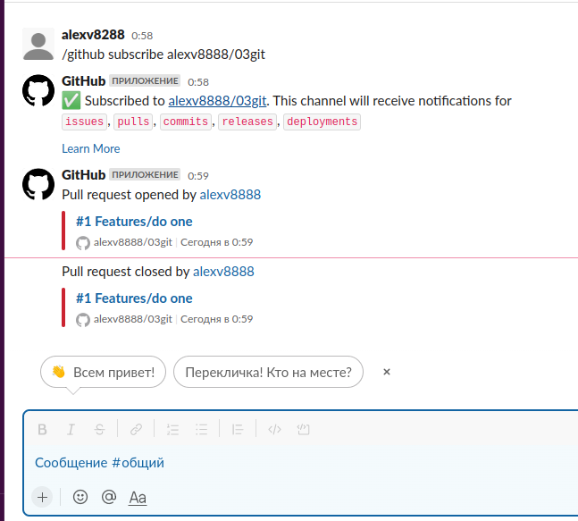

## Remote repositories

[GitHub](https://github.com/alexv8888/03git/)

[GitLab](https://gitlab.com/alexv8288/03git)

[Bitbucket](https://bitbucket.org/alexv8288/03git/)

## Script
```bash
#!/bin/bash
for repo in $(git remote show)
do
git push --all $repo
echo $repo - git push done
done
```

## Slack


