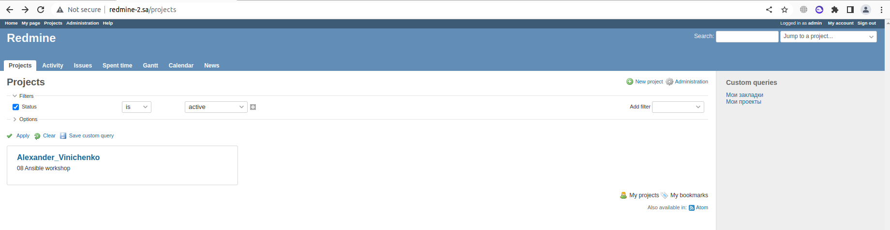

## Output

```bash
PLAY [redmine] ********************************************************************************************************************************************************************************************

TASK [Gathering Facts] ************************************************************************************************************************************************************************************
Saturday 13 August 2022  18:08:16 +0300 (0:00:00.013)       0:00:00.013 ******* 
ok: [redmine_2]

TASK [debug] **********************************************************************************************************************************************************************************************
Saturday 13 August 2022  18:08:18 +0300 (0:00:01.668)       0:00:01.681 ******* 
ok: [redmine_2] => {
    "msg": "192.168.56.7"
}

TASK [mysql_deployment : MySQL. Install packages] *********************************************************************************************************************************************************
Saturday 13 August 2022  18:08:18 +0300 (0:00:00.049)       0:00:01.731 ******* 
changed: [redmine_2]

TASK [mysql_deployment : mysql_db] ************************************************************************************************************************************************************************
Saturday 13 August 2022  18:09:19 +0300 (0:01:00.746)       0:01:02.477 ******* 
changed: [redmine_2]

TASK [mysql_deployment : mysql_user] **********************************************************************************************************************************************************************
Saturday 13 August 2022  18:09:19 +0300 (0:00:00.552)       0:01:03.029 ******* 
changed: [redmine_2]

TASK [app_deployment : Redmine. Install packages] *********************************************************************************************************************************************************
Saturday 13 August 2022  18:09:20 +0300 (0:00:00.564)       0:01:03.594 ******* 

changed: [redmine_2]

TASK [app_deployment : Redmine. Clone repository] *********************************************************************************************************************************************************
Saturday 13 August 2022  18:10:42 +0300 (0:01:22.451)       0:02:26.045 ******* 
changed: [redmine_2]

TASK [app_deployment : Redmine. Change permissions] *******************************************************************************************************************************************************
Saturday 13 August 2022  18:11:06 +0300 (0:00:23.963)       0:02:50.009 ******* 
changed: [redmine_2]

TASK [app_deployment : Redmine. Change permissions] *******************************************************************************************************************************************************
Saturday 13 August 2022  18:11:07 +0300 (0:00:00.568)       0:02:50.577 ******* 
changed: [redmine_2]

TASK [app_deployment : Config database] *******************************************************************************************************************************************************************
Saturday 13 August 2022  18:11:07 +0300 (0:00:00.354)       0:02:50.932 ******* 
changed: [redmine_2]

TASK [app_deployment : Redmine. Setup 01] *****************************************************************************************************************************************************************
Saturday 13 August 2022  18:11:08 +0300 (0:00:00.868)       0:02:51.800 ******* 
changed: [redmine_2]

TASK [app_deployment : Session store secret generation] ***************************************************************************************************************************************************
Saturday 13 August 2022  18:12:47 +0300 (0:01:39.093)       0:04:30.894 ******* 
changed: [redmine_2]

TASK [app_deployment : Redmine. Setup 02] *****************************************************************************************************************************************************************
Saturday 13 August 2022  18:12:50 +0300 (0:00:02.713)       0:04:33.608 ******* 
changed: [redmine_2]

TASK [app_deployment : Configuration files for virtualhost] ***********************************************************************************************************************************************
Saturday 13 August 2022  18:13:17 +0300 (0:00:26.833)       0:05:00.441 ******* 
changed: [redmine_2]

TASK [app_deployment : meta] ******************************************************************************************************************************************************************************
Saturday 13 August 2022  18:13:17 +0300 (0:00:00.602)       0:05:01.044 ******* 

RUNNING HANDLER [app_deployment : apache restart] *********************************************************************************************************************************************************
Saturday 13 August 2022  18:13:17 +0300 (0:00:00.000)       0:05:01.044 ******* 
changed: [redmine_2]

TASK [Add redmine-2.sa to host file] **********************************************************************************************************************************************************************
Saturday 13 August 2022  18:13:18 +0300 (0:00:01.041)       0:05:02.086 ******* 
changed: [redmine_2]

TASK [uri] ************************************************************************************************************************************************************************************************
Saturday 13 August 2022  18:13:19 +0300 (0:00:00.342)       0:05:02.429 ******* 
ok: [redmine_2]

TASK [lineinfile] *****************************************************************************************************************************************************************************************
Saturday 13 August 2022  18:13:25 +0300 (0:00:06.595)       0:05:09.024 ******* 
changed: [redmine_2]

PLAY RECAP ************************************************************************************************************************************************************************************************
redmine_2                  : ok=18   changed=15   unreachable=0    failed=0    skipped=0    rescued=0    ignored=0   

Saturday 13 August 2022  18:13:26 +0300 (0:00:00.465)       0:05:09.490 ******* 
=============================================================================== 
app_deployment : Redmine. Setup 01 ---------------------------------------------------------------------------------------------------------------------------------------------------------------- 99.09s
app_deployment : Redmine. Install packages -------------------------------------------------------------------------------------------------------------------------------------------------------- 82.45s
mysql_deployment : MySQL. Install packages -------------------------------------------------------------------------------------------------------------------------------------------------------- 60.75s
app_deployment : Redmine. Setup 02 ---------------------------------------------------------------------------------------------------------------------------------------------------------------- 26.83s
app_deployment : Redmine. Clone repository -------------------------------------------------------------------------------------------------------------------------------------------------------- 23.96s
uri ------------------------------------------------------------------------------------------------------------------------------------------------------------------------------------------------ 6.60s
app_deployment : Session store secret generation --------------------------------------------------------------------------------------------------------------------------------------------------- 2.71s
Gathering Facts ------------------------------------------------------------------------------------------------------------------------------------------------------------------------------------ 1.67s
app_deployment : apache restart -------------------------------------------------------------------------------------------------------------------------------------------------------------------- 1.04s
app_deployment : Config database ------------------------------------------------------------------------------------------------------------------------------------------------------------------- 0.87s
app_deployment : Configuration files for virtualhost ----------------------------------------------------------------------------------------------------------------------------------------------- 0.60s
app_deployment : Redmine. Change permissions ------------------------------------------------------------------------------------------------------------------------------------------------------- 0.57s
mysql_deployment : mysql_user ---------------------------------------------------------------------------------------------------------------------------------------------------------------------- 0.56s
mysql_deployment : mysql_db ------------------------------------------------------------------------------------------------------------------------------------------------------------------------ 0.55s
lineinfile ----------------------------------------------------------------------------------------------------------------------------------------------------------------------------------------- 0.47s
app_deployment : Redmine. Change permissions ------------------------------------------------------------------------------------------------------------------------------------------------------- 0.35s
Add redmine-2.sa to host file ---------------------------------------------------------------------------------------------------------------------------------------------------------------------- 0.34s
debug ---------------------------------------------------------------------------------------------------------------------------------------------------------------------------------------------- 0.05s
app_deployment : meta ------------------------------------------------------------------------------------------------------------------------------------------------------------------------------ 0.00s
Playbook run took 0 days, 0 hours, 5 minutes, 9 seconds


```

## Project

