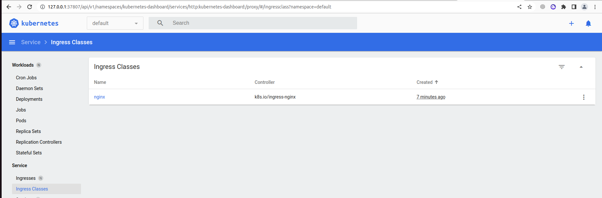

## Install minikube

```bash
 1997  sudo apt update
 1998  sudo apt-get install -y apt-transport-https
 1999  curl -s https://packages.cloud.google.com/apt/doc/apt-key.gpg | sudo apt-key add -
 2000  echo "deb https://apt.kubernetes.io/ kubernetes-xenial main" | sudo tee -a /etc/apt/sources.list.d/kubernetes.list
 2001  sudo apt update
 2002  sudo apt-get install -y kubectl
 2007  curl -LO https://storage.googleapis.com/minikube/releases/latest/minikube-linux-amd64
 2008  sudo install minikube-linux-amd64 /usr/local/bin/minikube
 2009  sudo minikube start
 2010  sudo minikube start --driver=virtualbox
 2011  minikube start
 2012  minikube status
 2013  minikube dashboard
```


## Enable ingress

```bash
az@az-HP:~$ minikube addons enable ingress
💡  ingress is an addon maintained by Kubernetes. For any concerns contact minikube on GitHub.
You can view the list of minikube maintainers at: https://github.com/kubernetes/minikube/blob/master/OWNERS
    ▪ Using image k8s.gcr.io/ingress-nginx/controller:v1.2.1
    ▪ Using image k8s.gcr.io/ingress-nginx/kube-webhook-certgen:v1.1.1
    ▪ Using image k8s.gcr.io/ingress-nginx/kube-webhook-certgen:v1.1.1
🔎  Verifying ingress addon...
🌟  The 'ingress' addon is enabled
az@az-HP:~$ kubectl get pods -n ingress-nginx
NAME                                        READY   STATUS      RESTARTS   AGE
ingress-nginx-admission-create-bw4jc        0/1     Completed   0          2m34s
ingress-nginx-admission-patch-sf9pq         0/1     Completed   1          2m34s
ingress-nginx-controller-755dfbfc65-gnkhh   1/1     Running     0          2m34s
az@az-HP:~$ minikube addons list
|-----------------------------|----------|--------------|--------------------------------|
|         ADDON NAME          | PROFILE  |    STATUS    |           MAINTAINER           |
|-----------------------------|----------|--------------|--------------------------------|
| ambassador                  | minikube | disabled     | 3rd party (Ambassador)         |
| auto-pause                  | minikube | disabled     | Google                         |
| csi-hostpath-driver         | minikube | disabled     | Kubernetes                     |
| dashboard                   | minikube | enabled ✅   | Kubernetes                     |
| default-storageclass        | minikube | enabled ✅   | Kubernetes                     |
| efk                         | minikube | disabled     | 3rd party (Elastic)            |
| freshpod                    | minikube | disabled     | Google                         |
| gcp-auth                    | minikube | disabled     | Google                         |
| gvisor                      | minikube | disabled     | Google                         |
| headlamp                    | minikube | disabled     | 3rd party (kinvolk.io)         |
| helm-tiller                 | minikube | disabled     | 3rd party (Helm)               |
| inaccel                     | minikube | disabled     | 3rd party (InAccel             |
|                             |          |              | [info@inaccel.com])            |
| ingress                     | minikube | enabled ✅   | Kubernetes                     |
| ingress-dns                 | minikube | disabled     | Google                         |
| istio                       | minikube | disabled     | 3rd party (Istio)              |
| istio-provisioner           | minikube | disabled     | 3rd party (Istio)              |
| kong                        | minikube | disabled     | 3rd party (Kong HQ)            |
| kubevirt                    | minikube | disabled     | 3rd party (KubeVirt)           |
| logviewer                   | minikube | disabled     | 3rd party (unknown)            |
| metallb                     | minikube | disabled     | 3rd party (MetalLB)            |
| metrics-server              | minikube | disabled     | Kubernetes                     |
| nvidia-driver-installer     | minikube | disabled     | Google                         |
| nvidia-gpu-device-plugin    | minikube | disabled     | 3rd party (Nvidia)             |
| olm                         | minikube | disabled     | 3rd party (Operator Framework) |
| pod-security-policy         | minikube | disabled     | 3rd party (unknown)            |
| portainer                   | minikube | disabled     | 3rd party (Portainer.io)       |
| registry                    | minikube | disabled     | Google                         |
| registry-aliases            | minikube | disabled     | 3rd party (unknown)            |
| registry-creds              | minikube | disabled     | 3rd party (UPMC Enterprises)   |
| storage-provisioner         | minikube | enabled ✅   | Google                         |
| storage-provisioner-gluster | minikube | disabled     | 3rd party (Gluster)            |
| volumesnapshots             | minikube | disabled     | Kubernetes                     |
|-----------------------------|----------|--------------|--------------------------------|
az@az-HP:~$
```

## Set RAM and CPU's

```bash
az@az-HP:~$ minikube stop
✋  Stopping node "minikube"  ...
🛑  Powering off "minikube" via SSH ...
🛑  1 node stopped.
az@az-HP:~$ minikube delete
🔥  Deleting "minikube" in docker ...
🔥  Deleting container "minikube" ...
🔥  Removing /home/az/.minikube/machines/minikube ...
💀  Removed all traces of the "minikube" cluster.
az@az-HP:~$ minikube start --memory 4096 --cpus 2
😄  minikube v1.26.1 on Ubuntu 22.04
✨  Automatically selected the docker driver. Other choices: virtualbox, ssh, qemu2 (experimental)
📌  Using Docker driver with root privileges
👍  Starting control plane node minikube in cluster minikube
🚜  Pulling base image ...
🔥  Creating docker container (CPUs=2, Memory=4096MB) ...
🐳  Preparing Kubernetes v1.24.3 on Docker 20.10.17 ...
    ▪ Generating certificates and keys ...
    ▪ Booting up control plane ...
    ▪ Configuring RBAC rules ...
🔎  Verifying Kubernetes components...
    ▪ Using image gcr.io/k8s-minikube/storage-provisioner:v5
🌟  Enabled addons: storage-provisioner, default-storageclass
🏄  Done! kubectl is now configured to use "minikube" cluster and "default" namespace by default

```
## Dashboard


## Ansible play

```bash
PLAY RECAP ******************************************************************************************************************************
localhost                  : ok=3    changed=0    unreachable=0    failed=0    skipped=0    rescued=0    ignored=0   
node1                      : ok=772  changed=145  unreachable=0    failed=0    skipped=1259 rescued=0    ignored=9   
node2                      : ok=501  changed=92   unreachable=0    failed=0    skipped=737  rescued=0    ignored=2   

Thursday 18 August 2022  00:47:46 +0300 (0:00:00.095)       0:42:29.806 *******
===============================================================================
download : download_file | Validate mirrors ------------------------------------------------------------------------------------- 72.83s
kubernetes/preinstall : Install packages requirements --------------------------------------------------------------------------- 69.69s
kubernetes-apps/ansible : Kubernetes Apps | Lay Down CoreDNS templates ---------------------------------------------------------- 59.22s
kubernetes-apps/ansible : Kubernetes Apps | Start Resources --------------------------------------------------------------------- 43.87s
network_plugin/calico : Calico | Create calico manifests ------------------------------------------------------------------------ 36.38s
download : download_container | Download image if required ---------------------------------------------------------------------- 35.67s
etcd : Check certs | Register ca and etcd admin/member certs on etcd hosts ------------------------------------------------------ 35.12s
download : download_container | Download image if required ---------------------------------------------------------------------- 31.48s
download : download_container | Download image if required ---------------------------------------------------------------------- 28.84s
kubernetes/control-plane : kubeadm | Initialize first master -------------------------------------------------------------------- 27.29s
download : download_container | Download image if required ---------------------------------------------------------------------- 24.92s
bootstrap-os : Assign inventory name to unconfigured hostnames (non-CoreOS, non-Flatcar, Suse and ClearLinux, non-Fedora) ------- 24.59s
kubernetes/kubeadm : Join to cluster -------------------------------------------------------------------------------------------- 22.60s
download : download_container | Download image if required ---------------------------------------------------------------------- 21.16s
download : download_container | Download image if required ---------------------------------------------------------------------- 20.90s
network_plugin/calico : Start Calico resources ---------------------------------------------------------------------------------- 20.87s
container-engine/containerd : download_file | Download item --------------------------------------------------------------------- 20.79s
kubernetes/preinstall : Ensure kube-bench parameters are set -------------------------------------------------------------------- 19.30s
download : download_container | Download image if required ---------------------------------------------------------------------- 19.16s
download : download_file | Download item ---------------------------------------------------------------------------------------- 18.82s
```
