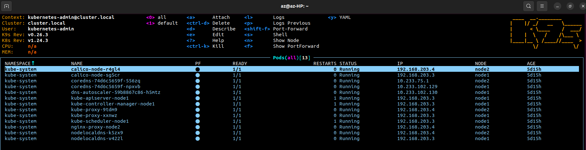

## Setup kubectl for local run (aliases)

```bash
 1984  echo 'alias k=kubectl' >>~/.bashrc
 1985  echo 'alias kgpo="kubectl get pods"' >>~/.bashrc
 1992  echo 'alias kgno="kubectl get nodes"' >>~/.bashrc

az@az-HP:~/.kube$ kgno
NAME    STATUS   ROLES           AGE     VERSION
node1   Ready    control-plane   5d19h   v1.24.3
node2   Ready    <none>          5d19h   v1.24.3
```

## Print-screen of k9s



## Config from k3s add to existing config 


```bash
 1997  cp ~/.kube/config ~/.kube/config.bak 
 2001  scp vagrant@192.168.56.6:/etc/rancher/k3s/k3s.yaml k3s
 2018  KUBECONFIG=~/.kube/config:./k3s kubectl config view --flatten > /tmp/config
 2021  mv /tmp/config ~/.kube/config
 ```

```bash
apiVersion: v1
clusters:
- cluster:
    certificate-authority-data: LS0tLS1C...
    server: https://127.0.0.1:6443
  name: cluster.local
- cluster:
    certificate-authority-data: LS0tLS1C...
    server: https://192.168.56.6:6443
  name: default
contexts:
- context:
    cluster: default
    user: default
  name: default
- context:
    cluster: cluster.local
    user: kubernetes-admin
  name: kubernetes-admin@cluster.local
current-context: kubernetes-admin@cluster.local
kind: Config
preferences: {}
users:
- name: default
  user:
    client-certificate-data: LS0tLS1CRUh...
    client-key-data: LS0tLS1CRUdJTiBFQyB...
- name: kubernetes-admin
  user:
    client-certificate-data: LS0tLS1CRUd...
    client-key-data: LS0tLS1CRUdJTiBSU0E...
```
