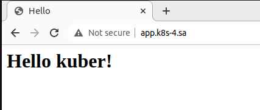
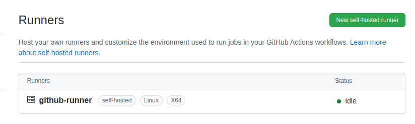

## Deployment of nginx service

```yaml
---
apiVersion: apps/v1
kind: Deployment
metadata:
  name: webserver
  labels:
    app: nginx
spec:
  replicas: 3
  strategy:
    type: RollingUpdate
    rollingUpdate:
      maxSurge: "50%"
      maxUnavailable: 0
  selector:
    matchLabels:
      app: nginx
  template:
    metadata:
      labels:
        app: nginx
    spec:
      containers:
      - name: ngx
        image: nginx
        ports:
        - containerPort: 80
        resources:
          requests:
            cpu: 50m
            memory: 50Mi
          limits:
            cpu: 100m
            memory: 100Mi
        volumeMounts:
        - name: indexpage-mount
          mountPath: /usr/share/nginx/html/index.html
          subPath: index.html
      volumes:
      - name: indexpage-mount
        configMap:
          name: indexpage
---
apiVersion: v1
kind: Service
metadata:
  name: nginx-service
  labels:
    run: nginx-service
spec:
  ports:
  - port: 80
    protocol: TCP
  selector:
    app: nginx

---
apiVersion: networking.k8s.io/v1
kind: Ingress
metadata:
  name: ingress-sa
  annotations:
    kubernetes.io/ingress.class: nginx
    nginx.ingress.kubernetes.io/server-alias: "app.k8s-4.sa"
spec:
  rules:
    - host: app.k8s-3.sa
      http:
        paths:
          - path: /
            pathType: Prefix
            backend:
              service:
                name: nginx-service
                port:
                  number: 80
---
apiVersion: v1
kind: ConfigMap
metadata:
  name: indexpage
data:
  index.html: |
    <html>
    <head>
    <title>Hello</title>
    </head>
    <body>
    <h1>Hello kuber!</h1>
    </body>
    </html>
```



## Deploy a self-hosted runner

```yaml
---
apiVersion: apps/v1
kind: Deployment
metadata:
  name: githubrunner
  namespace: github
  labels:
    app: runner
spec:
  replicas: 1
  selector:
    matchLabels:
      app: runner
  template:
    metadata:
      labels:
        app: runner
      namespace: github
    spec:
      containers:
      - name: github-runner
        image: tcardonne/github-runner     
        env:
        - name: RUNNER_NAME
          value: github-runner
        - name: RUNNER_TOKEN
          valueFrom:
            secretKeyRef:
              name: mysecret
              key: TOKEN
        - name: RUNNER_REPOSITORY_URL
          value: https://github.com/alexv8888/03git
---
apiVersion: v1
data:
  TOKEN: QVNE...
kind: Secret
metadata:
  name: mysecret
  namespace: github
type: Opaque
```

