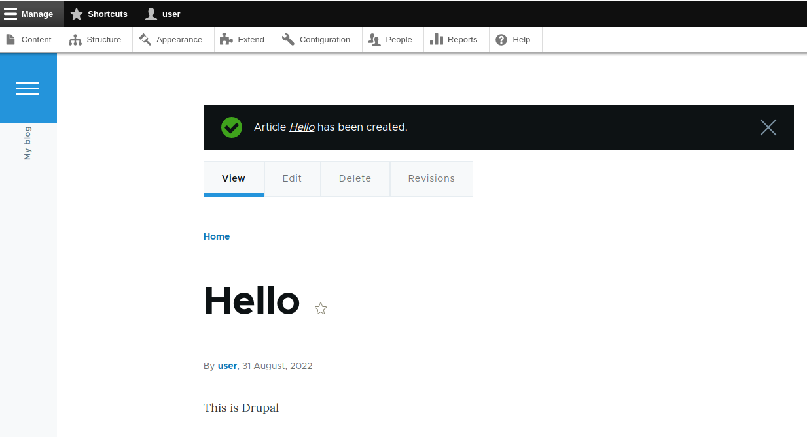
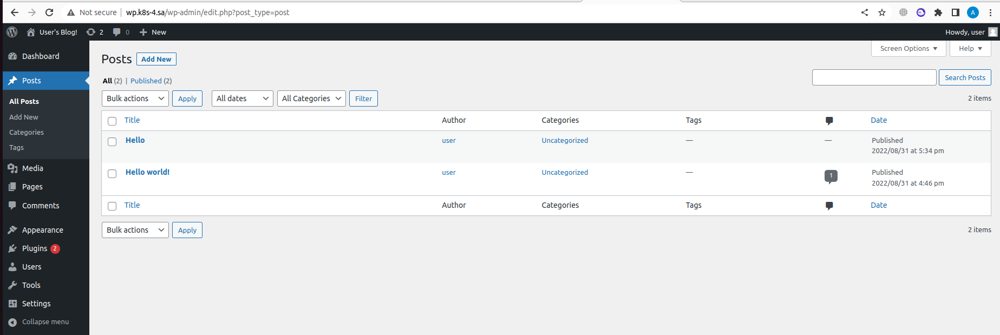

```bash
 1998  mkdir 13helm
 1999  cd 13helm/
 2000  wget https://get.helm.sh/helm-v3.9.4-linux-amd64.tar.gz
 2001  tar -zxvf helm-v3.9.4-linux-amd64.tar.gz 
 2002  mv linux-amd64/helm /usr/local/bin/helm
 2003  sudo mv linux-amd64/helm /usr/local/bin/helm
 2024  helm repo add bitnami https://charts.bitnami.com/bitnami
 2032  helm repo add nfs-subdir-external-provisioner https://kubernetes-sigs.github.io/nfs-subdir-external-provisioner
 2034  helm repo update
 2035  helm install nfs-subdir-external-provisioner nfs-subdir-external-provisioner/nfs-subdir-external-provisioner --set nfs.server=192.168.37.105 --set nfs.path=/mnt/IT-Academy/nfs-data/sa2-21-22
 2053  kubectl apply -f wpingress.yaml 
 2054  kubectl apply -f dpingress.yaml
 2094  ansible-playbook -i inv.yaml maria.yaml -u root
 2187  helm install my-wordpress --set mariadb.enabled=false,externalDatabase.host=192.168.202.4,externalDatabase.password=password,global.storageClass=nfs-client,wordpressPassword=password bitnami/wordpress
 2188  helm install my-drupal --set mariadb.enabled=false,externalDatabase.host=192.168.202.4,externalDatabase.password=password,global.storageClass=nfs-client,drupalPassword=password bitnami/drupal

```


