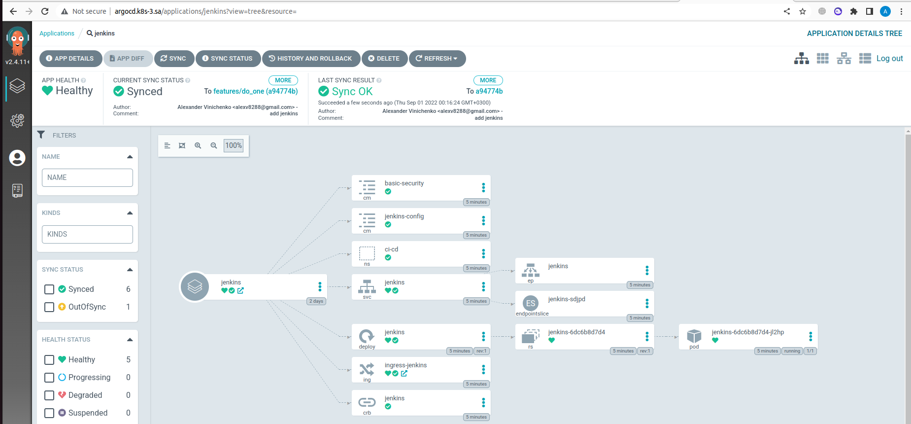
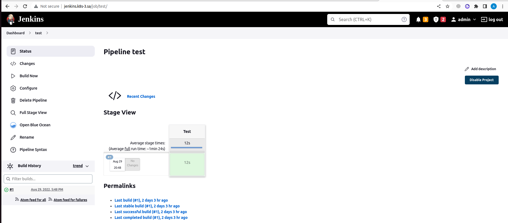

```bash
az@az-HP:~/14kub$ helm template jenkins-chart/
---
# Source: jenkins-chart/templates/deployment.yaml
apiVersion: v1
kind: Namespace
metadata:
  name: ci-cd
---
# Source: jenkins-chart/templates/deployment.yaml
apiVersion: v1
kind: ConfigMap
metadata:
  name: basic-security
  namespace: ci-cd
data:
  basic-security.groovy: |
    #!groovy
    import jenkins.model.*
    import hudson.security.*
    def instance = Jenkins.getInstance()
    println "--> creating local user 'admin'"
    def password = System.getenv("PASS")
    def hudsonRealm = new HudsonPrivateSecurityRealm(false)
    hudsonRealm.createAccount('admin',"admin")
    instance.setSecurityRealm(hudsonRealm)
    def strategy = new FullControlOnceLoggedInAuthorizationStrategy()
    strategy.setAllowAnonymousRead(true)
    instance.setAuthorizationStrategy(strategy)
    instance.save()
---
# Source: jenkins-chart/templates/deployment.yaml
apiVersion: v1
kind: ConfigMap
metadata:
  name: jenkins-config
  namespace: ci-cd
data:
  jenkins.yaml: |
        jenkins:
          numExecutors: 2
          clouds:
          - kubernetes:
              containerCapStr: "10"
              maxRequestsPerHostStr: "32"
              jenkinsUrl: "http://jenkins:8080"
              name: "kubernetes"
              namespace: ci-cd
              skipTlsVerify: true
        credentials:
          system:
            domainCredentials:
            - credentials:
              - usernamePassword:
                  description: "Githubuser"
                  id: "some_randome"
                  password: "XXXXXXXXXXX"
                  scope: GLOBAL
                  username: "git_hub_user"
        unclassified:
          location:
            adminAddress: alexv8288@gmail.com
            url: http://jenkins.k8s-4.sa/
          shell:
            shell: "/bin/bash"
---
# Source: jenkins-chart/templates/deployment.yaml
apiVersion: rbac.authorization.k8s.io/v1
kind: ClusterRoleBinding
metadata:
  name: jenkins
  namespace: ci-cd
roleRef:
  apiGroup: rbac.authorization.k8s.io
  kind: ClusterRole
  name: cluster-admin
subjects:
- kind: ServiceAccount
  name: default
  namespace: ci-cd
---
# Source: jenkins-chart/templates/service.yaml
apiVersion: v1
kind: Service
metadata:
  name: jenkins
  namespace: ci-cd
spec:
  ports:
    - name: master
      port: 8080
      targetPort: 8080
    - name: slave
      port: 50000
      targetPort: 50000
  selector:
    app: jenkins
---
# Source: jenkins-chart/templates/deployment.yaml
apiVersion: apps/v1
kind: Deployment
metadata:
  name: jenkins
  namespace: ci-cd
spec:
  replicas: 1
  selector:
    matchLabels:
      app: jenkins
  template:
    metadata:
      labels:
        app: jenkins
    spec:
      containers:
        - name: jenkins
          image: jfrog.it-academy.by/public/jenkins-ci:alexv8288
          imagePullPolicy: IfNotPresent
          env:
            - name: JAVA_OPTS
              value: "-Djenkins.install.runSetupWizard=false"
            - name: CASC_JENKINS_CONFIG
              value: /var/jenkins_home/casc_configs/jenkins.yaml
          ports:
            - name: http-port
              containerPort: 8080
            - name: jnlp-port
              containerPort: 50000
          securityContext:
            runAsUser: 0
          resources:
            requests:
              cpu: 3000m
              memory: 3000Mi
            limits:
              cpu: 3000m
              memory: 4000Mi
          volumeMounts:
            - name: jenkins-auth-config
              mountPath: /var/jenkins_home/init.groovy.d/basic-security.groovy
              subPath: basic-security.groovy
            - name: jenkins-config-yaml
              mountPath: /var/jenkins_home/casc_configs/jenkins.yaml
              subPath: jenkins.yaml
            - name: jenkins-config
              mountPath: /var/jenkins_home
      volumes:
        - name: jenkins-auth-config
          configMap:
            name: basic-security
        - name: jenkins-config-yaml
          configMap:
            name: jenkins-config
        - name: jenkins-config
          nfs:
            server: 192.168.37.105
            path: /mnt/IT-Academy/nfs-data/sa2-21-22/alexv8288/jenkins
---
# Source: jenkins-chart/templates/ingress.yaml
apiVersion: networking.k8s.io/v1
kind: Ingress
metadata:
  name: ingress-jenkins
  namespace: ci-cd
  annotations:
    kubernetes.io/ingress.class: nginx
    nginx.ingress.kubernetes.io/server-alias: jenkins.k8s-4.sa
spec:
  rules:
    - host: jenkins.k8s-3.sa
      http:
        paths:
          - path: /
            pathType: Prefix
            backend:
              service:
                name: jenkins
                port:
                  number: 8080

```

```bash
az@az-HP:~/14kub$ helm package jenkins-chart/
Successfully packaged chart and saved it to: /home/az/14kub/jenkins-chart-0.2.0.tgz
az@az-HP:~/14kub$ helm install my-jenkins jenkins-chart-0.2.0.tgz 
NAME: my-jenkins
LAST DEPLOYED: Thu Sep  1 00:11:11 2022
NAMESPACE: default
STATUS: deployed
REVISION: 1
TEST SUITE: None

```
