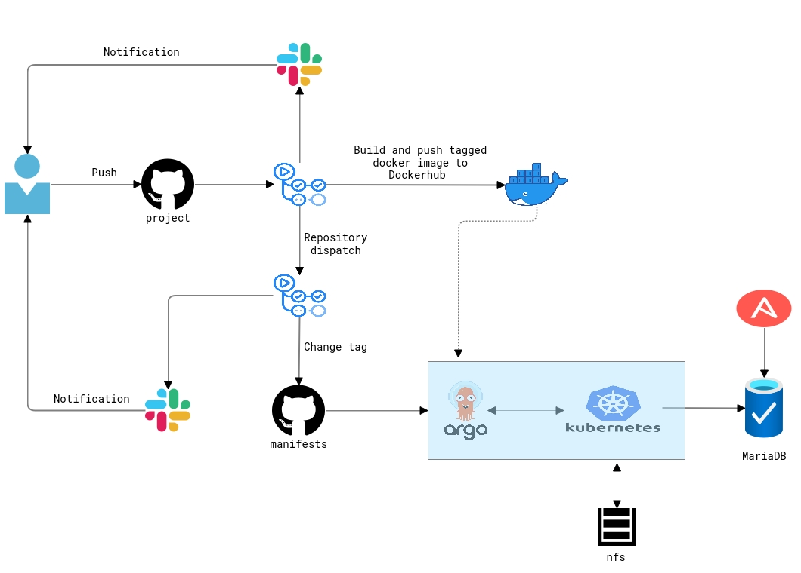

#Final Project Report#

- Project's reporter: Alexander Vinichenko

- Group number: md-sa2-21-22

#Description of application for deployment#

- Name of the application - Wordpress
- Programming language - PHP
- DB - MariaDB
- Link - [Wordpress](https://github.com/docker-library/wordpress)

#Pipeline#

#Technologies which were used in the project#

- Orchestration: Kubernetes

- Automation tools: Ansible, ArgoCD, Github Actions

- Other: Slack, Docker

#CI/CD description#

CI pipeline is triggered by pushing commits in the main branch of alexv8888/project repository. It builds a docker image from the files which are located in the "Docker" folder, pushes the image to Dockerhub and sends a message with a new tag to Github Actions pipeline in alexv8888/manifests. This pipeline then updates the image tag in the kubertenes manifests which are tracked by ArgoCD. Rollback can be done via ArgoCD.

#Project link#
[Project](https://github.com/alexv8888/project)
[Manifests](https://github.com/alexv8888/manifests)
[Dockerhub](https://hub.docker.com/repository/docker/alexv8288/wordpress_app)