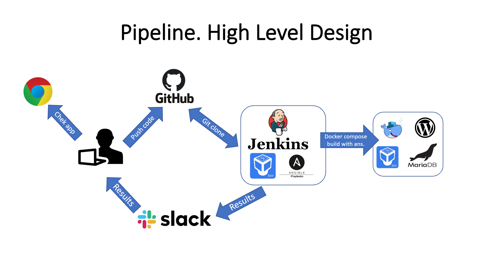

## Project report

### Project's reporter: Alexandr Andreenko
### Group number: m-sa2-14-20

## Description of application for deployment
- Name: Wordpress
- Application is written in PHP, Web - Apache
- Database: MariaDB
- [CI & CD GitHub repository](https://github.com/AlexandrAndreenko/project.git)

### Pipeline. High Level Design

### Technologies which were used in project
- **Orchestration:** Jenkins
- **Automation tools:** Ansible
- **Infrastructure:** VirtualBox
- **Container:** Docker, docker-compose
- **SCM:** GitHub
- **Notification:** Slack

### Preparing infrastructure and app installation description:

  * Deployment starts with Jenkins
  * After pushing the code to SCM, Jenkins (master) downloads GitHub repository and runs .yaml files with Ansible
  * Ansible run playbook **deploy.yaml** with inventory file **hosts.yaml**
  * Installing and Configuring Docker, Docker-compose
  * Running Docker containers (DB & App images) with docker-compose
  * Notify Slack about the results of pipeline

### App update description:

  * Creating directory and make backup of app and db
  * Stop and delete container wordpess
  * Copying new docker-compose file
  * Download new docker images and run new container
  * Test if its working
  * If the update was successful, jenkins sent notification to slack.
  * If the content check on the page did not return the set value, ansible send notification about failed update and start rollbacking app. 

### App rollback description:

  * Stop and remove docker container with app
  * Remove app filese.
  * Comeback previous contents to app folder 
  * Run previous app conteiner with first docker-compose file.
  * Test if its working
  * Ansible reports to Slack that the rollback has complete
  * Notify Slack about the results of that pipeline (update/rollback)

### Usefull links

[Github bitnami-docker-wordpress](https://hub.docker.com/r/bitnami/wordpress/)
