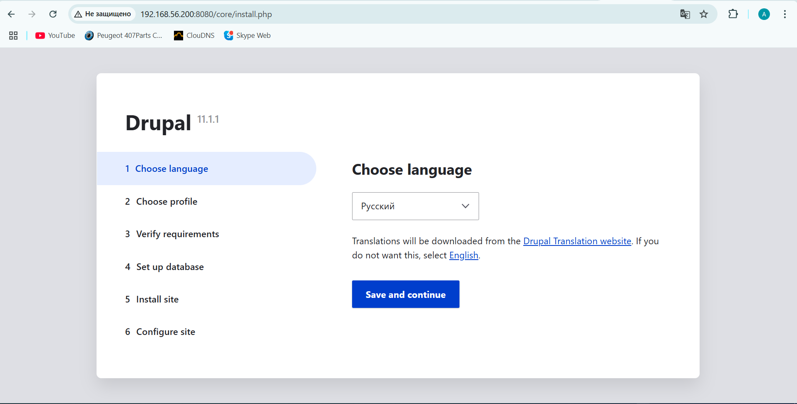
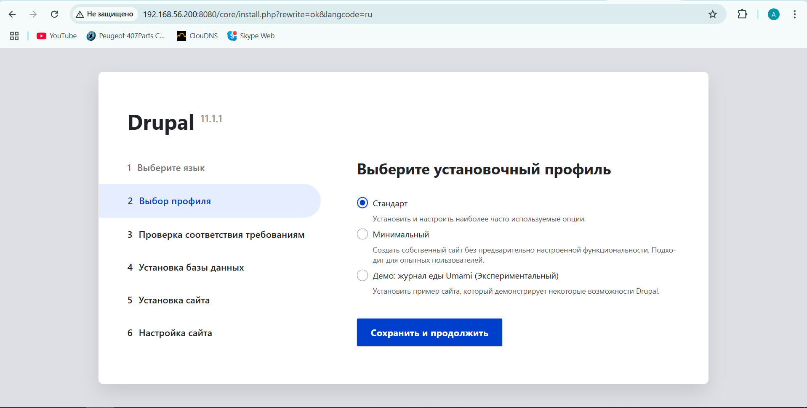
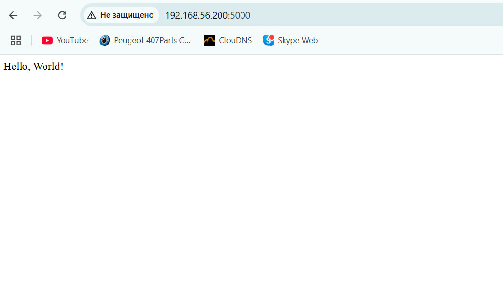
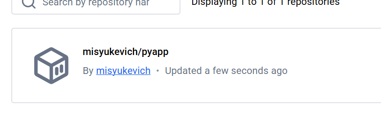
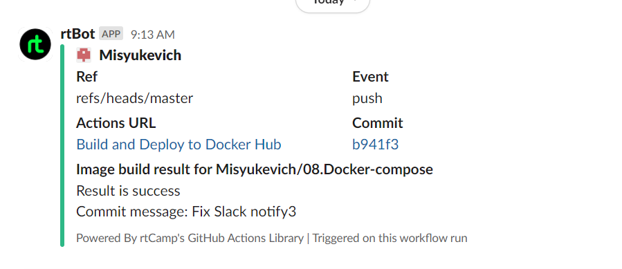
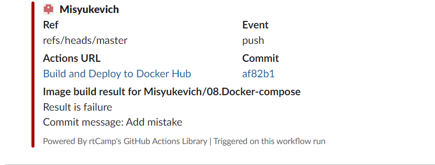

# 08. Docker. Docker compose

## Homework Assignment 1: Docker Compose for Application Stacks

[Dockerfile](./Assignment1/Dockerfile)

[Docker compose](./Assignment1/docker-compose.yaml)

### Run Docker compose

```shell

docker compose up -d

WARN[0000] /home/misyukevich/08.Docker/docker-compose.yaml: the attribute `version` is obsolete, it will be ignored, please remove it to avoid potential confusion
[+] Building 130.1s (13/13) FINISHED                                                                                                       docker:default
 => [drupal internal] load build definition from Dockerfile                                                                                          0.0s
 => => transferring dockerfile: 392B                                                                                                                 0.0s
 => WARN: FromAsCasing: 'as' and 'FROM' keywords' casing do not match (line 1)                                                                       0.0s
 => [drupal internal] load metadata for docker.io/library/mariadb:latest                                                                             0.0s
 => [drupal internal] load metadata for docker.io/library/drupal:latest                                                                              1.0s
 => [drupal internal] load .dockerignore                                                                                                             0.0s
 => => transferring context: 2B                                                                                                                      0.0s
 => [drupal stage-1 1/5] FROM docker.io/library/drupal:latest@sha256:040c6d740a774a2abb3f909f77342ea62c6eedf526b55ce4af0faf3bdee0c4a2               86.0s
 => => resolve docker.io/library/drupal:latest@sha256:040c6d740a774a2abb3f909f77342ea62c6eedf526b55ce4af0faf3bdee0c4a2                               0.0s
 => => sha256:19b8b345aefdb08d07f4470c16e16cc480845fbe229bff115e5f206a92d09075 4.62kB / 4.62kB                                                       0.0s
 => => sha256:8fff76cf83dd1f23e14a91739489310432c294a00df129511c63f79603836211 14.32kB / 14.32kB                                                     0.0s
 => => sha256:05e004e38cd923e1e05927f28863da55672f2765a6c354ffeaf1aac61fddd950 225B / 225B                                                           0.3s
 => => sha256:6c0335640eef2cdbb512bd83dca7eb9bcffd9d2e2639583384f7e3d81d819434 104.35MB / 104.35MB                                                  51.7s
 => => sha256:040c6d740a774a2abb3f909f77342ea62c6eedf526b55ce4af0faf3bdee0c4a2 7.96kB / 7.96kB                                                       0.0s
 => => sha256:9228f3fa46c10a3a1eee49639e1d97125655453d5e8c2a042527a9a980022202 226B / 226B                                                           1.2s
 => => extracting sha256:05e004e38cd923e1e05927f28863da55672f2765a6c354ffeaf1aac61fddd950                                                            0.0s
 => => sha256:a4d4a5a93692eba2e8d66dec3d5095cfcec86714313aeeab55a2adc7f3b9b561 20.12MB / 20.12MB                                                    17.4s
 => => sha256:b0ddef6aec1821efe140671be155ec4d4d85c19dbd0c622fa19a42fa9b9aa5a1 427B / 427B                                                           1.7s
 => => sha256:ac37b14f2c9cdd4f964e93a22a35e8d51502e4b9c55d5744bf8221a040c8a03e 480B / 480B                                                           2.6s
 => => sha256:f1a2b56ba197e0b67a94e653d913445e1eba3d4b427aa8054dcf2c526c57d097 12.65MB / 12.65MB                                                    14.7s
 => => sha256:f6c436b244b8d28def78b05796883b5f523e7fa565a19da8726dcf17418708d1 489B / 489B                                                          15.3s
 => => sha256:66ef6ef33f8bc47b5efd65a524dce6280a9fae07083be14761cb799941ad841d 11.65MB / 11.65MB                                                    24.9s
 => => sha256:8dbe7fe859d09012ab92706dc5db2e143387f0be2f1737eefaf2aa33e0b143b2 2.46kB / 2.46kB                                                      17.7s
 => => sha256:9bbe234e29095a38e267e15befd51391a61ebd68a04441bdf4b3a90f4b3bcbf5 246B / 246B                                                          18.0s
 => => sha256:bf2f883095aaa1107121693d7419a7df9d6fbafc03601e599540f287ca96065e 892B / 892B                                                          18.2s
 => => sha256:4f4fb700ef54461cfa02571ae0db9a0dc1e0cdb5577484a6d75e68dc38e8acc1 32B / 32B                                                            18.6s
 => => sha256:203bd6ec50f534d2c23cc94d341b049828355c023670c619e32e106d81d743f0 2.00MB / 2.00MB                                                      21.1s
 => => sha256:b71ddce96f714fcd3d0dee2c01bc7c1f11d248ce9f7a9dfd65378f54b5b1959f 314B / 314B                                                          21.5s
 => => sha256:c706ce5015d2050cbba4b40523b3acbf7ed753a9e12f007626f29c501d8c619a 742.24kB / 742.24kB                                                  22.7s
 => => sha256:b04d7274f519f5a28dc4bcc843bfd392b30a10a8a7a223af6f103fbb795a5435 114B / 114B                                                          23.0s
 => => sha256:fa965b13913d08c870becb80ed22989412ad2a7b0daef93d69155f10ae36ace2 20.04MB / 20.04MB                                                    37.7s
 => => extracting sha256:6c0335640eef2cdbb512bd83dca7eb9bcffd9d2e2639583384f7e3d81d819434                                                           10.9s
 => => extracting sha256:9228f3fa46c10a3a1eee49639e1d97125655453d5e8c2a042527a9a980022202                                                            0.0s
 => => extracting sha256:a4d4a5a93692eba2e8d66dec3d5095cfcec86714313aeeab55a2adc7f3b9b561                                                            1.6s
 => => extracting sha256:b0ddef6aec1821efe140671be155ec4d4d85c19dbd0c622fa19a42fa9b9aa5a1                                                            0.0s
 => => extracting sha256:ac37b14f2c9cdd4f964e93a22a35e8d51502e4b9c55d5744bf8221a040c8a03e                                                            0.0s
 => => extracting sha256:f1a2b56ba197e0b67a94e653d913445e1eba3d4b427aa8054dcf2c526c57d097                                                            0.3s
 => => extracting sha256:f6c436b244b8d28def78b05796883b5f523e7fa565a19da8726dcf17418708d1                                                            0.0s
 => => extracting sha256:66ef6ef33f8bc47b5efd65a524dce6280a9fae07083be14761cb799941ad841d                                                            1.5s
 => => extracting sha256:8dbe7fe859d09012ab92706dc5db2e143387f0be2f1737eefaf2aa33e0b143b2                                                            0.0s
 => => extracting sha256:9bbe234e29095a38e267e15befd51391a61ebd68a04441bdf4b3a90f4b3bcbf5                                                            0.0s
 => => extracting sha256:bf2f883095aaa1107121693d7419a7df9d6fbafc03601e599540f287ca96065e                                                            0.0s
 => => extracting sha256:4f4fb700ef54461cfa02571ae0db9a0dc1e0cdb5577484a6d75e68dc38e8acc1                                                            0.0s
 => => extracting sha256:203bd6ec50f534d2c23cc94d341b049828355c023670c619e32e106d81d743f0                                                            0.2s
 => => extracting sha256:b71ddce96f714fcd3d0dee2c01bc7c1f11d248ce9f7a9dfd65378f54b5b1959f                                                            0.0s
 => => extracting sha256:c706ce5015d2050cbba4b40523b3acbf7ed753a9e12f007626f29c501d8c619a                                                            0.1s
 => => extracting sha256:b04d7274f519f5a28dc4bcc843bfd392b30a10a8a7a223af6f103fbb795a5435                                                            0.0s
 => => extracting sha256:fa965b13913d08c870becb80ed22989412ad2a7b0daef93d69155f10ae36ace2                                                           17.2s
 => [drupal internal] load build context                                                                                                             0.0s
 => => transferring context: 27B                                                                                                                     0.0s
 => CACHED [drupal db 1/1] FROM docker.io/library/mariadb:latest                                                                                     0.0s
 => [drupal stage-1 2/5] COPY ./sites /var/www/html/sites                                                                                            8.4s
 => [drupal stage-1 3/5] RUN docker-php-ext-install pdo pdo_mysql                                                                                   33.3s
 => [drupal stage-1 4/5] COPY --from=db /var/lib/mysql /var/lib/mysql                                                                                0.2s
 => [drupal stage-1 5/5] RUN chown -R www-data:www-data /var/www/html/sites                                                                          0.5s
 => [drupal] exporting to image                                                                                                                      0.3s
 => => exporting layers                                                                                                                              0.3s
 => => writing image sha256:77dd08849052dd433fce4b9cf241b50a25c178e7b2688b13e77f4918bd1766aa                                                         0.0s
 => => naming to docker.io/library/08docker-drupal                                                                                                   0.0s
 => [drupal] resolving provenance for metadata file                                                                                                  0.0s
[+] Running 7/7
 ✔ drupal                          Built                                                                                                             0.0s
 ✔ Network 08docker_default        Created                                                                                                           0.3s
 ✔ Volume "08docker_drupal_sites"  Created                                                                                                           0.0s
 ✔ Volume "08docker_mariadb_data"  Created                                                                                                           0.0s
 ✔ Volume "08docker_drupal_data"   Created                                                                                                           0.0s
 ✔ Container 08docker-drupal-1     Started                                                                                                           1.3s
 ✔ Container 08docker-db-1         Started                                                                                                           1.4s
```

### Checking in a web browser






## Homework Assignment 2: Docker build automation

[Dockerfile](./Assignment2/Dockerfile)

[Workflow](./Assignment2/.github/workflows/docker-build-push.yaml)

[Application](./Assignment2/PyApp.py)

[Docker image](https://hub.docker.com/repository/docker/misyukevich/pyapp/general)

### Build image and run 

```shell
docker build -t helloworld . 

[+] Building 13.5s (11/11) FINISHED                                                                       docker:default
 => [internal] load build definition from Dockerfile                                                                0.0s
 => => transferring dockerfile: 460B                                                                                0.0s
 => [internal] load metadata for docker.io/library/python:3.11-slim                                                13.2s
 => [internal] load .dockerignore                                                                                   0.0s
 => => transferring context: 2B                                                                                     0.0s
 => [internal] load build context                                                                                   0.0s
 => => transferring context: 65B                                                                                    0.0s
 => [builder 1/4] FROM docker.io/library/python:3.11-slim@sha256:6ed5bff4d7d377e2a27d9285553b8c21cfccc4f00881de1b2  0.0s
 => CACHED [builder 2/4] WORKDIR /app                                                                               0.0s
 => CACHED [builder 3/4] COPY requirements.txt .                                                                    0.0s
 => CACHED [builder 4/4] RUN pip install --no-cache-dir -r requirements.txt                                         0.0s
 => CACHED [stage-1 2/3] COPY --from=builder /usr/local/lib/python3.11/site-packages /usr/local/lib/python3.11/sit  0.0s
 => CACHED [stage-1 3/3] COPY PyApp.py .                                                                            0.0s
 => exporting to image                                                                                              0.0s
 => => exporting layers                                                                                             0.0s
 => => writing image sha256:bbc08905b3cf4fd369b52ff0ecfa4c0910e92c0be539b7eeb73820b0489b82fa                        0.0s
 => => naming to docker.io/library/helloworld                                                                       0.0s
```

```
docker run -d -p 5000:5000 helloworld

docker ps

CONTAINER ID   IMAGE            COMMAND                  CREATED          STATUS                          PORTS                             NAMES
54693a285018   helloworld       "python PyApp.py"        10 seconds ago   Up 10 seconds                   0.0.0.0:5000->5000/tcp, :::5000->5000/tcp   focused_saha

```



### Workwlows results


### Docker hub



### Slack notify






