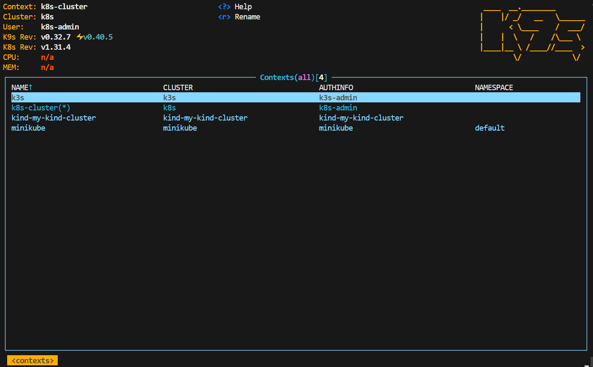
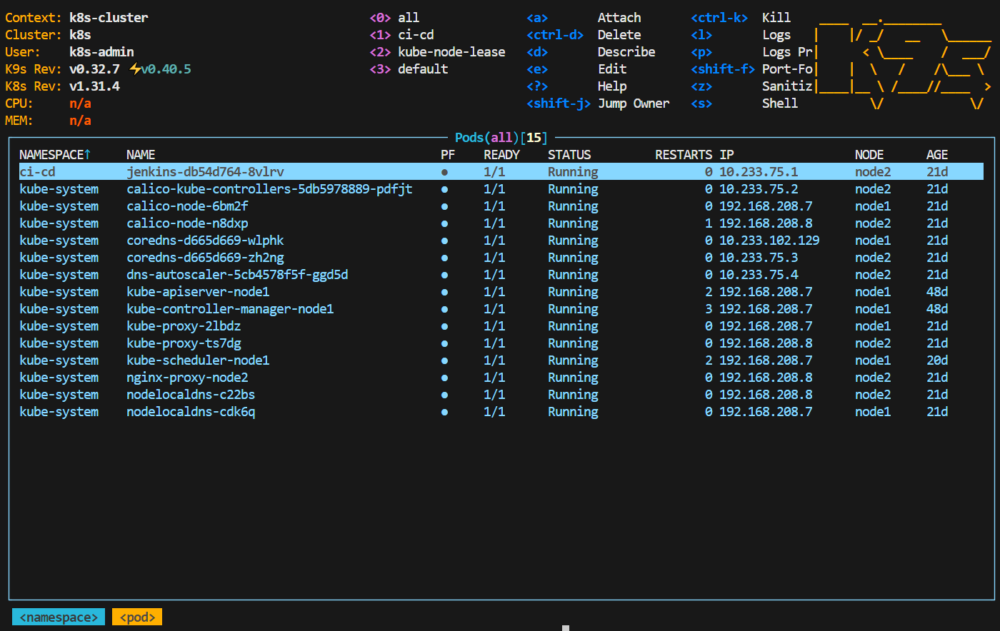
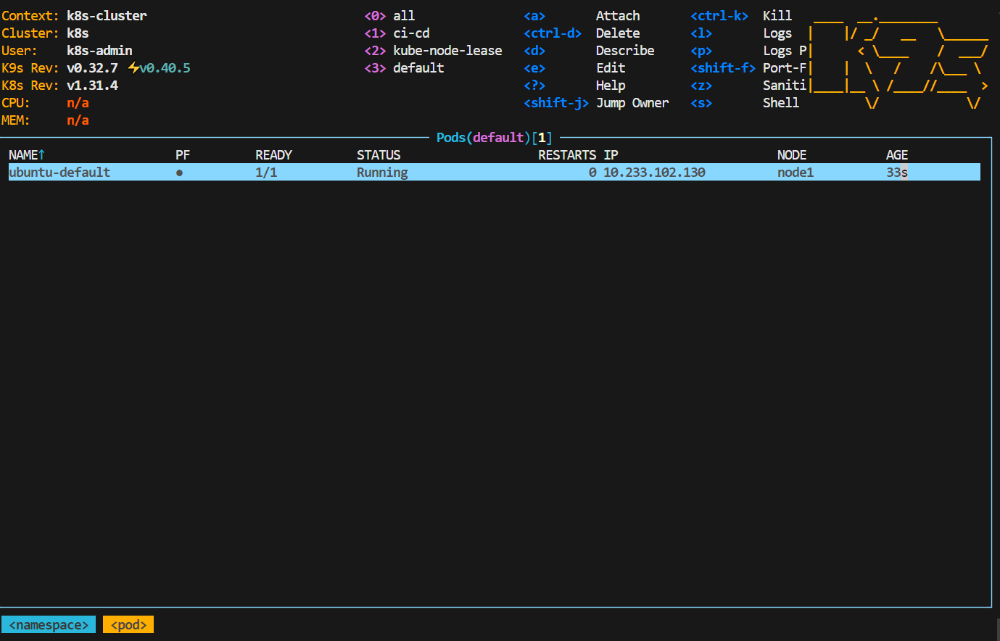
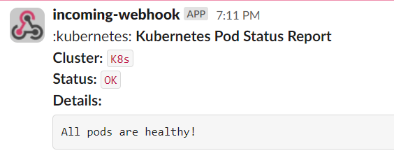

# 10. Kubernetes installation (WS)

## Homework Assignment 1. K8s Installation

### Install kubectl

```shell
curl -LO https://dl.k8s.io/release/`curl -LS https://dl.k8s.io/release/stable.txt`/bin/linux/amd64/
chmod +x ./kubectl
sudo mv ./kubectl /usr/local/bin/kubectl
kubectl version --client
Client Version: v1.32.0
Kustomize Version: v5.5.0
```
### Install K9s

```shell 
wget  https://github.com/derailed/k9s/releases/download/v0.32.7/k9s_linux_amd64.deb
sudo dpkg -i k9s_linux_amd64.deb
k9s version
 ____  __.________       
|    |/ _/   __   \______
|      < \____    /  ___/
|    |  \   /    /\___ \ 
|____|__ \ /____//____  >
        \/            \/ 

Version:    v0.32.7
Commit:     6b5d24f5741a1789fb97ba3e11f0ee868d93459d
Date:       2024-11-16T20:22:28Z
```
 
#### Context


#### Pods in all namespaces


### Pod deployment

[Manifest](./pod.yaml)

```shell
kubectl apply -f pod.yaml
```
#### Checking pod


### Cluster monitoring

[Action](https://github.com/Misyukevich/10.Kubernetes.Installation.WS/actions/workflows/pod-checking.yaml)

[Workflow](./.github/workflows/pod-checking.yaml)


