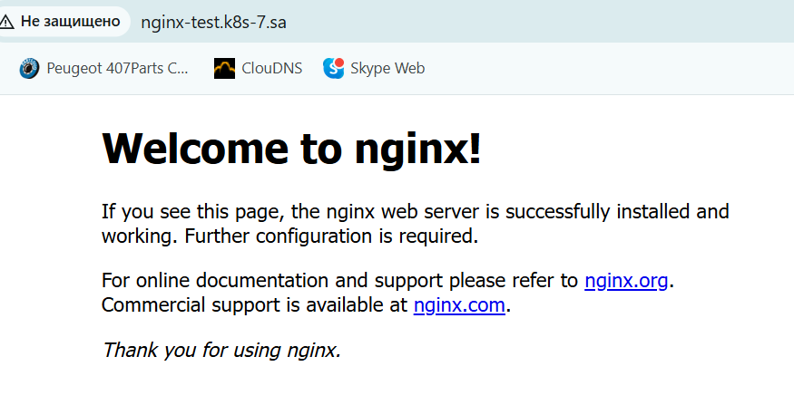
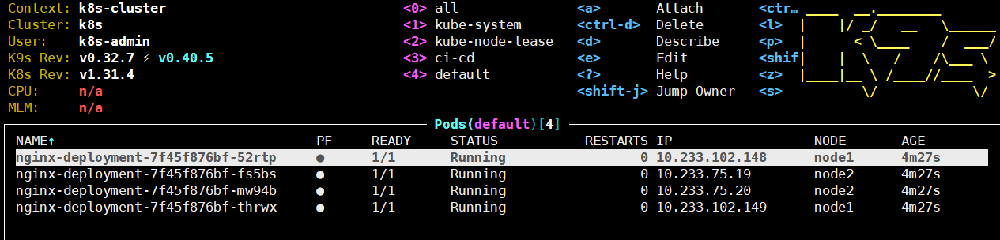

# 11. Kubernetes. Basic objects

## Homework Assignment 1. Nginx deployment

### Manifest
```shell
---
apiVersion: apps/v1
kind: Deployment
metadata:
  name: nginx-deployment
  labels:
    app: nginx
spec:
  replicas: 4
  strategy:
    type: RollingUpdate
    rollingUpdate:
      maxSurge: 25%
      maxUnavailable: 0%
  selector:
    matchLabels:
      app: nginx
  template:
    metadata:
      labels:
        app: nginx
    spec:
      containers:
      - name: nginx
        image: nginx:latest
        resources:
          requests:
            cpu: "250m"
            memory: "128Mi"
          limits:
            cpu: "500m"
            memory: "256Mi"
        ports:
        - containerPort: 80
---
apiVersion: v1
kind: Service
metadata:
  name: nginx-service
spec:
  selector:
    app: nginx
  ports:
  - port: 80
    targetPort: 80
    
---
apiVersion: networking.k8s.io/v1
kind: Ingress
metadata:
  name: nginx-ingress
  annotations:
    nginx.ingress.kubernetes.io/server-alias: "nginx-test.k8s-8.sa"
spec:
  ingressClassName: nginx
  rules:
    - host: nginx-test.k8s-7.sa
      http:
        paths:
          - path: /
            pathType: Prefix
            backend:
              service:
                name: nginx-service
                port:
                  number: 80
```
## Browser check



### Nginx pods


