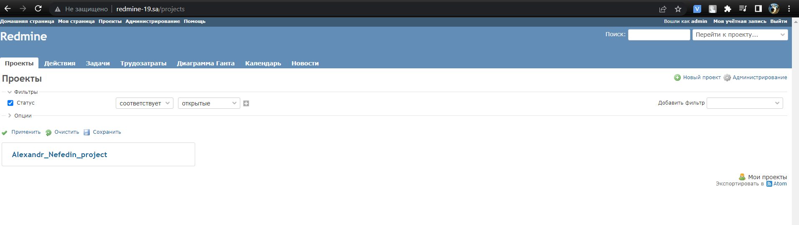

# Ansible.WS

## Output from playbook
```bash
demo@ubuntu:~/Desktop/ansible.workshop.home$ ansible-playbook -i inv.yaml redmine.yaml

PLAY [redmine] *********************************************************************************************************
TASK [Gathering Facts] *************************************************************************************************Sunday 15 May 2022  08:09:37 -0700 (0:00:00.011)       0:00:00.011 ************
ok: [redmine_19]

TASK [Show ansible host] ***********************************************************************************************Sunday 15 May 2022  08:09:40 -0700 (0:00:02.261)       0:00:02.273 ************
ok: [redmine_19] => {
    "msg": "192.168.201.19"
}

TASK [mysql : MySQL.Install MYSQL] *************************************************************************************Sunday 15 May 2022  08:09:40 -0700 (0:00:00.034)       0:00:02.308 ************
ok: [redmine_19]

TASK [mysql : MySQL.Create DB] *****************************************************************************************Sunday 15 May 2022  08:09:43 -0700 (0:00:03.310)       0:00:05.618 ************
ok: [redmine_19]

TASK [mysql : MySQL.Create DB User] ************************************************************************************Sunday 15 May 2022  08:09:44 -0700 (0:00:00.794)       0:00:06.413 ************
ok: [redmine_19]

TASK [redmine : Redmine. Install packages] *****************************************************************************Sunday 15 May 2022  08:09:45 -0700 (0:00:00.869)       0:00:07.282 ************
changed: [redmine_19]

TASK [redmine : Redmine. Clone repository] *****************************************************************************Sunday 15 May 2022  08:09:57 -0700 (0:00:12.156)       0:00:19.438 ************
ok: [redmine_19]

TASK [redmine : Redmine. Change permissions] ***************************************************************************Sunday 15 May 2022  08:09:58 -0700 (0:00:00.845)       0:00:20.284 ************
ok: [redmine_19]

TASK [redmine : Redmine. Change permissions] ***************************************************************************Sunday 15 May 2022  08:09:59 -0700 (0:00:00.889)       0:00:21.173 ************
changed: [redmine_19]

TASK [redmine : Redmine. Config database] ******************************************************************************Sunday 15 May 2022  08:09:59 -0700 (0:00:00.777)       0:00:21.951 ************
ok: [redmine_19]

TASK [redmine : Redmine. Setup 01] *************************************************************************************Sunday 15 May 2022  08:10:01 -0700 (0:00:01.311)       0:00:23.262 ************
changed: [redmine_19]

TASK [redmine : Redmine. Session store secret generation] **************************************************************Sunday 15 May 2022  08:10:05 -0700 (0:00:04.305)       0:00:27.567 ************
ok: [redmine_19]

TASK [redmine : Redmine. Setup 02] *************************************************************************************Sunday 15 May 2022  08:10:06 -0700 (0:00:00.678)       0:00:28.245 ************
changed: [redmine_19]

TASK [redmine : Redmine. Configuration files for virtualhost] **********************************************************Sunday 15 May 2022  08:10:15 -0700 (0:00:09.113)       0:00:37.359 ************
ok: [redmine_19]

TASK [redmine : meta] **************************************************************************************************Sunday 15 May 2022  08:10:16 -0700 (0:00:01.309)       0:00:38.668 ************

TASK [add redmine-19.sa to host file] **********************************************************************************Sunday 15 May 2022  08:10:16 -0700 (0:00:00.022)       0:00:38.691 ************
changed: [redmine_19]

TASK [uri] *************************************************************************************************************Sunday 15 May 2022  08:10:17 -0700 (0:00:00.698)       0:00:39.389 ************
ok: [redmine_19]

TASK [lineinfile] ******************************************************************************************************Sunday 15 May 2022  08:10:18 -0700 (0:00:00.892)       0:00:40.282 ************
changed: [redmine_19]

PLAY RECAP *************************************************************************************************************redmine_19                 : ok=17   changed=6    unreachable=0    failed=0    skipped=0    rescued=0    ignored=0

Sunday 15 May 2022  08:10:18 -0700 (0:00:00.797)       0:00:41.079 ************
===============================================================================
redmine : Redmine. Install packages ---------------------------------------------------------------------------- 12.16s
redmine : Redmine. Setup 02 ------------------------------------------------------------------------------------- 9.11s
redmine : Redmine. Setup 01 ------------------------------------------------------------------------------------- 4.30s
mysql : MySQL.Install MYSQL ------------------------------------------------------------------------------------- 3.31s
Gathering Facts ------------------------------------------------------------------------------------------------- 2.26s
redmine : Redmine. Config database ------------------------------------------------------------------------------ 1.31s
redmine : Redmine. Configuration files for virtualhost ---------------------------------------------------------- 1.31s
uri ------------------------------------------------------------------------------------------------------------- 0.89s
redmine : Redmine. Change permissions --------------------------------------------------------------------------- 0.89s
mysql : MySQL.Create DB User ------------------------------------------------------------------------------------ 0.87s
redmine : Redmine. Clone repository ----------------------------------------------------------------------------- 0.85s
lineinfile ------------------------------------------------------------------------------------------------------ 0.80s
mysql : MySQL.Create DB ----------------------------------------------------------------------------------------- 0.79s
redmine : Redmine. Change permissions --------------------------------------------------------------------------- 0.78s
add redmine-19.sa to host file ---------------------------------------------------------------------------------- 0.70s
redmine : Redmine. Session store secret generation -------------------------------------------------------------- 0.68s
Show ansible host ----------------------------------------------------------------------------------------------- 0.03s
redmine : meta -------------------------------------------------------------------------------------------------- 0.02s
Playbook run took 0 days, 0 hours, 0 minutes, 41 seconds

```
## Printscreen of my project in application


