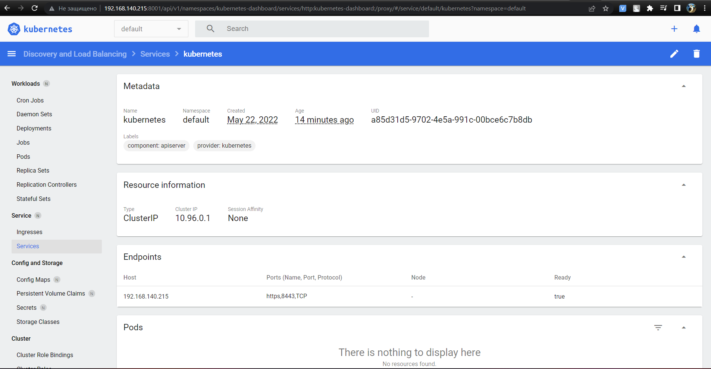

# Kubernetes
## minikube
### $ minikube addons list
```bash
|-----------------------------|----------|--------------|--------------------------------|
|         ADDON NAME          | PROFILE  |    STATUS    |           MAINTAINER           |
|-----------------------------|----------|--------------|--------------------------------|
| ambassador                  | minikube | disabled     | third-party (ambassador)       |
| auto-pause                  | minikube | disabled     | google                         |
| csi-hostpath-driver         | minikube | disabled     | kubernetes                     |
| dashboard                   | minikube | disabled     | kubernetes                     |
| default-storageclass        | minikube | enabled ✅   | kubernetes                     |
| efk                         | minikube | disabled     | third-party (elastic)          |
| freshpod                    | minikube | disabled     | google                         |
| gcp-auth                    | minikube | disabled     | google                         |
| gvisor                      | minikube | disabled     | google                         |
| helm-tiller                 | minikube | disabled     | third-party (helm)             |
| ingress                     | minikube | enabled ✅   | unknown (third-party)          |
| ingress-dns                 | minikube | disabled     | google                         |
| istio                       | minikube | disabled     | third-party (istio)            |
| istio-provisioner           | minikube | disabled     | third-party (istio)            |
| kong                        | minikube | disabled     | third-party (Kong HQ)          |
| kubevirt                    | minikube | disabled     | third-party (kubevirt)         |
| logviewer                   | minikube | disabled     | unknown (third-party)          |
| metallb                     | minikube | disabled     | third-party (metallb)          |
| metrics-server              | minikube | disabled     | kubernetes                     |
| nvidia-driver-installer     | minikube | disabled     | google                         |
| nvidia-gpu-device-plugin    | minikube | disabled     | third-party (nvidia)           |
| olm                         | minikube | disabled     | third-party (operator          |
|                             |          |              | framework)                     |
| pod-security-policy         | minikube | disabled     | unknown (third-party)          |
| portainer                   | minikube | disabled     | portainer.io                   |
| registry                    | minikube | disabled     | google                         |
| registry-aliases            | minikube | disabled     | unknown (third-party)          |
| registry-creds              | minikube | disabled     | third-party (upmc enterprises) |
| storage-provisioner         | minikube | enabled ✅   | google                         |
| storage-provisioner-gluster | minikube | disabled     | unknown (third-party)          |
| volumesnapshots             | minikube | disabled     | kubernetes                     |
|-----------------------------|----------|--------------|--------------------------------|
```

## Run minikube with different HW options (RAM/CPU)
### $ minikube start --memory 2048 --cpus 2
```bash
😄  minikube v1.25.2 on Ubuntu 20.04
✨  Using the docker driver based on existing profile
❗  Your cgroup does not allow setting memory.
    ▪ More information: https://docs.docker.com/engine/install/linux-postinstall/#your-kernel-does-not-support-cgroup-swap-limit-capabilities
❗  Your cgroup does not allow setting memory.
    ▪ More information: https://docs.docker.com/engine/install/linux-postinstall/#your-kernel-does-not-support-cgroup-swap-limit-capabilities
❗  You cannot change the memory size for an existing minikube cluster. Please first delete the cluster.
👍  Starting control plane node minikube in cluster minikube
🚜  Pulling base image ...
🏃  Updating the running docker "minikube" container ...
🐳  Preparing Kubernetes v1.23.3 on Docker 20.10.12 ...
    ▪ kubelet.housekeeping-interval=5m
🔎  Verifying Kubernetes components...
    ▪ Using image k8s.gcr.io/ingress-nginx/controller:v1.1.1
    ▪ Using image k8s.gcr.io/ingress-nginx/kube-webhook-certgen:v1.1.1
    ▪ Using image k8s.gcr.io/ingress-nginx/kube-webhook-certgen:v1.1.1
    ▪ Using image gcr.io/k8s-minikube/storage-provisioner:v5
🔎  Verifying ingress addon...
🌟  Enabled addons: storage-provisioner, ingress, default-storageclass
🏄  Done! kubectl is now configured to use "minikube" cluster and "default" namespace by default
```
## Dashboard screen:


## Final stage of deployment k8s
```bash
PLAY RECAP ****************************************************************************************************************************************************************
localhost                  : ok=4    changed=0    unreachable=0    failed=0    skipped=0    rescued=0    ignored=0
node1                      : ok=725  changed=28   unreachable=0    failed=0    skipped=1305 rescued=0    ignored=2
node2                      : ok=491  changed=15   unreachable=0    failed=0    skipped=757  rescued=0    ignored=2

Sunday 22 May 2022  03:09:37 -0700 (0:00:00.054)       0:26:20.210 ************
===============================================================================
kubernetes-apps/ansible : Kubernetes Apps | Lay Down CoreDNS templates -------------------------------------------------------------------------------------------- 48.52s
kubernetes-apps/ansible : Kubernetes Apps | Start Resources ------------------------------------------------------------------------------------------------------- 43.13s
download : download_file | Validate mirrors ----------------------------------------------------------------------------------------------------------------------- 35.12s
network_plugin/calico : Calico | Create calico manifests ---------------------------------------------------------------------------------------------------------- 29.08s
network_plugin/calico : Start Calico resources -------------------------------------------------------------------------------------------------------------------- 19.89s
policy_controller/calico : Create calico-kube-controllers manifests ----------------------------------------------------------------------------------------------- 19.46s
kubernetes/preinstall : Ensure kube-bench parameters are set ------------------------------------------------------------------------------------------------------ 19.43s
kubernetes/control-plane : Backup old certs and keys -------------------------------------------------------------------------------------------------------------- 19.36s
container-engine/containerd : containerd | Remove orphaned binary ------------------------------------------------------------------------------------------------- 15.98s
etcd : Check certs | Register ca and etcd admin/member certs on etcd hosts ---------------------------------------------------------------------------------------- 15.97s
etcd : Check certs | Register ca and etcd admin/member certs on etcd hosts ---------------------------------------------------------------------------------------- 15.86s
kubernetes/preinstall : Create kubernetes directories ------------------------------------------------------------------------------------------------------------- 15.76s
kubernetes-apps/ansible : Kubernetes Apps | Lay Down nodelocaldns Template ---------------------------------------------------------------------------------------- 14.89s
policy_controller/calico : Start of Calico kube controllers ------------------------------------------------------------------------------------------------------- 13.45s
kubernetes/node : Modprobe Kernel Module for IPVS ----------------------------------------------------------------------------------------------------------------- 12.90s
kubernetes/control-plane : Update server field in component kubeconfigs ------------------------------------------------------------------------------------------- 12.85s
kubernetes/preinstall : Remove search/domain/nameserver options before block -------------------------------------------------------------------------------------- 12.83s
container-engine/containerd : containerd | Ensure containerd directories exist ------------------------------------------------------------------------------------ 12.73s
kubernetes/preinstall : Remove search/domain/nameserver options before block -------------------------------------------------------------------------------------- 12.72s
kubernetes/preinstall : Remove search/domain/nameserver options after block --------------------------------------------------------------------------------------- 12.65s
```
