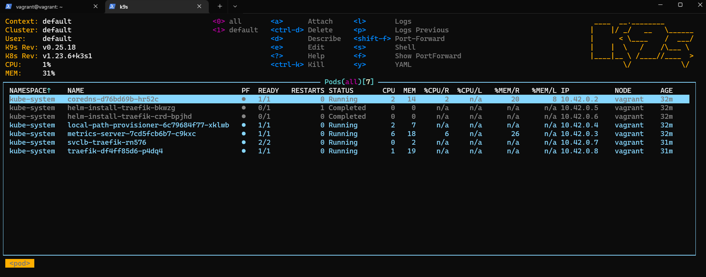
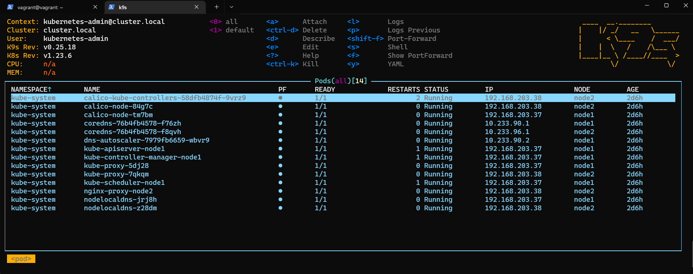

## Kubectl config

### $ kubectl config view

```bash
apiVersion: v1
clusters:
- cluster:
    certificate-authority-data: DATA+OMITTED
    server: https://127.0.0.1:6443
  name: cluster.local
- cluster:
    certificate-authority-data: DATA+OMITTED
    server: https://192.168.140.218:6443
  name: default
contexts:
- context:
    cluster: default
    user: default
  name: default
- context:
    cluster: cluster.local
    user: kubernetes-admin
  name: kubernetes-admin@cluster.local
current-context: kubernetes-admin@cluster.local
kind: Config
preferences: {}
users:
- name: default
  user:
    client-certificate-data: REDACTED
    client-key-data: REDACTED
- name: kubernetes-admin
  user:
    client-certificate-data: REDACTED
    client-key-data: REDACTED
```

## Kubectl config use-context

```bash
$ kcuc default
Switched to context "default".

$ kgno
NAME      STATUS   ROLES                  AGE   VERSION
vagrant   Ready    control-plane,master   39m   v1.23.6+k3s1

$ kcuc kubernetes-admin@cluster.local
Switched to context "kubernetes-admin@cluster.local".

$ kgno
NAME    STATUS   ROLES                  AGE    VERSION
node1   Ready    control-plane,master   2d6h   v1.23.6
node2   Ready    <none>                 2d6h   v1.23.6
```

## K9s screenshots



