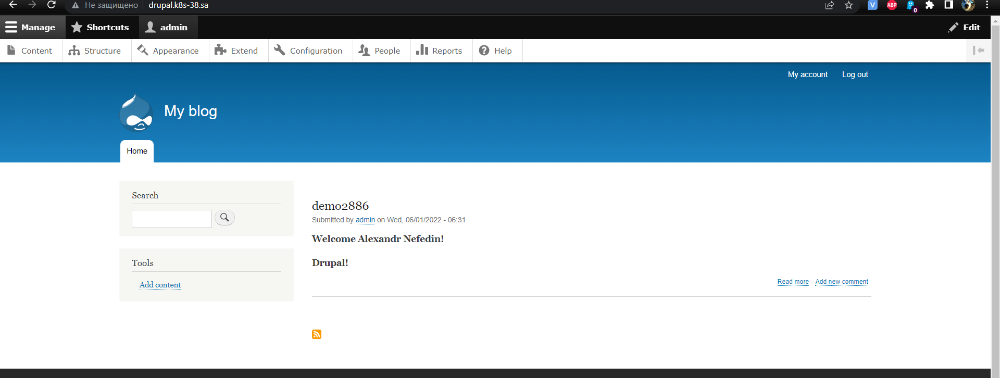
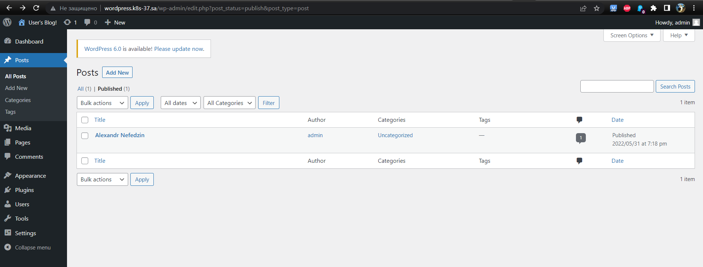

## 13. Kubernetes. Helm

### History of helm run commands
```bash
#install helm
mkdir helm

cd helm
wget https://get.helm.sh/helm-v3.9.0-linux-amd64.tar.gz
tar -xf helm-v3.9.0-linux-amd64.tar.gz

cd linux-amd64/

sudo mv linux-amd64/helm /usr/local/bin/helm
helm

cd ..
rm -rf helm-v3.9.0-linux-amd64.tar.gz
rm -rf linux-amd64

#add bitnami repo
helm repo add bitnami https://charts.bitnami.com/bitnami

#install nfc-provisioner
helm repo add nfs-subdir-external-provisioner https://kubernetes-sigs.github.io/nfs-subdir-external-provisioner/
helm install nfs-subdir-external-provisioner nfs-subdir-external-provisioner/nfs-subdir-external-provisioner \
    --set nfs.server=192.168.37.105 \
    --set nfs.path=/mnt/IT-Academy/nfs-data/sa2-20-22/alexandr_nefedin/

#create igress for wordpress
vim wordpress_ing.yaml
kubectl apply -f wordpress_ing.yaml

#install wordpress
helm install sa-wordpress  --set global.storageClass=nfs-client,wordpressUsername=admin,wordpressPassword=admin9999 bitnami/wordpress

#create igress for drupal
vim drupal_ing.yaml
kubectl apply -f drupal_ing.yaml

#install drupal
helm install sa-drupal --set global.storageClass=nfs-client,drupalUsername=admin,drupalPassword=admin787878 bitnami/drupal

```

## Screenshots creates blogs



