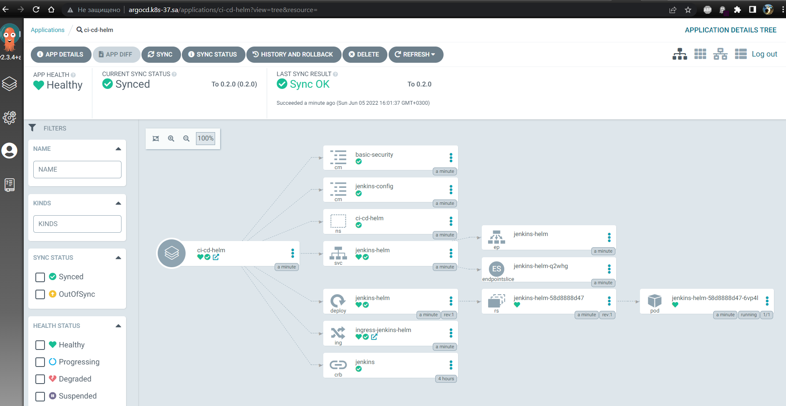
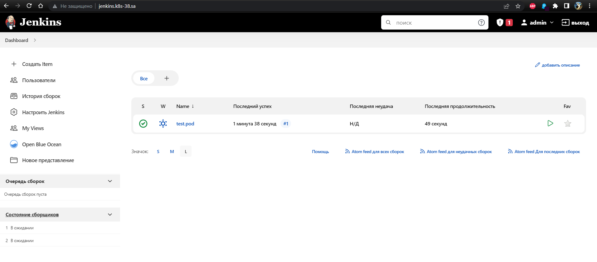

## 14. Kubernetes application deployment

## ArgoCD - Jenkins application details



## ArgoCD - Jenkins application manifest

```bash 
project: default
source:
  repoURL: 'https://demo2886.github.io/jenkins_helm/'
  targetRevision: 0.2.0
  chart: jenkins-app
destination:
  server: 'https://kubernetes.default.svc'
  namespace: ci-cd-helm
syncPolicy:
  automated: {}
```

## My Jenkins Dashboard


