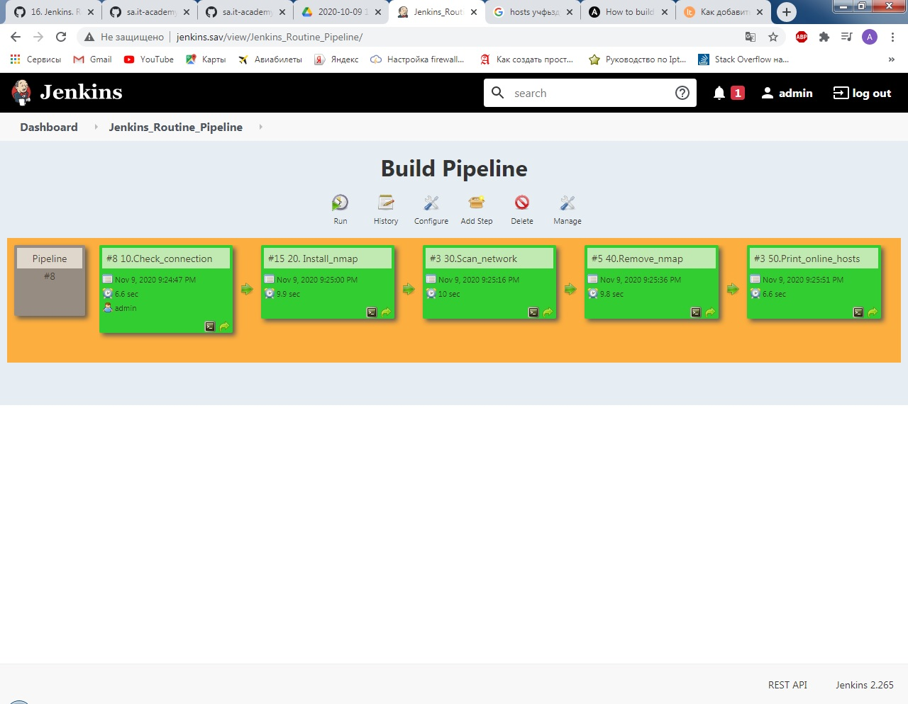

# 16.Jenkins.Routine

## Configuring ssh connection to remote machine on vagrant machine
```bash
vagrant ssh
sudo -i 
su - jenkins
cd .ssh/
nano config
chmod 600 config
ssh-copy-id jump_sa@178.124.206.53
ssh-copy-id root@192.168.203.12
```

##ssh config
```
# EC
Host jenkins_node_12_it.academy
        User jenkins
        HostName 192.168.203.12
        ProxyJump ec_bastion

Host ec_bastion
        User jump_sa
        HostName 178.124.206.53

Host 192.168.203.*
        ProxyJump ec_bastion
```

## Ansible install on vagrant machine
```
yum update
yum install epel-repo -y
yum update
yum install ansible -y
```

## Install Parameterized Trigger Plugin and install Build Pipeline Plugin
```
Go to Manage Jenkins > Manage Plugins > Avaible Parameterized Trigger
Go to Manage Jenkins > Manage Plugins > Avaible Build Pipeline Plugin
```

## Pipeline Output

### 10.Check_connection
```
Started by user admin
Running as SYSTEM
Building on master in workspace /var/lib/jenkins/workspace/10.Check_connection
[10.Check_connection] $ /bin/bash /tmp/jenkins5649073310895238711.sh
192.168.203.12 | SUCCESS => {
    "ansible_facts": {
        "discovered_interpreter_python": "/usr/bin/python3"
    }, 
    "changed": false, 
    "ping": "pong"
}
Triggering a new build of 20. Install_nmap
Finished: SUCCESS
```

###20.20Install_nmap
```
Started by upstream project "10.Check_connection" build number 8
originally caused by:
 Started by user admin
Running as SYSTEM
Building on master in workspace /var/lib/jenkins/workspace/20. Install_nmap
[20. Install_nmap] $ /bin/bash /tmp/jenkins738190524235850715.sh
192.168.203.12 | CHANGED => {
    "ansible_facts": {
        "discovered_interpreter_python": "/usr/bin/python3"
    }, 
    "cache_update_time": 1604850071, 
    "cache_updated": false, 
    "changed": true, 
    "stderr": "", 
    "stderr_lines": [], 
    "stdout": "Reading package lists...\nBuilding dependency tree...\nReading state information...\nSuggested packages:\n  ndiff\nThe following NEW packages will be installed:\n  nmap\n0 upgraded, 1 newly installed, 0 to remove and 28 not upgraded.\nNeed to get 0 B/5174 kB of archives.\nAfter this operation, 24.0 MB of additional disk space will be used.\nSelecting previously unselected package nmap.\r\n(Reading database ... \r(Reading database ... 5%\r(Reading database ... 10%\r(Reading database ... 15%\r(Reading database ... 20%\r(Reading database ... 25%\r(Reading database ... 30%\r(Reading database ... 35%\r(Reading database ... 40%\r(Reading database ... 45%\r(Reading database ... 50%\r(Reading database ... 55%\r(Reading database ... 60%\r(Reading database ... 65%\r(Reading database ... 70%\r(Reading database ... 75%\r(Reading database ... 80%\r(Reading database ... 85%\r(Reading database ... 90%\r(Reading database ... 95%\r(Reading database ... 100%\r(Reading database ... 44769 files and directories currently installed.)\r\nPreparing to unpack .../nmap_7.60-1ubuntu5_amd64.deb ...\r\nUnpacking nmap (7.60-1ubuntu5) ...\r\nSetting up nmap (7.60-1ubuntu5) ...\r\nProcessing triggers for man-db (2.8.3-2ubuntu0.1) ...\r\n", 
    "stdout_lines": [
        "Reading package lists...", 
        "Building dependency tree...", 
        "Reading state information...", 
        "Suggested packages:", 
        "  ndiff", 
        "The following NEW packages will be installed:", 
        "  nmap", 
        "0 upgraded, 1 newly installed, 0 to remove and 28 not upgraded.", 
        "Need to get 0 B/5174 kB of archives.", 
        "After this operation, 24.0 MB of additional disk space will be used.", 
        "Selecting previously unselected package nmap.", 
        "(Reading database ... ", 
        "(Reading database ... 5%", 
        "(Reading database ... 10%", 
        "(Reading database ... 15%", 
        "(Reading database ... 20%", 
        "(Reading database ... 25%", 
        "(Reading database ... 30%", 
        "(Reading database ... 35%", 
        "(Reading database ... 40%", 
        "(Reading database ... 45%", 
        "(Reading database ... 50%", 
        "(Reading database ... 55%", 
        "(Reading database ... 60%", 
        "(Reading database ... 65%", 
        "(Reading database ... 70%", 
        "(Reading database ... 75%", 
        "(Reading database ... 80%", 
        "(Reading database ... 85%", 
        "(Reading database ... 90%", 
        "(Reading database ... 95%", 
        "(Reading database ... 100%", 
        "(Reading database ... 44769 files and directories currently installed.)", 
        "Preparing to unpack .../nmap_7.60-1ubuntu5_amd64.deb ...", 
        "Unpacking nmap (7.60-1ubuntu5) ...", 
        "Setting up nmap (7.60-1ubuntu5) ...", 
        "Processing triggers for man-db (2.8.3-2ubuntu0.1) ..."
    ]
}
Triggering a new build of 30.Scan_network
Finished: SUCCESS
```

### 30.Scan_network
```
Started by upstream project "20. Install_nmap" build number 15
originally caused by:
 Started by upstream project "10.Check_connection" build number 8
 originally caused by:
  Started by user admin
Running as SYSTEM
Building on master in workspace /var/lib/jenkins/workspace/30.Scan_network
[30.Scan_network] $ /bin/bash /tmp/jenkins3592965533004662515.sh
192.168.203.12 | CHANGED | rc=0 >>

Triggering a new build of 40.Remove_nmap
Finished: SUCCESS
```

### 40.Remove_nmap
```
Started by upstream project "30.Scan_network" build number 3
originally caused by:
 Started by upstream project "20. Install_nmap" build number 15
 originally caused by:
  Started by upstream project "10.Check_connection" build number 8
  originally caused by:
   Started by user admin
Running as SYSTEM
Building on master in workspace /var/lib/jenkins/workspace/40.Remove_nmap
[40.Remove_nmap] $ /bin/bash /tmp/jenkins2314340508618340856.sh
192.168.203.12 | CHANGED => {
    "ansible_facts": {
        "discovered_interpreter_python": "/usr/bin/python3"
    }, 
    "changed": true, 
    "stderr": "", 
    "stderr_lines": [], 
    "stdout": "Reading package lists...\nBuilding dependency tree...\nReading state information...\nThe following packages were automatically installed and are no longer required:\n  libblas3 liblinear3 liblua5.3-0\nUse 'apt autoremove' to remove them.\nThe following packages will be REMOVED:\n  nmap\n0 upgraded, 0 newly installed, 1 to remove and 28 not upgraded.\nAfter this operation, 24.0 MB disk space will be freed.\n(Reading database ... \r(Reading database ... 5%\r(Reading database ... 10%\r(Reading database ... 15%\r(Reading database ... 20%\r(Reading database ... 25%\r(Reading database ... 30%\r(Reading database ... 35%\r(Reading database ... 40%\r(Reading database ... 45%\r(Reading database ... 50%\r(Reading database ... 55%\r(Reading database ... 60%\r(Reading database ... 65%\r(Reading database ... 70%\r(Reading database ... 75%\r(Reading database ... 80%\r(Reading database ... 85%\r(Reading database ... 90%\r(Reading database ... 95%\r(Reading database ... 100%\r(Reading database ... 45579 files and directories currently installed.)\r\nRemoving nmap (7.60-1ubuntu5) ...\r\nProcessing triggers for man-db (2.8.3-2ubuntu0.1) ...\r\n", 
    "stdout_lines": [
        "Reading package lists...", 
        "Building dependency tree...", 
        "Reading state information...", 
        "The following packages were automatically installed and are no longer required:", 
        "  libblas3 liblinear3 liblua5.3-0", 
        "Use 'apt autoremove' to remove them.", 
        "The following packages will be REMOVED:", 
        "  nmap", 
        "0 upgraded, 0 newly installed, 1 to remove and 28 not upgraded.", 
        "After this operation, 24.0 MB disk space will be freed.", 
        "(Reading database ... ", 
        "(Reading database ... 5%", 
        "(Reading database ... 10%", 
        "(Reading database ... 15%", 
        "(Reading database ... 20%", 
        "(Reading database ... 25%", 
        "(Reading database ... 30%", 
        "(Reading database ... 35%", 
        "(Reading database ... 40%", 
        "(Reading database ... 45%", 
        "(Reading database ... 50%", 
        "(Reading database ... 55%", 
        "(Reading database ... 60%", 
        "(Reading database ... 65%", 
        "(Reading database ... 70%", 
        "(Reading database ... 75%", 
        "(Reading database ... 80%", 
        "(Reading database ... 85%", 
        "(Reading database ... 90%", 
        "(Reading database ... 95%", 
        "(Reading database ... 100%", 
        "(Reading database ... 45579 files and directories currently installed.)", 
        "Removing nmap (7.60-1ubuntu5) ...", 
        "Processing triggers for man-db (2.8.3-2ubuntu0.1) ..."
    ]
}
Triggering a new build of 50.Print_online_hosts
Finished: SUCCESS
```

### 50.Print_online_hosts
```
Started by upstream project "40.Remove_nmap" build number 5
originally caused by:
 Started by upstream project "30.Scan_network" build number 3
 originally caused by:
  Started by upstream project "20. Install_nmap" build number 15
  originally caused by:
   Started by upstream project "10.Check_connection" build number 8
   originally caused by:
    Started by user admin
Running as SYSTEM
Building on master in workspace /var/lib/jenkins/workspace/50.Print_online_hosts
[50.Print_online_hosts] $ /bin/bash /tmp/jenkins4702277890725835856.sh
192.168.203.12 | CHANGED | rc=0 >>

Starting Nmap 7.60 ( https://nmap.org ) at 2020-11-09 21:25 UTC
Nmap scan report for 192.168.203.1
Host is up (0.00096s latency).
MAC Address: 6E:CA:CE:19:96:EE (Unknown)
Nmap scan report for 192.168.203.2
Host is up (0.00052s latency).
MAC Address: B2:F0:94:EC:77:39 (Unknown)
Nmap scan report for 192.168.203.3
Host is up (0.00038s latency).
MAC Address: 2A:D6:C0:41:C7:52 (Unknown)
Nmap scan report for 192.168.203.4
Host is up (0.00037s latency).
MAC Address: A6:CB:98:B3:45:50 (Unknown)
Nmap scan report for 192.168.203.5
Host is up (0.00035s latency).
MAC Address: 52:DA:CE:BA:C1:F3 (Unknown)
Nmap scan report for 192.168.203.6
Host is up (0.00038s latency).
MAC Address: 72:EC:83:4A:85:ED (Unknown)
Nmap scan report for 192.168.203.7
Host is up (0.00038s latency).
MAC Address: 02:EE:40:89:EE:C1 (Unknown)
Nmap scan report for 192.168.203.8
Host is up (0.00039s latency).
MAC Address: 52:9B:22:39:E5:4C (Unknown)
Nmap scan report for 192.168.203.9
Host is up (0.00037s latency).
MAC Address: BE:E4:64:E7:DC:61 (Unknown)
Nmap scan report for 192.168.203.10
Host is up (0.00036s latency).
MAC Address: FE:F9:A3:C1:D4:DC (Unknown)
Nmap scan report for local-cent.site (192.168.203.11)
Host is up (0.00043s latency).
MAC Address: F2:4C:75:34:FE:2B (Unknown)
Nmap scan report for 192.168.203.13
Host is up (0.00049s latency).
MAC Address: 42:5D:67:08:8A:E2 (Unknown)
Nmap scan report for 192.168.203.14
Host is up (0.00098s latency).
MAC Address: D2:E5:39:4C:D1:36 (Unknown)
Nmap scan report for 192.168.203.15
Host is up (-0.10s latency).
MAC Address: 16:12:B0:04:FC:2E (Unknown)
Nmap scan report for 192.168.203.16
Host is up (-0.10s latency).
MAC Address: 96:77:AD:12:D3:67 (Unknown)
Nmap scan report for 192.168.203.17
Host is up (-0.10s latency).
MAC Address: BA:9F:0D:38:C2:34 (Unknown)
Nmap scan report for 192.168.203.18
Host is up (-0.10s latency).
MAC Address: 46:1E:29:9B:3B:2E (Unknown)
Nmap scan report for 192.168.203.19
Host is up (-0.10s latency).
MAC Address: 5E:E6:8B:2D:53:09 (Unknown)
Nmap scan report for 192.168.203.20
Host is up (-0.10s latency).
MAC Address: 6A:37:84:2C:DF:11 (Unknown)
Nmap scan report for 192.168.203.21
Host is up (-0.10s latency).
MAC Address: 3A:24:61:8F:37:C4 (Unknown)
Nmap scan report for 192.168.203.22
Host is up (-0.10s latency).
MAC Address: EA:A8:B3:BA:0A:84 (Unknown)
Nmap scan report for 192.168.203.23
Host is up (-0.10s latency).
MAC Address: C2:B5:D5:8E:19:F4 (Unknown)
Nmap scan report for 192.168.203.24
Host is up (-0.10s latency).
MAC Address: 26:57:E3:9E:59:3A (Unknown)
Nmap scan report for local-deb.site (192.168.203.12)
Host is up.
Nmap done: 256 IP addresses (24 hosts up) scanned in 3.62 seconds
Finished: SUCCESS
```
## Pipeline screen

