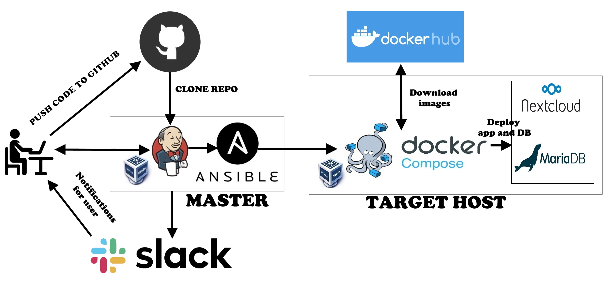

## Project report

### Project's reporter: Alexandr Sytchevskiy 
### Group number: m-sa2-14-20

## Description of application for deployment
- Name: Nextcloud
- Application is written in PHP, Javascript and other...
- Used database: MariaDB
- [CI & CD GitHub repository](https://github.com/Sanchelioss/DevOps_Project.git)

### Pipeline. High Level Design

### Technologies which were used in project
- **Orchestration:** Jenkins
- **Automation tools:** Ansible
- **Infrastructure:** VirtualBox
- **Container:** Docker, docker-compose
- **SCM:** GitHub
- **Notification:** Slack

### Preparing infrastructure and app installation description:

  * Deployment starts with Jenkins
  * Jenkins (master) downloads GitHub repository and runs .yaml files with Ansible
  * Ansible runs playbook **install.yaml** with inventory file **inventory.yaml**
  * Installing and Configuring rsync for creation backups
  * Installing and Configuring Docker
  * Creating local Docker volumes to
  * Running Docker containers with DB & App images
  * Notify Slack about the results of that pipeline

### App update description:

  * Stop and delete DB & app containers
  * Backup user and database data
  * Removing docker images
  * Removing and copying new docker-compose file
  * Download new docker images
  * Start the new app containers
  * Test working app homepage
  * If the update was successful, a notification is sent to Slack
  * If the content check on the page did not return the set value => ansible reports to Slack that the update has failed => auto start rollback

### App rollback description:

  * Stop and delete DB & app containers
  * Removing docker images
  * Remove app and DB dir contents
  * Comeback previous contents to home folders
  * Removing and copying previous docker-compose file
  * Download previous docker images
  * Start the previous app containers
  * Test working app homepage
  * Ansible reports to Slack that the rollback has complete
  * Notify Slack about the results of that pipeline (update/rollback)

   

### Usefull links

[Github nexctloud](https://github.com/nextcloud/docker.git)
