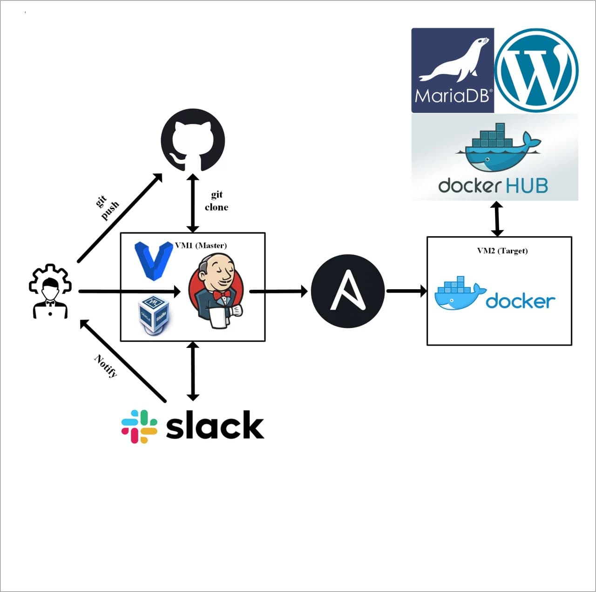

## Project report

### Project's reporter: Alexandr Trushyn
### Group number: m-sa2-14-20

## Description of application for deployment
- Name: Wordpress
- Application is written in PHP
- Used database: MariaDB
- [CI & CD GitHub repository](https://github.com/TrushynA/sa2_git)

### Project scheme 

### Technologies which were used in project
- **Orchestration:** Jenkins
- **Automation tools:** Ansible
- **Infrastructure:** VirtualBox, Vagrant
- **Container:** Docker
- **SCM:** GitHub
- **Notification:** Slack

   