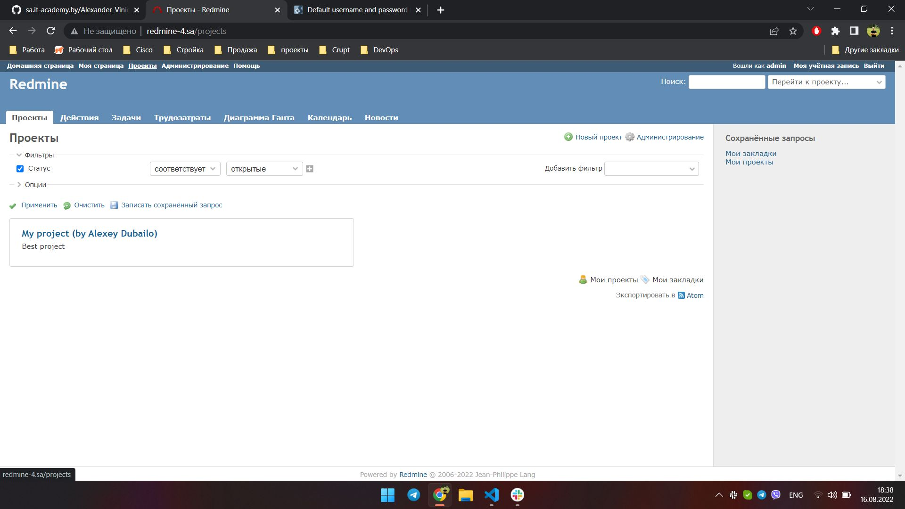

# 08. Ansible workshop
## Playbook output
```
PLAY [redmine] ****************************************************************************************************************************************************

TASK [Gathering Facts] ********************************************************************************************************************************************
Tuesday 16 August 2022  18:48:27 +0300 (0:00:00.032)       0:00:00.033 ******** 
ok: [redmine_4]

TASK [debug] ******************************************************************************************************************************************************
Tuesday 16 August 2022  18:48:33 +0300 (0:00:05.833)       0:00:05.866 ******** 
ok: [redmine_4] => {
    "msg": "192.168.201.4"
}

TASK [redmine_db_deploy : Redmine. Install packages] **************************************************************************************************************
Tuesday 16 August 2022  18:48:33 +0300 (0:00:00.156)       0:00:06.023 ******** 
ok: [redmine_4]

TASK [redmine_db_deploy : mysql_db] *******************************************************************************************************************************
Tuesday 16 August 2022  18:48:38 +0300 (0:00:05.026)       0:00:11.050 ******** 
ok: [redmine_4]

TASK [redmine_db_deploy : mysql_user] *****************************************************************************************************************************
Tuesday 16 August 2022  18:48:41 +0300 (0:00:03.391)       0:00:14.441 ******** 
ok: [redmine_4]

TASK [redmine_db_deploy : Config database] ************************************************************************************************************************
Tuesday 16 August 2022  18:48:44 +0300 (0:00:03.317)       0:00:17.758 ******** 
ok: [redmine_4]

TASK [redmine_web_deploy : Redmine. Install packages] *************************************************************************************************************
Tuesday 16 August 2022  18:48:50 +0300 (0:00:05.124)       0:00:22.883 ******** 
ok: [redmine_4]

TASK [redmine_web_deploy : Redmine. Clone repository] *************************************************************************************************************
Tuesday 16 August 2022  18:48:54 +0300 (0:00:04.380)       0:00:27.264 ******** 
ok: [redmine_4]

TASK [redmine_web_deploy : Redmine. Change permissions] ***********************************************************************************************************
Tuesday 16 August 2022  18:48:57 +0300 (0:00:03.014)       0:00:30.279 ******** 
ok: [redmine_4]

TASK [redmine_web_deploy : Redmine. Change permissions tmp] *******************************************************************************************************
Tuesday 16 August 2022  18:49:00 +0300 (0:00:02.547)       0:00:32.827 ******** 
ok: [redmine_4]

TASK [redmine_web_deploy : Redmine. Setup 01] *********************************************************************************************************************
Tuesday 16 August 2022  18:49:02 +0300 (0:00:02.834)       0:00:35.662 ******** 
changed: [redmine_4]

TASK [redmine_web_deploy : Session store secret generation] *******************************************************************************************************
Tuesday 16 August 2022  18:49:09 +0300 (0:00:06.155)       0:00:41.818 ******** 
ok: [redmine_4]

TASK [redmine_web_deploy : Redmine. Setup 02] *********************************************************************************************************************
Tuesday 16 August 2022  18:49:12 +0300 (0:00:03.033)       0:00:44.852 ******** 
changed: [redmine_4]

TASK [redmine_web_deploy : Configuration files for virtualhost] ***************************************************************************************************
Tuesday 16 August 2022  18:49:26 +0300 (0:00:14.199)       0:00:59.052 ******** 
ok: [redmine_4]

TASK [redmine_web_deploy : meta] **********************************************************************************************************************************
Tuesday 16 August 2022  18:49:31 +0300 (0:00:05.386)       0:01:04.438 ******** 

TASK [Add redmine-4.sa to host file] ******************************************************************************************************************************
Tuesday 16 August 2022  18:49:31 +0300 (0:00:00.102)       0:01:04.541 ******** 
changed: [redmine_4]

TASK [uri] ********************************************************************************************************************************************************
Tuesday 16 August 2022  18:49:34 +0300 (0:00:02.455)       0:01:06.997 ******** 
ok: [redmine_4]

TASK [lineinfile] *************************************************************************************************************************************************
Tuesday 16 August 2022  18:49:37 +0300 (0:00:03.678)       0:01:10.676 ******** 
changed: [redmine_4]

PLAY RECAP ********************************************************************************************************************************************************
redmine_4                  : ok=17   changed=4    unreachable=0    failed=0    skipped=0    rescued=0    ignored=0   

Tuesday 16 August 2022  18:49:40 +0300 (0:00:03.134)       0:01:13.811 ******** 
=============================================================================== 
redmine_web_deploy : Redmine. Setup 02 -------------------------------------------------------------------------------------------------------------------- 14.20s
redmine_web_deploy : Redmine. Setup 01 --------------------------------------------------------------------------------------------------------------------- 6.16s
Gathering Facts -------------------------------------------------------------------------------------------------------------------------------------------- 5.83s
redmine_web_deploy : Configuration files for virtualhost --------------------------------------------------------------------------------------------------- 5.39s
redmine_db_deploy : Config database ------------------------------------------------------------------------------------------------------------------------ 5.12s
redmine_db_deploy : Redmine. Install packages -------------------------------------------------------------------------------------------------------------- 5.03s
redmine_web_deploy : Redmine. Install packages ------------------------------------------------------------------------------------------------------------- 4.38s
uri -------------------------------------------------------------------------------------------------------------------------------------------------------- 3.68s
redmine_db_deploy : mysql_db ------------------------------------------------------------------------------------------------------------------------------- 3.39s
redmine_db_deploy : mysql_user ----------------------------------------------------------------------------------------------------------------------------- 3.32s
lineinfile ------------------------------------------------------------------------------------------------------------------------------------------------- 3.13s
redmine_web_deploy : Session store secret generation ------------------------------------------------------------------------------------------------------- 3.03s
redmine_web_deploy : Redmine. Clone repository ------------------------------------------------------------------------------------------------------------- 3.01s
redmine_web_deploy : Redmine. Change permissions tmp ------------------------------------------------------------------------------------------------------- 2.83s
redmine_web_deploy : Redmine. Change permissions ----------------------------------------------------------------------------------------------------------- 2.55s
Add redmine-4.sa to host file ------------------------------------------------------------------------------------------------------------------------------ 2.46s
debug ------------------------------------------------------------------------------------------------------------------------------------------------------ 0.16s
redmine_web_deploy : meta ---------------------------------------------------------------------------------------------------------------------------------- 0.10s
Playbook run took 0 days, 0 hours, 1 minutes, 13 seconds
```

## Project screenshot
 