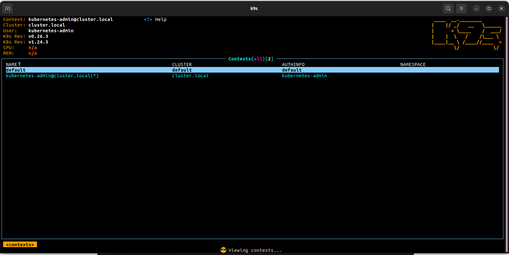
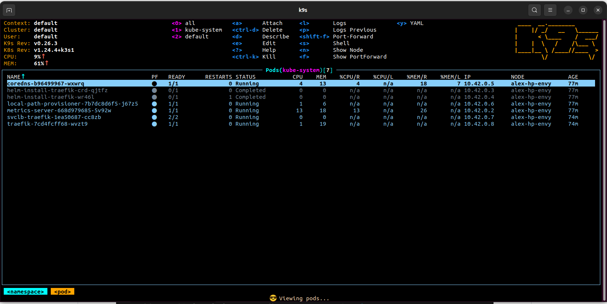
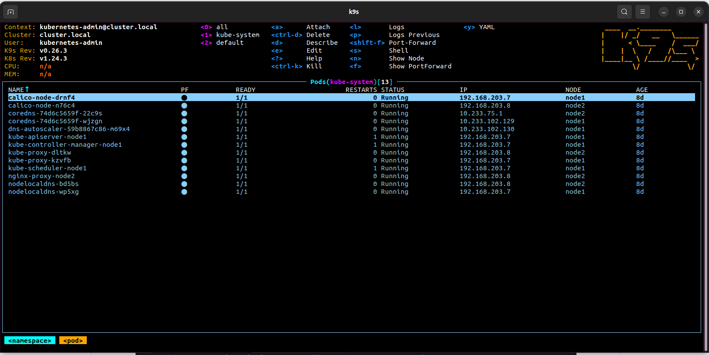

# 11. K8s install

## Bash aliases

```
alias k=kubectl
alias kgn="kubectl get nodes"
alias kgp="kubectl get pods"
alias kc="kubectl config use-context kubernetes-admin@cluster.local"
alias kl="kubectl config use-context default"
```
## Screenshots




## Config file

```bash
11.K8s git:(main) ✗ kubectl config view 
apiVersion: v1
clusters:
- cluster:
    certificate-authority-data: DATA+OMITTED
    server: https://127.0.0.1:6453
  name: cluster.local
- cluster:
    certificate-authority-data: DATA+OMITTED
    server: https://127.0.0.1:6443
  name: default
contexts:
- context:
    cluster: default
    user: default
  name: default
- context:
    cluster: cluster.local
    user: kubernetes-admin
  name: kubernetes-admin@cluster.local
current-context: default
kind: Config
preferences: {}
users:
- name: default
  user:
    client-certificate-data: REDACTED
    client-key-data: REDACTED
- name: kubernetes-admin
  user:
    client-certificate-data: REDACTED
    client-key-data: REDACTED
```