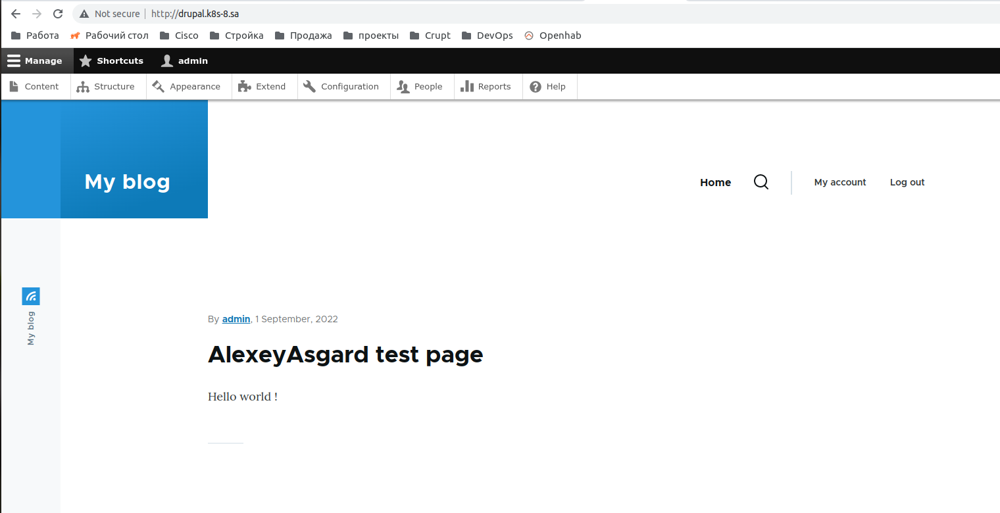
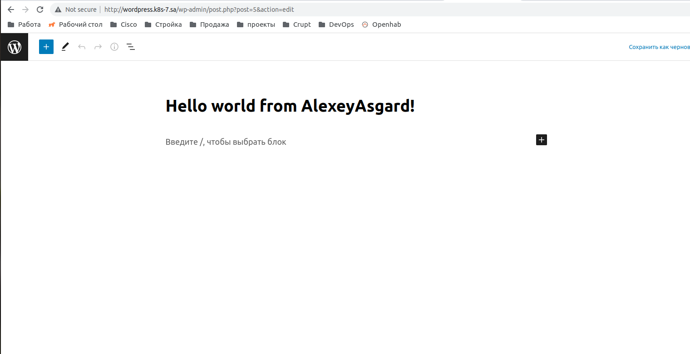

# 13. K8s HELM

## Instalation screenshots

### Drupal


### Wordpress


## Helm comands

```bash
~ ansible-playbook -i inventory.yaml dbinstallandcleate.yaml
~ helm install sa-wordpress --set mariadb.enabled=false,externalDatabase.host=192.168.203.8,externalDatabase.user=user_db,externalDatabase.password=pass_db,mariadb.auth.database=bitnami_wordpress,global.storageClass=nfs-client,wordpressUsername=admin,wordpressPassword=password bitnami/wordpress
```

```bash
~ ansible-playbook -i inventory.yaml dbinstallandcleate.yaml
~ helm install sa-drupal  --set mariadb.enabled=false,externalDatabase.host=192.168.203.8,externalDatabase.user=user_db,externalDatabase.password=pass_db,global.storageClass=nfs-client,drupalUsername=admin,drupalPassword=password bitnami/drupal
```