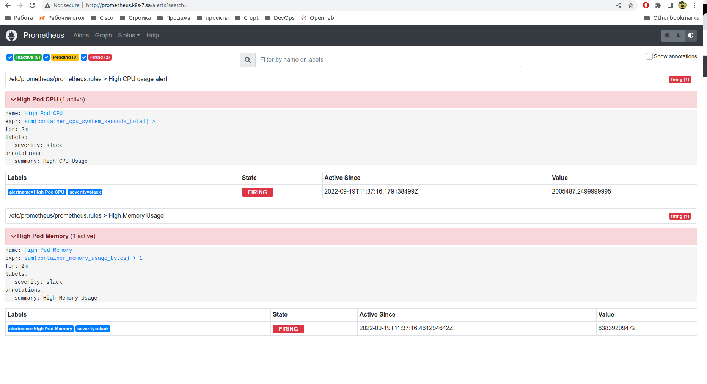
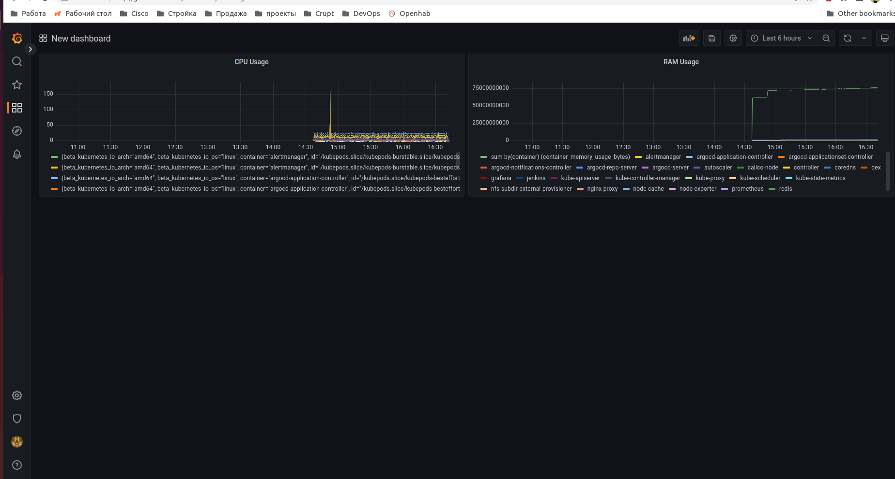
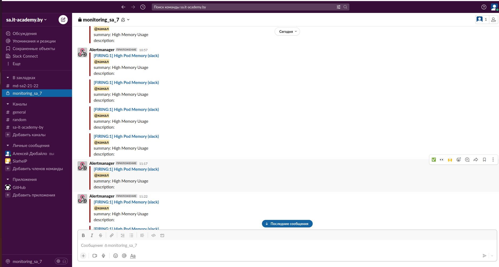

# 15. Technical and service monitoring

## Prometheus manifest
```
prometheus.rules: |-
    groups:
    - name: High Memory Usage
      rules:
      - alert: High Pod Memory
        expr: sum(container_memory_usage_bytes) > 1
        for: 2m
        labels:
          severity: slack
        annotations:
          summary: High Memory Usage
    - name: High CPU usage alert
      rules:
      - alert: High Pod CPU
        expr: sum(container_cpu_system_seconds_total) > 1
        for: 2m
        labels:
          severity: slack
        annotations:
          summary: High CPU Usage
```
## Alertmanager manifest
```
data:
  config.yml: |-
    global:
    templates:
    - '/etc/alertmanager/*.tmpl'
    route:
      receiver: slack-notify
      group_by: ['alertname', 'priority']
      group_wait: 10s
      repeat_interval: 1m
 
    receivers:
    - name: slack-notify
      slack_configs:
      - api_url: https://hooks.slack.com/services/<secret>
        channel: '#monitoring_sa_7'
        text: "<!channel> \nsummary: {{ .CommonAnnotations.summary }}\ndescription: {{ .CommonAnnotations.description }}"
```

## Screenshots

### Prometheus

### Grafana

###  Slack

