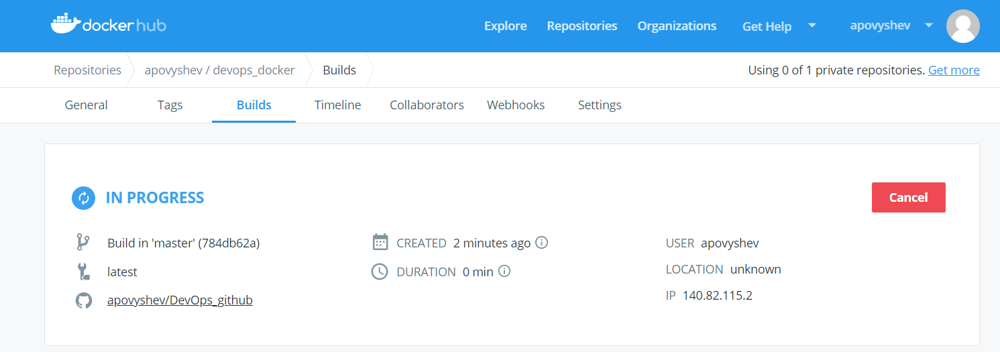
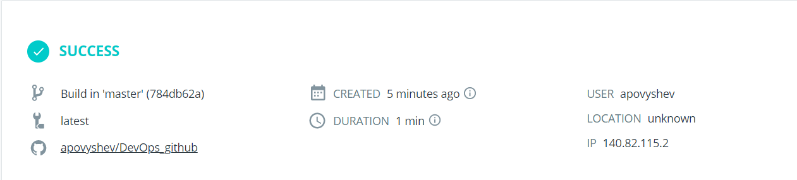
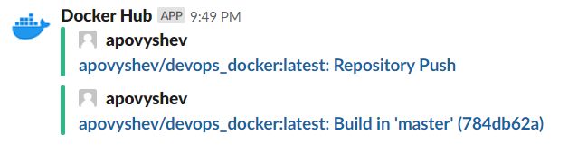

## This is the output from the local Docker build and automated build from docker.hub.


### Building the image
```
[root@gitlab docker]# docker build --tag=apovyshev/devops_docker:app .
Sending build context to Docker daemon  35.84kB
Step 1/7 : FROM python:2.7-slim
2.7-slim: Pulling from library/python
f5d23c7fed46: Pull complete
cdc362a1b8d3: Pull complete
d43d1ec67d25: Pull complete
20f5efb8573b: Pull complete
Digest: sha256:064a5e0cda22ac3c61fa0c18f3ce26df591302c81489b0c56dfee6129ae7bf6b
Status: Downloaded newer image for python:2.7-slim
 ---> 5caa018c2dc0
Step 2/7 : WORKDIR /app
 ---> Running in 11911b357abe
Removing intermediate container 11911b357abe
 ---> 020c44a3e046
Step 3/7 : COPY . /app
 ---> 492d1452daaa
Step 4/7 : RUN pip install --trusted-host pypi.python.org -r requirements.txt
 ---> Running in 3158fcd57b3c
DEPRECATION: Python 2.7 will reach the end of its life on January 1st, 2020. Please upgrade your Python as Python 2.7 won't be maintained after that date. A future version of pip will drop support for Python 2.7.
Collecting Flask (from -r requirements.txt (line 1))
  Downloading https://files.pythonhosted.org/packages/9b/93/628509b8d5dc749656a9641f4caf13540e2cdec85276964ff8f43bbb1d3b/Flask-1.1.1-py2.py3-none-any.whl (94kB)
Collecting Redis (from -r requirements.txt (line 2))
  Downloading https://files.pythonhosted.org/packages/ac/a7/cff10cc5f1180834a3ed564d148fb4329c989cbb1f2e196fc9a10fa07072/redis-3.2.1-py2.py3-none-any.whl (65kB)
Collecting click>=5.1 (from Flask->-r requirements.txt (line 1))
  Downloading https://files.pythonhosted.org/packages/fa/37/45185cb5abbc30d7257104c434fe0b07e5a195a6847506c074527aa599ec/Click-7.0-py2.py3-none-any.whl (81kB)
Collecting Werkzeug>=0.15 (from Flask->-r requirements.txt (line 1))
  Downloading https://files.pythonhosted.org/packages/d1/ab/d3bed6b92042622d24decc7aadc8877badf18aeca1571045840ad4956d3f/Werkzeug-0.15.5-py2.py3-none-any.whl (328kB)
Collecting itsdangerous>=0.24 (from Flask->-r requirements.txt (line 1))
  Downloading https://files.pythonhosted.org/packages/76/ae/44b03b253d6fade317f32c24d100b3b35c2239807046a4c953c7b89fa49e/itsdangerous-1.1.0-py2.py3-none-any.whl
Collecting Jinja2>=2.10.1 (from Flask->-r requirements.txt (line 1))
  Downloading https://files.pythonhosted.org/packages/1d/e7/fd8b501e7a6dfe492a433deb7b9d833d39ca74916fa8bc63dd1a4947a671/Jinja2-2.10.1-py2.py3-none-any.whl (124kB)
Collecting MarkupSafe>=0.23 (from Jinja2>=2.10.1->Flask->-r requirements.txt (line 1))
  Downloading https://files.pythonhosted.org/packages/fb/40/f3adb7cf24a8012813c5edb20329eb22d5d8e2a0ecf73d21d6b85865da11/MarkupSafe-1.1.1-cp27-cp27mu-manylinux1_x86_64.whl
Installing collected packages: click, Werkzeug, itsdangerous, MarkupSafe, Jinja2, Flask, Redis
Successfully installed Flask-1.1.1 Jinja2-2.10.1 MarkupSafe-1.1.1 Redis-3.2.1 Werkzeug-0.15.5 click-7.0 itsdangerous-1.1.0
Removing intermediate container 3158fcd57b3c
 ---> d637af5dd18a
Step 5/7 : EXPOSE 80
 ---> Running in 648ba8c7e45a
Removing intermediate container 648ba8c7e45a
 ---> b18ea27c03df
Step 6/7 : ENV NAME World
 ---> Running in bdbd9cb24be4
Removing intermediate container bdbd9cb24be4
 ---> e4e999bdbf25
Step 7/7 : CMD ["python", "app.py"]
 ---> Running in c41f6f808c88
Removing intermediate container c41f6f808c88
 ---> 873fb5c9f6bc
Successfully built 873fb5c9f6bc
Successfully tagged apovyshev/devops_docker:app
[root@gitlab docker]# docker image ls
REPOSITORY                TAG                 IMAGE ID            CREATED              SIZE
apovyshev/devops_docker   app                 873fb5c9f6bc        About a minute ago   148MB
python                    2.7-slim            5caa018c2dc0        5 days ago           137MB
hello-world               latest              fce289e99eb9        6 months ago         1.84kB
```
### Running the image and curling the container
```
[root@gitlab docker]# docker run -d -p 4000:80 apovyshev/devops_docker:app
c4c9d04f66d495996b6c6e673e201d4e425bbb54e9c2a481c8013a3dc907dac7
[root@gitlab docker]# curl http://localhost:4000
<h3>Hello World!</h3><b>Hostname:</b> c4c9d04f66d4<br/><b>Visits:</b> <i>cannot connect to Redis, counter disabled</i>
```
### Logging in to docker and pushing the image
```
[root@gitlab docker]# docker login
Login with your Docker ID to push and pull images from Docker Hub. If you don't have a Docker ID, head over to https://hub.docker.com to create one.
Username: apovyshev
Password:
WARNING! Your password will be stored unencrypted in /root/.docker/config.json.
Configure a credential helper to remove this warning. See
https://docs.docker.com/engine/reference/commandline/login/#credentials-store

Login Succeeded
```
```
[root@gitlab docker]# docker push apovyshev/devops_docker:app
The push refers to repository [docker.io/apovyshev/devops_docker]
b7f397bdbf93: Pushed
850c19763204: Pushed
ade68aa7bdd1: Pushed
63d42cb10c64: Pushed
32d47307f796: Layer already exists
c86aa07d5fdb: Pushed
d8a33133e477: Pushed
app: digest: sha256:f226c08a04a43b579412b6702fbf9bd9ea721440b1a6ead4a21f70e0b88f46b5 size: 1789
```
### Runnint automated build
```
[root@gitlab docker]# git push upstream master
Counting objects: 8, done.
Delta compression using up to 2 threads.
Compressing objects: 100% (6/6), done.
Writing objects: 100% (7/7), 1.31 KiB | 0 bytes/s, done.
Total 7 (delta 1), reused 0 (delta 0)
remote: Resolving deltas: 100% (1/1), done.
To git@github.com:apovyshev/DevOps_github.git
   b53ec1f..784db62  master -> master
```
### The link to the docker [repository](https://cloud.docker.com/u/apovyshev/repository/docker/apovyshev/devops_docker)
### Start of the build

### The build is ready

### Notification

