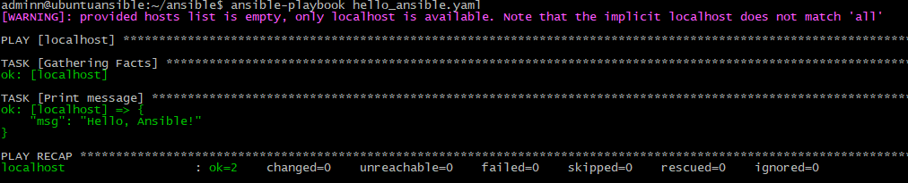
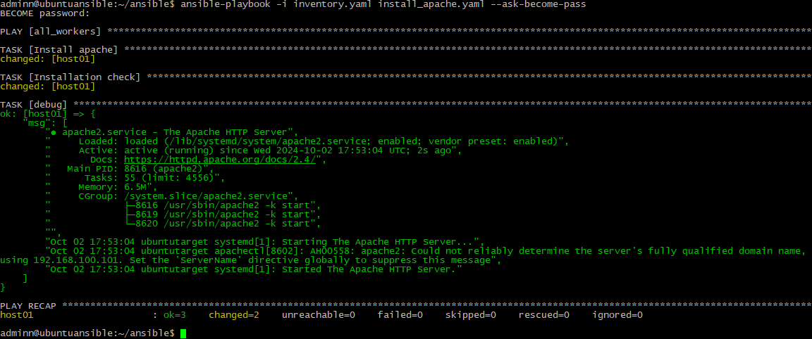
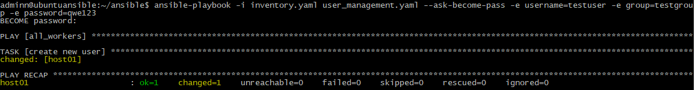

# 05. Ansible start
## Homework Assignment 1: Setting Up Ansible
### 1. Install Ansible on your local machine or a virtual environment.
```bash
adminn@ubuntuansible:~$ sudo apt install ansible

adminn@ubuntuansible:~$ ansible --version
ansible 2.9.6
  config file = /etc/ansible/ansible.cfg
  configured module search path = ['/home/adminn/.ansible/plugins/modules', '/usr/share/ansible/plugins/modules']
  ansible python module location = /usr/lib/python3/dist-packages/ansible
  executable location = /usr/bin/ansible
  python version = 3.8.10 (default, Sep 11 2024, 16:02:53) [GCC 9.4.0]
adminn@ubuntuansible:~$
```
### 2. Create a directory for your Ansible playbooks and configuration files.
```bash
adminn@ubuntuansible:~$ pwd
/home/adminn
adminn@ubuntuansible:~$ mkdir ansible
adminn@ubuntuansible:~$ cd ansible
adminn@ubuntuansible:~/ansible$
```
### 3. Write an Ansible playbook that prints "Hello, Ansible!" to the console.
```bash
adminn@ubuntuansible:~/ansible$ cat hello_ansible.yaml
- hosts: localhost
  vars:
    message: "Hello, Ansible!"

  tasks:
    - name: Print message
      debug:
        msg: "{{message}}"
      tags:
        - no_facts
        - always


adminn@ubuntuansible:~/ansible$
```
### 4. Run the playbook using the ansible-playbook command and ensure it executes successfully.
```bash
adminn@ubuntuansible:~/ansible$ ansible-playbook hello_ansible.yaml
```


### 5. Document the installation process and the steps you took to run the playbook.
```bash
Documented above
```
## Homework Assignment 2: Managing Remote Hosts
### 1. Set up a virtual machine (or use an existing one in IT-ACADEMY DC) to act as your remote target.
```bash
Deployed ubuntu 22.04, name TargetHost
```
### 2. Ensure SSH access to the remote machine from your local machine.


### 3. Write an Ansible playbook to install a basic package (e.g., vim or htop) on the remote host.
```bash
adminn@ubuntuansible:~/ansible$ cat install_apache.yaml
- hosts: all_workers
  gather_facts: False
  strategy: free

  tasks:

   - name: Install apache
     become: true
     apt:
       name: apache2
       state: latest

   - name: Installation check
     shell: |
       systemctl status apache2
     register: out

   - debug:
       msg: "{{out.stdout_lines}}"
adminn@ubuntuansible:~/ansible$
```
### 4. Use inventory files to manage the connection details for the remote host.
```bash
adminn@ubuntuansible:~/ansible$ cat inventory.yaml
all_workers:
  children:
    work_sa:
      hosts:
        host01:
          ansible_host: 192.168.100.101

      vars:
        ansible_user: adminn
```
### 5. Execute the playbook and verify that the package is installed on the remote host.



## Homework Assignment 3: Managing Users and Groups
### 1. Create a playbook to manage users and groups on a remote host.
```bash
Done
```
### 2. Define tasks to create a new user, assign the user to a specific group, and set a password.
```bash
adminn@ubuntuansible:~/ansible$ cat user_management.yaml
- hosts: all_workers
  gather_facts: False
  strategy: free

  tasks:

   - name: create new user
     become: true
     ansible.builtin.user:
       user: "{{ username }}"
       group: "{{ group }}"
       password: "{{ password | password_hash('sha512') }}"
       state: present
adminn@ubuntuansible:~/ansible$

```
### 3. Parameterize the playbook to allow dynamic user and group names.
```bash
Done above
```
### 4. Execute the playbook and verify that the user and group configurations are applied.
```bash
adminn@ubuntuansible:~/ansible$ ansible-playbook -i inventory.yaml user_management.yaml --ask-become-pass -e username=testuser -e group=testgroup -e password=qwe123
```


```bash
adminn@ubuntutarget:/etc/ssh$ groups testuser
testuser : testgroup
adminn@ubuntutarget:/etc/ssh$
```
### 5. Your ansible project add to folder 05.Ansible.start, create README.md with short report inside and prepare PR
```bash
Done
```