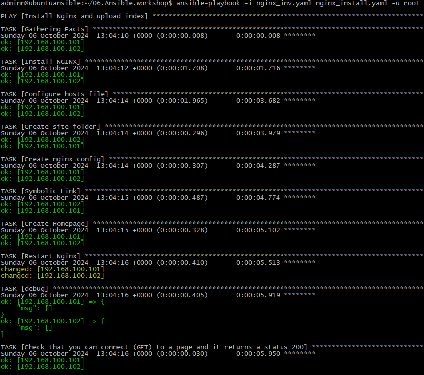
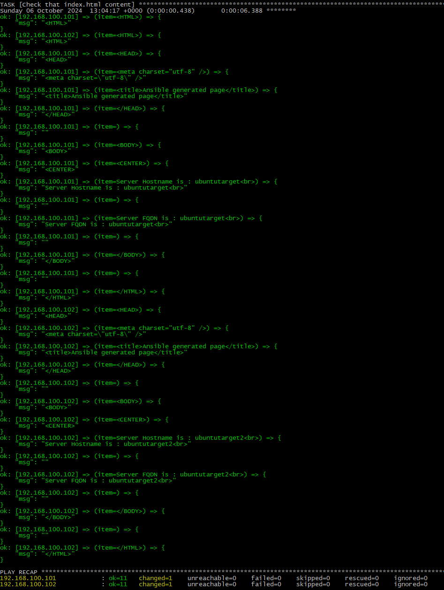
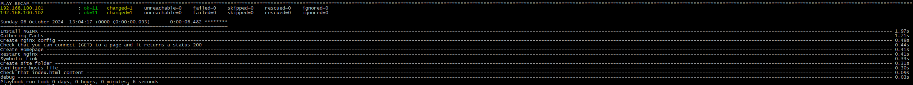

### Homework Assignment 1: Configuration Management
## 1. Choose a web server software (e.g., Nginx) for configuration management.
```bash
NGINX
```
## 2. Write an Ansible playbook to install and configure the chosen web server on a remote host (two virtualhosts using templates).
## 3. Include tasks to create a simple HTML file served by the web server, with unique data inside (host name and FQDN) for each virtualhost.
```bash
adminn@ubuntuansible:~/06.Ansible.workshop$ cat nginx_install.yaml
- name: Install Nginx and upload index
  hosts: webservers

  vars:
    index_src: ./Website
    index_dst: /var/www/html
    config_dst: /etc/nginx/sites-available

  tasks:
    - name: Install NGINX
      ansible.builtin.apt:
        name: nginx
        state: latest
        update_cache: yes

    - name: Configure hosts file
      ansible.builtin.lineinfile:
        path: /etc/hosts
        line: "127.0.0.1 {{ ansible_hostname }}site.local"

    - name: Create site folder
      ansible.builtin.file:
        path: "{{ index_dst }}/{{ ansible_hostname }}"
        state: directory
        mode: "0755"

    - name: Create nginx config
      template: src={{ index_src }}/nginx_config.j2 dest={{ config_dst }}/{{ ansible_hostname }}site.conf mode=0755

    - name: Symbolic Link
      ansible.builtin.copy:
        remote_src: yes
        src: "{{ config_dst }}/{{ ansible_hostname }}site.conf"
        dest: "/etc/nginx/sites-enabled/"

    - name: Create Homepage
      template: src={{ index_src }}/index.j2 dest={{ index_dst }}/{{ ansible_hostname }}/index.html mode=0755

    - name: Restart Nginx
      shell: |
        systemctl restart nginx
      register: out

    - debug:
        msg: "{{out.stdout_lines}}"

    - name: Check that you can connect (GET) to a page and it returns a status 200
      ansible.builtin.uri:
        url: http://{{ ansible_hostname }}site.local

    - name: Check that index.html content
      debug: msg="{{item}}"
      loop: "{{ lookup('url', 'http://{{ansible_hostname}}site.local', wantlist=True) }}"
adminn@ubuntuansible:~/06.Ansible.workshop$

```
### Inventory
```bash
adminn@ubuntuansible:~/06.Ansible.workshop$ cat nginx_inv.yaml
webservers:
  hosts:
    192.168.100.101:
    192.168.100.102:
adminn@ubuntuansible:~/06.Ansible.workshop$

```

### index template
```bash
adminn@ubuntuansible:~/06.Ansible.workshop/Website$ cat index.j2
<HTML>
<HEAD>
<meta charset="utf-8" />
<title>Ansible generated page</title>
</HEAD>

<BODY>
<CENTER>
Server Hostname is : {{ansible_hostname}}<br>

Server FQDN is : {{ansible_fqdn}}<br>

</BODY>

</HTML>

```

### Nginx config template
```bash
adminn@ubuntuansible:~/06.Ansible.workshop/Website$ cat nginx_config.j2
server {
       listen 80;
#       listen [::]:80;

       server_name {{ ansible_hostname }}site.local;

       root /var/www/html/{{ ansible_hostname }};
       index index.html;

       location / {
               try_files $uri $uri/ =404;
       }
}

```
## 4. Run the playbook and ensure the web server is installed, configured, and serving the HTML file.




## Comments
For the last task to work I configured /etc/hosts on the control node to be able to resolve websites names.