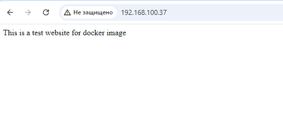

# Homework Assignment 1: Docker Installation and Basic Commands
## 1. Install Docker on your local machine or a virtual environment.
```bash
adminn@ubuntudocker:~$ mkdir Docker
adminn@ubuntudocker:~$ cd Docker/
adminn@ubuntudocker:~/Docker$ ls
adminn@ubuntudocker:~/Docker$ sudo apt-get update
adminn@ubuntudocker:~/Docker$ sudo apt-get install ca-certificates curl
adminn@ubuntudocker:~/Docker$ sudo install -m 0755 -d /etc/apt/keyrings
adminn@ubuntudocker:~/Docker$ sudo curl -fsSL https://download.docker.com/linux/ubuntu/gpg -o /etc/apt/keyrings/docker.asc
adminn@ubuntudocker:~/Docker$ sudo chmod a+r /etc/apt/keyrings/docker.asc
adminn@ubuntudocker:~/Docker$ echo \
>   "deb [arch=$(dpkg --print-architecture) signed-by=/etc/apt/keyrings/docker.asc] https://download.docker.com/linux/ubuntu \
>   $(. /etc/os-release && echo "$VERSION_CODENAME") stable" | \
>   sudo tee /etc/apt/sources.list.d/docker.list > /dev/null
adminn@ubuntudocker:~/Docker$ sudo apt-get update
adminn@ubuntudocker:~/Docker$ sudo apt-get install docker-ce docker-ce-cli containerd.io docker-buildx-plugin docker-compose-plugin
adminn@ubuntudocker:~/Docker$ sudo usermod -aG docker $USER
```
## 2. Verify the Docker installation by running the docker --version command.
```bash
adminn@ubuntudocker:~$ docker --version
Docker version 27.3.1, build ce12230
adminn@ubuntudocker:~$
```
## 3. Pull the official "hello-world" Docker image and run a container based on it.
```bash
adminn@ubuntudocker:~$ docker pull hello-world:latest
latest: Pulling from library/hello-world
c1ec31eb5944: Pull complete
Digest: sha256:d211f485f2dd1dee407a80973c8f129f00d54604d2c90732e8e320e5038a0348
Status: Downloaded newer image for hello-world:latest
docker.io/library/hello-world:latest
adminn@ubuntudocker:~$ docker run hello-world:latest

Hello from Docker!
This message shows that your installation appears to be working correctly.

To generate this message, Docker took the following steps:
 1. The Docker client contacted the Docker daemon.
 2. The Docker daemon pulled the "hello-world" image from the Docker Hub.
    (amd64)
 3. The Docker daemon created a new container from that image which runs the
    executable that produces the output you are currently reading.
 4. The Docker daemon streamed that output to the Docker client, which sent it
    to your terminal.

To try something more ambitious, you can run an Ubuntu container with:
 $ docker run -it ubuntu bash

Share images, automate workflows, and more with a free Docker ID:
 https://hub.docker.com/

For more examples and ideas, visit:
 https://docs.docker.com/get-started/
```
## 4. List the running containers using the docker ps command.
```bash
adminn@ubuntudocker:~$ docker ps -a
CONTAINER ID   IMAGE                COMMAND    CREATED         STATUS                     PORTS     NAMES
7635b70456e8   hello-world:latest   "/hello"   9 seconds ago   Exited (0) 8 seconds ago             heuristic_beaver
adminn@ubuntudocker:~$
```
## 5. Document the installation process and the commands used for verification.
```bash
Done
```


# Homework Assignment 2: Building a Docker Image with Dockerfile
## 1. Create a new directory for your Dockerfile and application code.
```bash
adminn@ubuntudocker:~/Docker$ ls
Dockerfile  Website.py
adminn@ubuntudocker:~/Docker$
```
## 2. Write a Dockerfile to build an image for a simple web application (e.g., Flask or Node.js).
### Web-application:
```bash
adminn@ubuntudocker:~/Docker$ cat Website.py
#!/bin/python
from flask import Flask
app = Flask(__name__)

@app.route('/')

def index():
    return "This is a test website for docker image"


app.run(host="0.0.0.0", port=80)
adminn@ubuntudocker:~/Docker$
```
## 3. Copy your application code into the image and set the necessary environment.
### Dockerfile
```bash
adminn@ubuntudocker:~/Docker$ cat Dockerfile
FROM python
RUN mkdir -p ./testwebsite
WORKDIR ./testwebsite
COPY . /testwebsite
RUN pip3 install flask
CMD ["python3","Website.py"]
adminn@ubuntudocker:~/Docker$
```
## 4. Build the Docker image using the docker build command.
```bash
adminn@ubuntudocker:~/Docker$ docker build -t websiteapp .
[+] Building 0.6s (10/10) FINISHED                                                                                                                                                                                                                                                                            docker:default
 => [internal] load build definition from Dockerfile                                                                                                                                                                                                                                                                    0.0s
 => => transferring dockerfile: 172B                                                                                                                                                                                                                                                                                    0.0s
 => [internal] load metadata for docker.io/library/python:latest                                                                                                                                                                                                                                                        0.5s
 => [internal] load .dockerignore                                                                                                                                                                                                                                                                                       0.0s
 => => transferring context: 2B                                                                                                                                                                                                                                                                                         0.0s
 => [1/5] FROM docker.io/library/python:latest@sha256:45803c375b95ea33f482e53a461eca8f247617667d703660a06ccf5eb3d05326                                                                                                                                                                                                  0.0s
 => [internal] load build context                                                                                                                                                                                                                                                                                       0.0s
 => => transferring context: 202B                                                                                                                                                                                                                                                                                       0.0s
 => CACHED [2/5] RUN mkdir -p ./testwebsite                                                                                                                                                                                                                                                                             0.0s
 => CACHED [3/5] WORKDIR ./testwebsite                                                                                                                                                                                                                                                                                  0.0s
 => CACHED [4/5] COPY . /testwebsite                                                                                                                                                                                                                                                                                    0.0s
 => CACHED [5/5] RUN pip3 install flask                                                                                                                                                                                                                                                                                 0.0s
 => exporting to image                                                                                                                                                                                                                                                                                                  0.0s
 => => exporting layers                                                                                                                                                                                                                                                                                                 0.0s
 => => writing image sha256:2ec7c0c1eaf8bcfc935495a4b094056abdbc093a74045516fc1def148761f52f                                                                                                                                                                                                                            0.0s
 => => naming to docker.io/library/websiteapp                                                                                                                                                                                                                                                                           0.0s

 1 warning found (use docker --debug to expand):
 - WorkdirRelativePath: Relative workdir "./testwebsite" can have unexpected results if the base image changes (line 3)
```
## 5. Run a container based on the image and access the web application.
```bash
adminn@ubuntudocker:~/Docker$ docker run --name websiteapp1 -p 80:80 -d websiteapp
0a491a780a4bcca89b62b5e8fe3e2593428d4e22b3734f746c83b3728996413f
adminn@ubuntudocker:~/Docker$ docker ps
CONTAINER ID   IMAGE        COMMAND                CREATED         STATUS         PORTS                               NAMES
0a491a780a4b   websiteapp   "python3 Website.py"   4 seconds ago   Up 4 seconds   0.0.0.0:80->80/tcp, :::80->80/tcp   websiteapp1
```
## 6. Document the steps taken to create the Dockerfile, build the image, and access the app.
