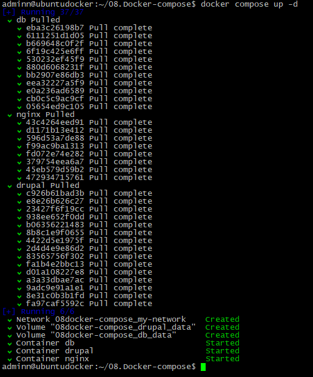
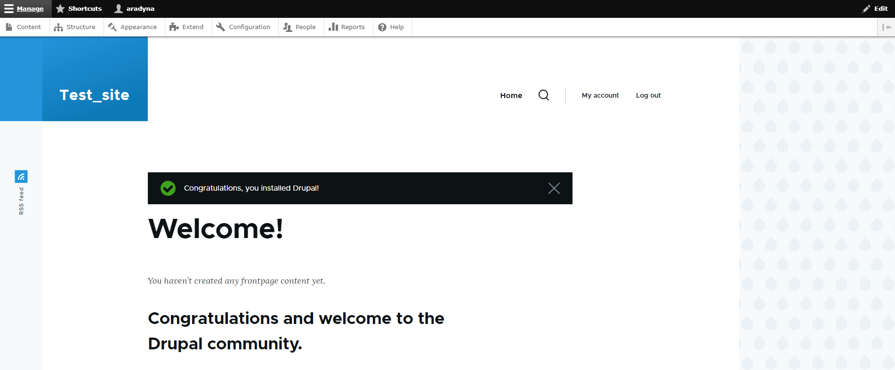
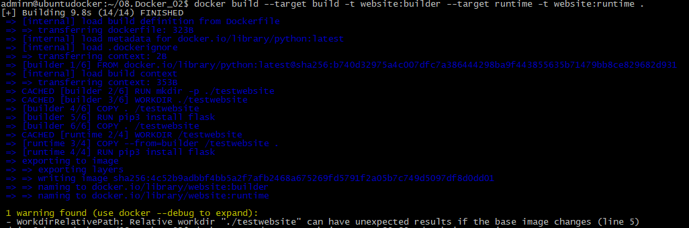
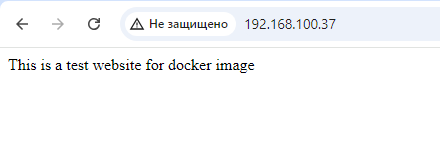
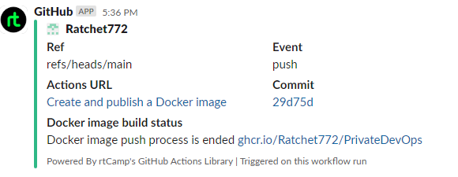
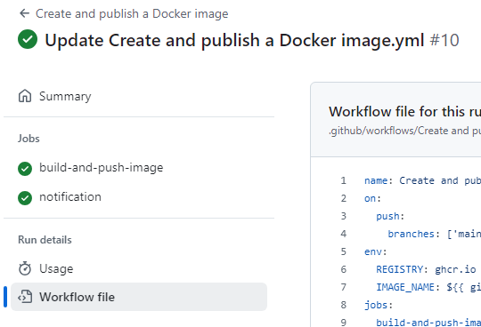

# Homework Assignment 1: Docker Compose for Application Stacks
## 1.Select a combination of services (e.g., web app, database) to create a multi-container application.
```bash
Drupal fpm, MySQL, Nginx
```
## 2.Create a Docker Compose YAML file to define the services, networks, and volumes.
```bash
adminn@ubuntudocker:~/08.Docker-compose$ cat docker-compose.yaml
services:
  drupal:
    depends_on:
        - db
    image: drupal:9-fpm-alpine
    container_name: drupal
    env_file: .env
    volumes:
      - drupal_data:/var/www/html/
    networks:
      - my-network

  db:
    image: mysql:8.0
    container_name: db
    env_file: .env
    restart: always
    environment:
      - MYSQL_ROOT_PASSWORD=${PASS_FOR_ALL}
      - MYSQL_DATABASE=drupal
      - MYSQL_USER=drupal
      - MYSQL_PASSWORD=${PASS_FOR_ALL}
    volumes:
      - db_data:/var/lib/mysql
    networks:
      - my-network

  nginx:
    image: nginx:alpine
    container_name: nginx
    ports:
      - "80:80"
    volumes:
      - drupal_data:/var/www/html
      - ./nginx-conf:/etc/nginx/conf.d
    depends_on:
      - drupal
    networks:
      - my-network

volumes:
  drupal_data:
  db_data:

networks:
  my-network:

adminn@ubuntudocker:~/08.Docker-compose$
```
## 3.Configure environment variables and dependencies between services.
```bash
adminn@ubuntudocker:~/08.Docker-compose$ cat .env
PASS_FOR_ALL=mypass
adminn@ubuntudocker:~/08.Docker-compose$
```
### Nginx config:
```bash
adminn@ubuntudocker:~/08.Docker-compose$ cat nginx-conf/nginx.conf
server {
    listen 80;
    listen [::]:80;

    server_name localhost;

    index index.php index.html index.htm;

    root /var/www/html;

    location ~ /.well-known/acme-challenge {
        allow all;
        root /var/www/html;
    }

    location / {
        try_files $uri $uri/ /index.php$is_args$args;
    }

    rewrite ^/core/authorize.php/core/authorize.php(.*)$ /core/authorize.php$1;

    location ~ \.php$ {
        try_files $uri =404;
        fastcgi_split_path_info ^(.+\.php)(/.+)$;
        fastcgi_pass drupal:9000;
        fastcgi_index index.php;
        include fastcgi_params;
        fastcgi_param SCRIPT_FILENAME $document_root$fastcgi_script_name;
        fastcgi_param PATH_INFO $fastcgi_path_info;
    }

    location ~ /\.ht {
        deny all;
    }

    location = /favicon.ico {
        log_not_found off; access_log off;
    }
    location = /robots.txt {
        log_not_found off; access_log off; allow all;
    }
    location ~* \.(css|gif|ico|jpeg|jpg|js|png)$ {
        expires max;
        log_not_found off;
    }
}
adminn@ubuntudocker:~/08.Docker-compose$
```
## 4.Run the application stack using the docker-compose up or docker compose up command.


```bash
adminn@ubuntudocker:~/08.Docker-compose$ docker compose ps
NAME      IMAGE                 COMMAND                  SERVICE   CREATED         STATUS         PORTS
db        mysql:8.0             "docker-entrypoint.s…"   db        4 minutes ago   Up 4 minutes   3306/tcp, 33060/tcp
drupal    drupal:9-fpm-alpine   "docker-php-entrypoi…"   drupal    4 minutes ago   Up 4 minutes   9000/tcp
nginx     nginx:alpine          "/docker-entrypoint.…"   nginx     4 minutes ago   Up 4 minutes   0.0.0.0:80->80/tcp, :::80->80/tcp
adminn@ubuntudocker:~/08.Docker-compose$
```
## 5.Access the application through a web browser or API client.


## 6.Document the Docker Compose file structure and the steps to deploy the application stack.
```bash
Done
```

# Homework Assignment 2: Docker build automation (github action)
## 1.Choose a programming language (e.g., Java, Go, Python) and a sample application.
### Python App
```bash
adminn@ubuntudocker:~/08.Docker_02$ cat Website.py
#!/bin/python
from flask import Flask
app = Flask(__name__)

@app.route('/')

def index():
    return "This is a test website for docker image"


app.run(host="0.0.0.0", port=80)
adminn@ubuntudocker:~/08.Docker_02$
```
## 2.Write a multi-stage Dockerfile to build the application with different stages for build and runtime.
```bash
adminn@ubuntudocker:~/08.Docker_02$ cat Dockerfile
#Build

FROM python AS builder
RUN mkdir -p ./testwebsite
WORKDIR ./testwebsite
COPY . /testwebsite
RUN pip3 install flask
COPY . /testwebsite

#Runtime
FROM python AS runtime
WORKDIR /testwebsite
COPY --from=builder /testwebsite .
RUN pip3 install flask
CMD ["python3","Website.py"]
adminn@ubuntudocker:~/08.Docker_02$
```
## 3.Compile or package the application in the build stage.
```bash
#Build

FROM python AS builder
RUN mkdir -p ./testwebsite
WORKDIR ./testwebsite
COPY . /testwebsite
RUN pip3 install flask
COPY . /testwebsite
```
## 4.Copy the compiled application into the runtime stage and configure it to run.
```bash
#Runtime
FROM python AS runtime
WORKDIR /testwebsite
COPY --from=builder /testwebsite .
RUN pip3 install flask
CMD ["python3","Website.py"]
```
## 5.Build the multi-stage Docker image and run a container based on it.


### Run container
```bash
adminn@ubuntudocker:~/08.Docker_02$ docker run -d --name websiteapp -p 80:80 -d website:runtime
e46203c15516ad4eb3fd8e9b54fe4bebc6cb6b43ca5f745ef416447f2d866588
adminn@ubuntudocker:~/08.Docker_02$ docker ps
CONTAINER ID   IMAGE             COMMAND                CREATED         STATUS         PORTS                               NAMES
e46203c15516   website:runtime   "python3 Website.py"   4 seconds ago   Up 3 seconds   0.0.0.0:80->80/tcp, :::80->80/tcp   websiteapp
```

## 6.Push/publish image to docker hub and/or github container register.
```bash
name: Create and publish a Docker image
on:
  push:
    branches: ['main']
env:
  REGISTRY: ghcr.io
  IMAGE_NAME: ${{ github.repository }}	
jobs:
  build-and-push-image:
    runs-on: ubuntu-latest  
    permissions:
      contents: read
      packages: write
      attestations: write
      id-token: write
    steps:
    - name: Checkout repository
      uses: actions/checkout@v4		
    - name: Log in to the Container registry
      uses: docker/login-action@65b78e6e13532edd9afa3aa52ac7964289d1a9c1
      with:
          registry: ghcr.io
          username: ${{ github.actor }}
          password: ${{ secrets.GITHUB_TOKEN }}		  
    - name: Extract metadata (tags, labels) for Docker
      id: meta
      uses: docker/metadata-action@9ec57ed1fcdbf14dcef7dfbe97b2010124a938b7
      with:
          images: ${{ env.REGISTRY }}/${{ env.IMAGE_NAME }}  
    - name: Build and push Docker image
      id: push
      uses: docker/build-push-action@f2a1d5e99d037542a71f64918e516c093c6f3fc4
      with:
          context: .
          push: true
          tags: ${{ steps.meta.outputs.tags }}
          labels: ${{ steps.meta.outputs.labels }}	  
    - name: Generate artifact attestation
      uses: actions/attest-build-provenance@v1
      with:
          subject-name: ${{ env.REGISTRY }}/${{ env.IMAGE_NAME}}
          subject-digest: ${{ steps.push.outputs.digest }}
          push-to-registry: true
```
## 7.Slack notification when build failed/success with image name/tag.
```bash	  	  
  notification:
    needs: build-and-push-image
    runs-on: ubuntu-latest
    steps:
    - name: Slack Notification
      uses: rtCamp/action-slack-notify@v2
      env:
        SLACK_COLOR: ${{ job.status }}
        SLACK_MESSAGE: "Docker image push process is ended ${{ env.REGISTRY }}/${{ env.IMAGE_NAME}}"
        SLACK_TITLE: Docker image build status
        SLACK_USERNAME: GitHub
        SLACK_WEBHOOK: ${{ secrets.HOOK }}
```

## 8.Document the Dockerfile structure, the build process, and the advantages of multi-stage builds.
